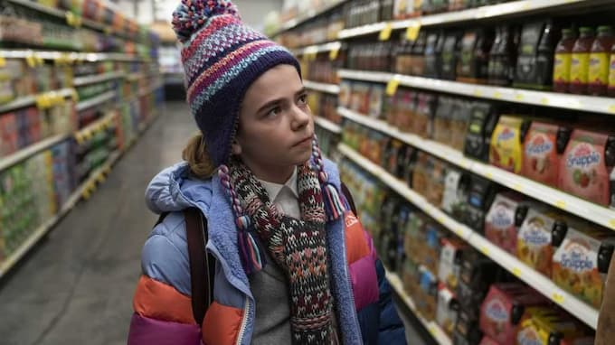

_Cena de Station Eleven: crianças traumatizadas pela pandemia seriam capazes de construir um bom futuro?_

Padrões mentais são escorregadios. Você pensa que se livrou de um, mas ele acaba voltando. Nesse caso, meu **ranhetismo cultural**: basta surgir um hype que fico automaticamente desconfiado. Porém, em vez de simplesmente ignorá-lo, tenho de investigá-lo e achar um motivo para reclamar.

Aconteceu de novo com a minissérie pós-apocalíptica [Station Eleven](https://en.wikipedia.org/wiki/Station_Eleven_(miniseries)), da HBO. Baseada [num livro](https://www.amazon.com.br/Esta%C3%A7%C3%A3o-Onze-Emily-John-Mandel-ebook/dp/B00YD5RR9K?crid=333MS62NSS4CP&keywords=estacao+onze&qid=1642071027&sprefix=estacao%2Caps%2C246&sr=8-1&linkCode=ll1&tag=eduf-20&linkId=1120be3b429a6ad1ed6b27e9b14ddfd4&language=pt_BR&ref_=as_li_ss_tl) de 2014, de [Emily St. John Mandel](https://en.m.wikipedia.org/wiki/Emily_St._John_Mandel), fala sobre uma pandemia que destrói a civilização como a conhecemos. Adeus, tecnologias, conveniências e até estados nação.

Em vez de descambar para um cenário Mad Max, a série adota um tom bem mais prosaico: mostra como, para sobreviver, as pessoas tiveram que voltar a um sistema quase feudal. A vida continua, mas sem eletricidade.

Assistimos aos primeiros anos da reconstrução dessa sociedade a partir de um ponto de vista bem particular: o de um grupo de teatro mambembe Shakespeareano, que se apresenta regularmente, circulando por um circuito mais ou menos seguro.

Ou seja, tudo para agradar velhotes nostálgicos como eu: pitadas de filmes _indie_, trilha sonora com Parliament / Funkadelic, além de uma história em quadrinhos surreal, inspirando grupos fanáticos. Tudo embalado num roteiro não-linear, cheio de mistérios e frases de efeito ocasionais.

Perfeito para a volta do meu instinto ranheta: “Soa à distopia fabricada via pesquisas de marketing, para agradar à Geração X”. Quem disse que consegui resistir? Assisti a uns capítulos, esperando reforçar meu ceticismo. Afinal, sempre damos um jeito de continuar a ser quem achamos que somos. Logo estava engajado. É que, embora a narrativa de Station Eleven seja um tanto solta demais, definitivamente, tem pontos interessantes.

Por exemplo, no episódio 5, acompanhamos o cotidiano de alguns norte-americanos isolados num aeroporto, enquanto a sociedade entra em colapso lá fora.

Eles passam pelos vários estágios da sobrevivência: primeiro, viciados pela conveniência, surtam porque seus voos atrasaram. Logo, percebem que não será mais possível voltar à “normalidade”. Assim, resignam-se a esperar, esperar e esperar.

Aos poucos, as garantias do mundo moderno vão se dissolvendo — em especial a Internet. Então, a materialidade do mundo vai **retomando seu lugar**: celulares viram apenas objetos de plástico, vidro e metal. Os smarts-alguma-coisa perdem sua frágil esperteza imputada.

Felizmente, os retirantes se dão conta de que, afinal, estão num aeroporto: um local protegido, com comida (e bebida alcoólica) relativamente abundante. Pelo menos por algum tempo.

É claro que a história começa a complicar. Mas nem precisaria. O que mais me interessou nela foi exatamente esse aspecto, digamos, “realista” da quebra progressiva dos nossos atuais padrões de vida. Como [alertava Buñuel](https://pt.wikipedia.org/wiki/O_Anjo_Exterminador), já em 1962, quando ficamos trancados juntos num local, tendemos a reajustar nossas sensibilidades morais.

Mas, a duras penas, também surge uma nova relação com o planeta, a partir das sobras da parafernália do mundo capitalista. O que me lembrou de [um texto de Ailton Krenak](https://www.amazon.com.br/Ideias-para-adiar-fim-mundo/dp/8535932410?crid=2K6FG7PTBOO8B&keywords=ideias+para+adiar+o+fim+do+mundo+ailton+krenak&qid=1641944548&sprefix=ideias+para+adiar+o+fim+do+mundo%2Caps%2C162&sr=8-1&linkCode=ll1&tag=eduf-20&linkId=2acaae7f8268a7d1bb4a044a77e4595e&language=pt_BR&ref_=as_li_ss_tl): os índios estão acostumados a sobreviver, mas e a sociedade moderna?

Station Eleven faz algumas perguntas provocadoras: como lidar com o luto de uma cultura? “Sobreviver não é o suficiente“. Como superar o trauma da transição? Será que a geração descompensada que a assistiu (e também a provocou) também vai atrapalhar o futuro?

Não quero atrair urucubaca, mas, em breve, acho que teremos que pensar em coisas um tanto parecidas. Com ou sem ranhetismo.

* * *

Obrigado ao [Gabriel Pardal](https://www.gabrielpardal.com/) por apontar umas correções no texto.
