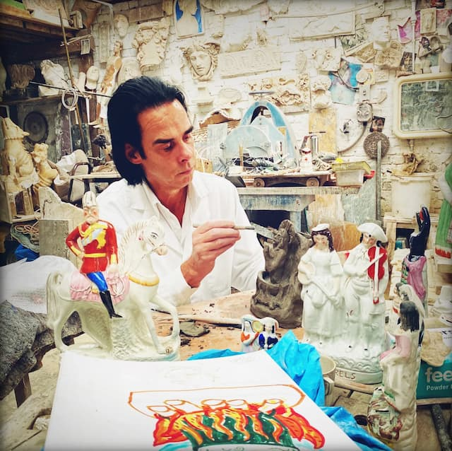
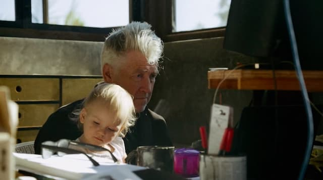

_O ceramista e músico (nas horas vagas), Nick Cave._

Milagre. Neste ano, acho que assisti a só dois documentários sobre artistas: [David Lynch - The Art Life](https://en.wikipedia.org/wiki/David_Lynch:_The_Art_Life) e, agora, [This Much I Now To Be True](https://www.nickcave.com/films/this-much-i-know-to-be-true/), sobre Nick Cave. Quer dizer, espera aí. Teve a [PJ Harvey também](https://eduf.me/pj-harvey-e-o-professor-polvo/). Enfim. Melhor nem começar a investigar, porque vou descobrir mais.

De qualquer forma, o que eu queria dizer é o seguinte: Cave e Lynch são duas personalidades bastante diferentes, mas compartilham algo muito comum com praticamente todos os artistas: **o amor à rotina**.

Se o pessoal do capital financeiro gosta de adrenalina, de dar _reload_ em gráficos (o que não deixa de ser um consumo de narrativas), criadores precisam de alguma estrutura, de repetição, por meio da qual possam experimentar, experimentar e experimentar. Todos os dias.

David Lynch se refere a isso como “a vida artística”. Não importa o que aconteça, ele acorda e vai lidar com seus pincéis. Ou ferramentas de carpintaria. Ou constrói narrativas. Não interessa, exatamente, nem o meio e nem a mensagem: a mente de Lynch precisa estar engajada no ato de capturar e **materializar ideias**.

_Lynch dá um jeito de integrar até mesmo a paternidade à sua rotina artística._

Pense, agora, na [trágica vida de Nick Cave](https://www.grunge.com/172473/the-tragic-real-life-story-of-nick-cave/). Perdeu dois filhos: um de 15 anos, que caiu de um penhasco, outro de 31, que morreu uma semana depois de ter sido liberado da cadeia. Mudou de cidade e de país várias vezes. Mas só nos momentos da criação é que diz ter encontrado alguma espécie de paz.

Aliás, no começo de “This Much I Know...”, ele conta como virou ceramista para enfrentar a falta de dinheiro durante a pandemia. De alguma forma, ele precisa exorcizar o cotidiano criando estátuas de demônios. Além de escrever [newsletters](https://www.theredhandfiles.com/) e livros.

Alguns meditadores diriam que essa necessidade de “produzir algo a partir de ideias” pode ser superada. O difícil é se convencer a quebrar o hábito.

Você pode até perceber o quão volúveis (e potencialmente perigosas) as ideias são. Mas desistir de se deixar perturbar por elas é um trabalho longo. E qual é a única ferramenta que torna isso possível? De novo, a rotina, a repetição.

Obviamente, eu também sofro de apego à criação. E tento criar estruturas blindadas, SUV’s, [Sherman Tanks](https://www.nationalww2museum.org/visit/museum-campus/us-freedom-pavilion/vehicles-war/m4-sherman-tank), para defendê-las dos caos social, econômico, político e psicológico que as ameaçam cotidianamente.

A “vida artística” não é, necessariamente, uma alienação, mas uma estratégia para ir além do comportamento de manada, para evitar dizer só o que todos dizem, discutir só o que está em voga e pensar só o que é “pensável”.

Mas, é claro, tudo pode ser usado como escapismo. Ou gerenciamento de estados ansiosos da mente. "Sorte" de quem pode exercer essa atividade, como David Lynch, que conseguiu encontrar público para o seu surrealismo. Ou Nick Cave, que ainda conta com parceiros como Warren Ellis para dividir os experimentos. Inúmeros artistas não tiveram esse "privilégio".

No fundo, como criador, você dá o que tem de melhor, expressa a sensibilidade que consegue desenvolver. É uma oferenda. Uma que se descobre e se corrige na prática. Dia após dia. Repetição após repetição. Sob os auspícios da deusa Rotina.
