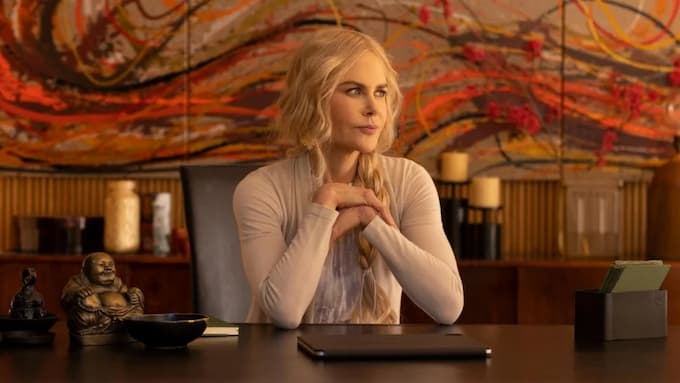

 _Nicole Kidman: ex-capitalista e guru… russa. Quem diria._

Estou assistindo a [Nine Perfect Strangers](https://pt.wikipedia.org/wiki/Nine_Perfect_Strangers_(miniss%C3%A9rie)), série sobre um _spa_ terapêutico na Califórnia. Dizendo assim, parece besteira _new age._ Mas espere aí. A série reflete bem certo _zeitgeist_ dos anos 2020:

1. **Super-heróis anti-heróis**. Gira em torno de uma líder carismática (Nicole Kidman), que se converte de capitalista selvagem para guru selvagem.
    
2. **Militarização da sexualidade.** Existe uma liberdade de identidades sexuais. Porém, é uma sexualidade usada como arma de manipulação entre personagens.
    
3. **Frankensteins metodológicos.** As terapias do _spa_ são misturas de diversos métodos, como bioenergética, yoga e interpretações convenientes de xamanismo.
    
4. **A redenção da redenção.** Em vez da desconfiança fatalista de séries como _Twin Peaks_ ("ah, essa natureza humana violenta e incorrigível"), vemos que os personagens estão sempre a um passo de revelarem suas naturezas bondosas. O impedimento aqui é, de novo, a repressão. Mas não exatamente a sexual. Os elementos repressores são múltiplos e paralelos: vindos da sociedade de consumo, das tragédias familiares, das rotinas, etc. É uma migração do sonho americano para o reino psicológico: se eu me esforçar no autoconhecimento, finalmente, serei feliz.
    
5. **Substâncias liberadoras.** Aqui, microdosagens de psicodélicos. Não por acaso, escondidas em vitaminas de frutas e vegetais. É que ainda acreditamos em saídas um tanto rápidas e externas: tome essa pílula e dê um passo além. Porém, desconfiamos da medicalização e despersonalização dessas substâncias. Queremos um quentinho. Os hippies usavam metáforas naturais para nomear suas drogas (sol, lua). Os yupies, nomes técnicos e siglas. Hoje, mantivemos a validação científica, mas preferimos substâncias "naturais" misturadas em poções vegetais. Ou nerdeamos a coisa toda. Por exemplo, MDMA, vira MD, que vira Michael Douglas.
    
6. **Hippie gótico.** Ok, eu quero espiar o terreno dos hippies, quero falar sobre _spa_. Mas preciso incutir na série algum elemento de mistério, pelo menos uma ameaça de morte. Só para garantir que a atenção não se dissipe para alguma rede social.
    
7. **Marvelização dos diálogos.** Como nos filmes da Marvel, os personagens falam por meio de piadas, com referências à história da cultura pop recente. Como se os roteiristas fossem todos discípulos de [Nick Hornby](https://www.amazon.com.br/Alta-fidelidade-Nick-Hornby/dp/8535923020?__mk_pt_BR=%C3%85M%C3%85%C5%BD%C3%95%C3%91&dchild=1&keywords=Nick+Hornby+alta+fidelidade&qid=1631112613&sr=8-1&linkCode=ll1&tag=eduf-20&linkId=b678d80338c5caf991f006df2d6f5d52&language=pt_BR&ref_=as_li_ss_tl).
    

Ainda estou no episódio 5 de 8 de _Nine Perfect Strangers_. Também não li o [livro de Liane Moriarty](https://www.amazon.com.br/Nove-Desconhecidos-Liane-Moriarty/dp/8551004689?__mk_pt_BR=%C3%85M%C3%85%C5%BD%C3%95%C3%91&dchild=1&keywords=Liane+Moriarty&qid=1631110802&sr=8-2&linkCode=ll1&tag=eduf-20&linkId=1627cf7da8447753483bcfad4dcc9951&language=pt_BR&ref_=as_li_ss_tl), no qual a série foi baseada. Mas, até agora, a coisa toda me sugere que o cadáver dos hippies está bem longe de ser sepultado. Ou melhor: deve ter sido enterrado no [Cemitério Maldito](https://pt.wikipedia.org/wiki/Pet_Sematary_(filme)) — só para marvelizar o final do texto.
