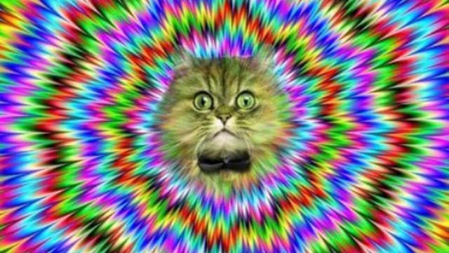

Antes de começar, uma promessa: **este será meu último texto sobre social media e bilionários**.

Tudo bem que a proposta desta newsletter seja investigar tecnologia e cultura buscando autoconhecimento. Mas já me repeti demais. Não quero mais me deixar pautar por esses assuntos que, embora importantes, são muito restritivos.

Vamos mudar esse sistema operacional.

* * *

Ainda assim, hoje partiremos de algumas frases publicadas logo que o Twitter foi comprado por Elon Musk, nesta semana.

O "Block Head", ex-CEO do Twitter, Jack Dorsey tuitou o seguinte:

> "O Twitter é a coisa mais próxima que temos de uma consciência global.

Com 330 milhões de usuários ativos (em 2019), o Twitter seria uma espécie de consciência global. Global por amostragem. A empresa esqueceu de convocar cerca de 7 bilhões de humanos para o empreendimento.

Imagine a quantidade de discursos, linguagens, lógicas, saberes tradicionais e sociabilidades que estão fora do Twitter ou nunca se enquadrariam nele. Se nem a [Biblioteca de Babel](https://en.wikipedia.org/wiki/The_Library_of_Babel) daria conta do recado, imagine um aplicativo.

> (...) Elon é a única solução (para a empresa) em que confio. Confio na sua missão de estender a luz da consciência."

De onde se deduz que a iluminação que Musk quer promover viria da tecnologia, de inovações no transporte, de viagens espaciais e de implantes cerebrais. Ou Musk teria um plano mais espiritual, que eu não conheço (é sempre uma hipótese).

Já, o próprio Elon Musk disse que:

> "O Twitter é a praça pública digital onde são debatidos os assuntos vitais para o futuro da humanidade."

Questionável. Isso, naturalmente, ignora espaços digitais como Telegram, Discord, open web, entre muitos outros.

"Mas muita gente _influente_ está no Twitter!" Depende do que você considera influente. Autores (historicamente) muito mais importantes estão nas bibliotecas. E, em países como o Brasil, até igrejas podem exercer mais poder do que o Twitter.

Mas, pelo jeito, eu preciso seguir as mesmas pessoas que Musk, já que minha timeline parece tratar de assuntos bem mais triviais, como o comportamento de Johnny Depp, as declarações factoides de presidentes, resmungos sobre TV, etc.

Dependendo da sua orientação ideológica, parece que a compra do Twitter ou salvou ou ameaçou a democracia. Mas e se os servidores da empresa simplesmente caíssem amanhã? Seríamos todos devorados pelos zumbis de Stalin, Mussolini, Franco e Pol Pot? Pelo jeito, os [sysadmins](https://en.wikipedia.org/wiki/System_administrator) do Twitter terão que ser recrutados em [Asgard](https://en.wikipedia.org/wiki/Asgard). Se o Twitter cair, a Internet morrerá. E começarão as guerras civis.

O jornalista Peter Kafka mostra um outro lado da companhia, no [Recode](https://www.vox.com/recode/23041717/twitter-musk-business-plan-peter-kafka-column):

> Como negócio, o maior problema do Twitter — com o qual a empresa sempre sofreu — é que é um serviço gratuito, mantido por anúncios, que não tem um número de usuários suficiente para atrair anunciantes.

Para Kafka, o problema é que **falta gente no aplicativo**, que a praça está vazia. O jornalista nos informa que, faturando U$ 5 bi por ano, o Twitter é considerado quase que um fracasso -- afinal, o Google faz cerca de U$ 257 bi e a Meta, U$ 117. Ou seja, ou bilhão é o novo centavo, ou os custos da empresa são mesmo estratosféricos.

## Viajando na tecnologia

As três citações acima são um bom exemplo de alucinação, de **viagem tecnodélica** (e não, não vou, aqui, julgar as intenções políticas e econômicas dos autores). É fácil criticar e escarnecer dos jornalistas e empresários da área de tecnologia. Mas eles sofrem de um problema muito disseminado: achar que o mundo inteiro funciona conforme a sua área de trabalho.

Emprego pode ser um alucinógeno poderoso. Pior: às vezes, ele é realmente influente (como, por exemplo, as áreas de finanças ou medicina). Ainda assim, não é o todo. E nem é estável. Um vírus pode alterar a economia. Um micro acidente pode destruir uma tecnologia bilionária.

Geralmente, artistas é que são acusados de autocentramento, de acreditarem serem os suprassumos da existência humana, de superdimensionarem problemas por estarem isolados em seus próprios campos de conhecimento. Mas, provavelmente, essa é uma característica da espécie: acreditar que o mundo inteiro é (ou deve ser) sua imagem e semelhança.

Besteira. Todos sabemos que vital _mesmo_ para o futuro da humanidade, aquilo que _realmente_ representa a consciência global, que estende a luz da consciência, é... esta newsletter. Ou estou alucinando?
