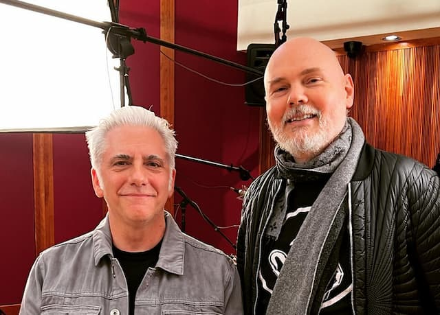

_Billy Corgan num filme do Tim Burton, segundo o MidJourney._

<iframe src="https://anchor.fm/monoestereo/embed/episodes/Aprender-sem-aprender-e1s8b0r" height="102px" width="100%" frameborder="0" scrolling="no"></iframe>

Outro dia, me perguntava: em qual rede social sou realmente viciado? Twitter? Nem tenho mais conta. Mastodon? Raramente visito. Instagram? Fico entediado em alguns segundos. Substack? Nah. Inclusive, é triste, mas já desenvolvi certa fadiga de newsletters.

Meu problema é mesmo o YouTube. E não necessariamente pelos parangolés algorítmicos. Minha área mais visitada do site é a busca. A página inicial é secundária.

É que meu vício vem de antes mesmo da Internet: tutoriais, entrevistas com músicos e artistas, _making ofs_, trajetórias e _timelines_. Essas coisas são as que prendem minha atenção. Desde a época em que o Vale do Silício era feito de cascalho.

Até mesmo com livros, de modo geral, em vez de ler apenas o conteúdo, procuro os detalhes de como a obra foi feita. Meu Airbnb favorito fica no país dos bastidores.

Isso não deixa de ser consumismo, só que num nível mais estrutural. Tipo Claude Lévi-Strauss de C&A. Não que eu esteja necessariamente interessado em aplicar o que aprendi. É um estranho fetiche pelo “como faz?”, “como isso foi possível?”, “como chegamos aqui?”.

Às vezes, essa curiosidade descamba para o orgulho, síndrome de Sherlock (“ah, tá vendo, consegui desvendar o mistério”). Mas também pode esbarrar na compulsão (“Santo Agostinho? Quero entender, embora não seja cristão e nem filósofo”).

Mas eu queria dizer outra coisa.

No imaginário Moderno, a valorização do aprendizado é um tanto ambígua. Dizer que se está constantemente aprendendo é tido como virtude. Simboliza humildade.

Mas, na prática, queremos atalhos e delegar o trabalho sujo para outros. Ou para máquinas. A inteligência artificial é o exemplo mais recente dessa tendência. Dizemos que aprender é nobre. Só que, na verdade, queremos o resultado, não o processo.

Ao longo dos anos, fomos convencidos a nos focar na validação social que a posse do conhecimento supostamente promove. De fato, isso é mais fácil de medir: quantos títulos, fãs, cargos e distintivos você possui. Os prazeres e saberes do treinamento cotidiano são mais nublados e subjetivos.

Até mesmo para nos divertir, preferimos os resultados aos processos. Por exemplo, nos videogames, há quem prefira tutoriais on-line e até [God Mode](https://en.wikipedia.org/wiki/God_mode). Ou turismo, em vez de andar pelas cidades. Rapidinha, em vez de longas preliminares.

Mas ainda há interesse em espiar a ansiedade, as agruras e o tédio do processo de aprendizado. E esse é um dos motivos pelos quais existem os documentários biográficos. Ver o outro aprender causa certo alívio. Não é comigo. Para Freddy Mercury, a rouquidão. Para mim, o Auto-Tune. Tem que haver um jeito mais "esperto" de "chegar lá".

Essa lógica explica a [famosa frase](https://lithub.com/crypto-nerd-sam-bankman-fried-who-just-lost-16-billion-would-never-read-a-book/) do ex-rei do cripto, Sam Bankman-Fried:

> "Se você escreveu um livro, você fez merda, deveria ter sido um post de blog com 6 parágrafos".

A ideia aqui é acumular saber de um modo produtivo e supostamente eficiente. O processo é um obstáculo. Entregue o pacote, não me peça para buscá-lo. E que seja de graça.

É uma busca sem busca. E, provavelmente, leva a uma acumulação de outra coisa, o cansaço. Ou de uma sensação de que tudo é pesado e moroso demais. É que, quanto mais evitamos os processos, mais eles viram fantasmagóricos, assustadores e inconvenientes. “Por que tenho que repetir _isso_ todos os dias?”

Mas… e se lidar com o processo, for, em si, o maior aprendizado? E se, como se diz, o caminho for mais importante que o destino? E se não houver nada além de jornada, jornada e jornada? De que servirá massivas quantidades de conhecimentos acumulados (e esquecidos) eficientemente?

_Rick Beato e Billy Corgan, dois “trutas” de YouTube._

Tudo isso para voltar ao YouTube.

Talvez eu seja apenas um tiozinho, nostálgico da geração X, mas não dá para deixar de reconhecer a alegria do [encontro de dois amantes de processos](https://www.youtube.com/watch?v=nAfkxHcqWKI). No caso, a entrevista que o produtor e YouTuber, Rick Beato, fez com Billy Corgan, do Smashing Pumpkins.

A conversa começa um tanto engessada. Corgan nem olha para os olhos de Beato. Mas, aos poucos, se deixa levar pelo detalhismo do apresentador. Logo os dois se deliciam em falar sobre timbres, pedais e processos criativos. Até mesmo a postura de Corgan muda. E ele admite que sempre acompanha o canal de Beato.

É por essas coisas que o YouTube me vicia tanto. Quando os algoritmos, o sensacionalismo e as controvérsias dão espaço para trocas absolutamente nerds sobre onde conectar fios, que botões girar, etc., aí sou sugado como cabelo debaixo do aspirador.

* * *

### TikTok, o ópio do povo

Antes que alguém pergunte, sim, Tiktok pode ser ainda mais viciante. Especialmente depois que o algorítimo fica devidamente treinado. No meu caso, pode ser um fluxo contínuo de tutoriais, bastidores e bateristas virtuosos.

O TikTok é ainda pior que o YouTube pelo seguinte: cria o hábito de consumir conteúdo em "momentos difusos e informais" — salas de espera, visitas ao banheiro ou entre tarefas. É uma espécie de não-momento, de férias cognitivas.

Então, a pessoa passa a assistir algo. O aplicativo dá a sensação de que você vai ficar ali só alguns minutos. Então, quando você percebe, já mudou de século.

De alguma forma, o TikTok dessacraliza, des-ritualiza, trivializa o consumo de conteúdo. De tão acessível e cotidiano, passa a ser onipresente.

Até experimentei publicar algum conteúdo no TikTok, via web. Mas, obviamente, já desinstalei o aplicativo.
