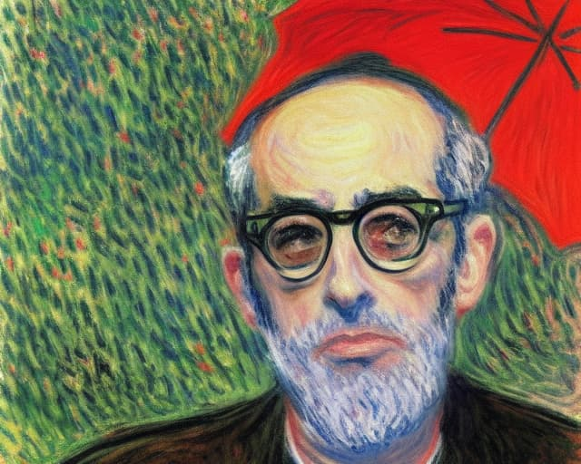
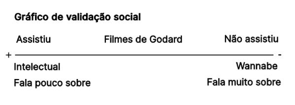

Talvez você tenha ouvido que o cineasta Jean Luc Godard morreu, aos 91 anos.

Talvez também saiba que algumas das suas técnicas narrativas (cortes bruscos e ensaios visuais humorísticos, por exemplo) abriram portas para muito do que se faz hoje na Internet, em especial no YouTube.

Mas Godard ficou famoso mesmo por despertar um fenômeno muito mais curioso.

Como explicar?

Era uma vez, os anos 90 e 2000. Neles, algumas pessoas debatiam sobre quem seriam os verdadeiros e os falsos intelectuais. Não no Twitter, mas nos bares e cafés -- era preciso sair de casa e investir dinheiro nessas atividades.

Curiosamente, uma das métricas para definir essa identidade era assistir e/ou saber falar sobre algum filme de Godard. Veja o gráfico abaixo.

Meio estranho? Enfim. Se você assistia e gostava, supostamente era mais intelectual. Se **fingia assistir e falava muito**, era “wannabe”.

Para alguns, falar sobre Godard era, automaticamente, ser elitista e esnobe. Para outros, não era elitista o suficiente.

Ah, o ser humano, essa coisa pitoresca.

O Godard lá enfrentando seus demônios na França e, do outro lado do Atlântico, vira validador social. Até apareceu numa música da Legião Urbana num mesmo contexto de questionamento de identidade.

Pois achei que essa prática tinha morrido naquela época. Mas ressurgiu na Internet, nos comentários sobre a morte de Godard. E agora ainda ganhou outros coloridos, porque o inimigo atual não é mais o _wannabe_, mas quem se “orgulha de ser ignorante”.

Então temos godardfóbicos, godardcistas, godard lovers, haters, etc. É. Realmente, um autor é uma tela enrugada em que projetamos nossas narrativas.

Raramente pensamos nisso quando começamos nessa “profissão”. Ficamos obcecados em gerenciar rejeição, aprovação e proficiência técnica, mas não imaginamos as complexidades, descontinuidades e absurdos em volta dos “criadores”.

Por isso, insisto que muitas vezes nos conectamos mais com a “energia” do artista do que com a sua obra. Godard era um transgressor. Então muitas pessoas gravitam em torno dessa energia. Para se apropriar dela ou serem repelidas. Os filmes iam para o segundo plano.

No fundo, autoria é uma força da natureza.

Ou algo assim.
