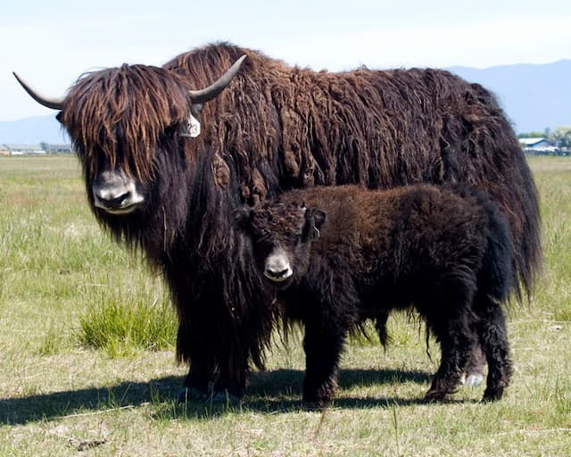

<iframe src="https://anchor.fm/monoestereo/embed/episodes/Barbeando-um-yak-e1en4hm" height="100%" width="100%" frameborder="0" scrolling="no"></iframe>

## Transcrição

Bem-vindo a mais um episódio on-the-road do MonoEstéreo, gravado com algumas limitações técnicas, mas com o mesmo entusiasmo de sempre.

E, por falar em viagem, em 2016, eu tive a oportunidade de passar uns 15 dias na região de Kham, no Tibete. Mesmo com toda a influência da modernização chinesa, ainda é um local bem _roots_, no qual você toma banho uma vez por mês, numa bica d’água na pedra e os banheiros mais sofisticados são buracos no chão — mas com vista para o Himalaia.

Enfim, lá, eu tive a oportunidade de conhecer os [Yaks](https://en.wikipedia.org/wiki/Yak), que são um tipo de boi extremamente peludo. Pense num animal dócil, familiar, mas enorme, preto, completamente sujo (para os padrões ocidentais) e com um pelo duro, denso e cheio de nós.

Agora imagine que você tivesse que pegar um barbeador, mesmo que elétrico, e tosquiar aquilo tudo. Não seria uma tarefa fácil: ainda que você tivesse distúrbio obsessivo compulsivo, ainda que conseguisse criar um plano linear de ação, não conseguiria manter-se linear por muito tempo. A própria tarefa lhe tomaria horas, porque, a cada região barbeada, surgiriam outras por tosar e assim por diante.

Barbear um yak parece uma ideia um tanto maluca, complexa e interminável. E é por isso que virou uma expressão cômica, que alguns programadores usam para descrever aquele tipo de tarefas que você começa e depois se vê metido em inúmeras outras sub-tarefas, que crescem exponencialmente e sugam todo seu tempo e energia vital.

Mas, espere aí, a expressão que usamos para esse tipo de situação não era “buraco de coelho”? Não exatamente. Buraco de coelho é um pouco mais otimista, supostamente prazerosa. Por exemplo: você entra na Internet para pesquisar qual é a melhor geladeira para comprar e, três horas e 50 abas de navegador depois, se dá conta de que está estudando o surgimento da refrigeração nas casas do ocidente.

Barbear Yak é mais frustrante: você tira um tufo e fica preso em um nó. E aí tem que descobrir uma técnica para desatá-lo. E isso te leva a outras subtarefas e outros nós. Barbear Yak é o lado frustrante do Buraco de Coelho. Está mais para ficar preso num labirinto do que perdido no supermercado. Mas há um fenômeno que une os dois: o uso intensivo do tempo. Eu ia dizer perder tempo. Mas não é bem assim: muitas vezes, essas tarefas malucas nos trazem experiências valiosas, nos treinam para situações difíceis. Mas é um treinamento de custo alto, em especial para quem trabalha por hora, como muitos escritores e programadores.

Mas por que estou falando sobre isso? Na verdade, para fazer uma espécie de complemento ao episódio da semana passada. Nele, conversamos sobre a ideia de que toda conveniência também traz em si novas inconveniências. A invenção do barco também é a invenção do naufrágio, lembra? Na verdade, esse é um estilo de pensamento muito antigo, tem pelo menos uns 3 mil anos: pensar sobre a interdependência e a não-linearidade. Tudo o que você faz e pensa, traz inúmeras consequências, que terão ainda outros desdobramentos.

Parece um raciocínio óbvio. Mas, no cotidiano, somos, de certa forma, treinados a ignorá-lo. Isso vai de sair de casa até o gerenciamento dos recursos do planeta. Pensamos em narrativas lineares, se nossas opiniões e atitudes terão consequências boas ou ruins, tudo num ponto de vista extremamente limitado. Mas, na verdade, a metáfora do Buraco de Coelho e de Barbear Yak são muito mais precisas. Quando fazemos qualquer coisa, abrimos diversas consequências, boas, ruins, boas e ruins ao mesmo tempo, influenciamos o futuro, reescrevemos o passado, mudamos a nós mesmos e os outros. Constantemente. É um processo dinâmico. Nunca acaba.

Por isso, toda vez que alguém me pergunta se estou pessimista ou otimista sobre um determinado assunto, eu adoraria poder responder: hmm, na verdade, estou barbeando um Yak.
