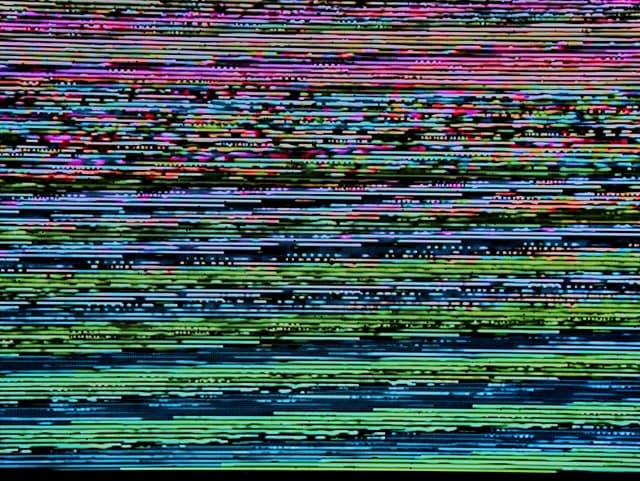

_Foto de [Michael Dziedzic](https://unsplash.com/@lazycreekimages?utm_source=unsplash&utm_medium=referral&utm_content=creditCopyText)._

Nessa semana, ficou evidente que a lógica do cancelamento, que parecia mais ou menos restrita ao universo da Internet, ganhou poderes geopolíticos. Agora, além de governantes questionáveis, temos de nos preocupar com tropas de pessoas estressadas tendo ideias atrás de teclados.

Depois das sanções promovidas pelo governo norte-americano, empresas da _big tech_ se consolidaram como forças paraestatais, cancelando serviços e negócios com a Rússia. Algumas delas agindo radicalmente, para evitar serem consideradas coniventes ou omissas. É o populismo 2.0, "descentralizado", privatizado.

O clima de pressão vai se instaurando até chegar a casos ingenuamente engraçados -- como restaurantes deixando de vender pratos russos -- até situações surreais -- como pessoas rejeitando Dostoiévski e marcas de vodca mudando de nome.

Definitivamente, entramos numa nova fase do uso da web2 como arma. As redes sociais nos acostumaram a viver o dia inteiro sob a influência de fluxos contínuos de manipulação emocional. De tal forma que até mesmo em _lives_ com análises técnicas e intelectualizadas, os chats se parecem mais com embates verbais entre Hoolligans. Cheios de LETRAS MAIÚSCULAS.

Na época da manipulação majoritariamente televisiva, era mais difícil juntar pessoas e organizar manifestações. Hoje, é possível atacar os outros (até em outro país) sem sair do sofá, sem ver o semblante do ser humano que se pretende atingir. Sem ter a chance de sentir uma fagulha de empatia, que poderia destruir o emocionalismo e o comportamento de manada.

Provavelmente, esse é um movimento midiático sem volta. Mas, por sorte, as relações entre humanos não podem ser resumidas àquelas que acontecem via mídia.

Se sobrevivermos relativamente bem às (possivelmente pavorosas) consequências da situação na Ucrânia, precisaremos reimaginar a web2. Não só do ponto de vista legislativo. E duvido que isso implique em usar uma abstração ainda maior, o metaverso.

Talvez, o movimento seja o exato contrário: diminuir a escala e a velocidade, comunicar menos, baixar as expectativas, voltar para as ruas, usar papel, rejeitar periodicidades. Mas, como sempre, só o tempo poderá dizer.

* * *

## Achei interessante

- [Podcast: o identitarismo branco](https://www1.folha.uol.com.br/ilustrissima/2022/03/obra-de-fanon-questiona-identitarismo-branco-afirma-pesquisador.shtml) - Entrevista com o pesquisador Daivison Faustino, sobre o escritor francês Frantz Fanon, um dos pioneiros em analisar o alcance do racismo na intelectualidade ocidental.
- Podcast (em inglês): [Michelle Schusterman conta](https://slate.com/podcasts/working/2022/03/fiction-ghostwriter-michelle-schusterman) como é trabalhar como escritora fantasma na área de ficção. Eu mesmo tenho atuando mais ou menos nessa área, então achei a conversa bem esclarecedora.
- Por falar nisso, [Reedsy](https://reedsy.com/) é uma plataforma para contratar escritores fantasma (em geral, produzindo em Inglês).
- Música: [Teke::Teke](https://www.teketekeband.com/) é uma banda canadense que mistura rock de garagem, vocais em japonês, algo de surf-rock, arpejos que lembram música árabe e instrumentos como flauta e tombone. Se existe algo mais pós-moderno, eu desconheço. [Confira uma apresentação ao vivo aqui](https://www.youtube.com/watch?v=ej0LV6MCteo).
