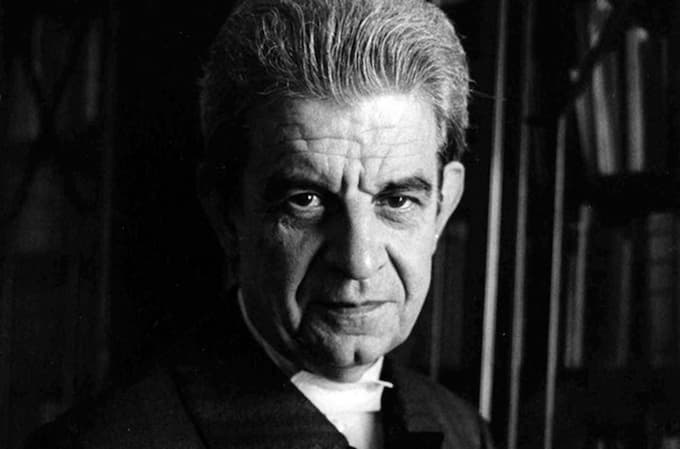

Livro: [Lacan Ainda: testemunho de uma análise](https://amzn.to/3p9wKdu) Autora: [Betty Milan](https://pt.wikipedia.org/wiki/Betty_Milan) Avaliação: 5 (de 10).

* * *

Falar sobre sua própria análise é um pouco como contar sonhos: por mais interessantes que sejam, é difícil empolgar outras pessoas. É que faltam sempre contextos, imagens e até mesmo palavras para expressar esses momentos de, digamos, expansão de consciência.

Tanto o sonho quanto a análise (e a meditação, claro) passam por um mergulho no tédio e também no assombro de descobrir como você funciona, na repetição, nos detalhes cotidianos.

A descoberta de padrões simultaneamente pessoais e universais, a degustação dos paradoxos e a conciliação de dualidades, tudo isso se passa num nível que desafia a palavra e a linearidade.

Assim, quando alguém se propõe a contar os sonhos e a análise, há um certo risco de criar uma narrativa um tanto anêmica ou, pelo menos, desconectada do leitor.

## O que esperar do livro

Tudo isso para reconhecer a coragem de [Betty Milan](https://www.bettymilan.com.br/). No livro, ela não só relata vislumbres de sua análise, como ainda explica alguns dos métodos do seu analista. No caso, apenas um dos mais icônicos do século 20: [Jacques Lacan](https://pt.wikipedia.org/wiki/Jacques_Lacan).

De alguma forma, o texto deve ajudar estudantes de psicanálise. Porém, não deve sustentar o interesse de curiosos buscando causos sobre o controverso Jacques Lacan. Não que o livro seja técnico. Pelo contrário, é um relato muito pessoal sobre a trajetória da, então, jovem adulta Betty Milan.

## Coisa de paulista?

_Lacan Ainda_, é uma interessante demonstração dos desafios que mulheres intelectuais e filhas de imigrantes enfrentavam no Brasil dos anos 70. Mas, especialmente, é um “livro paulista” — se é que isso é existe.

Por um lado, mostra a luta contra as limitações culturais do Brasil, como o machismo e a xenofobia, que já apareciam entre as crianças, em escolas. Por outro, relata a tentativa de encontrar uma terra prometida na França.

E é por isso que esse fenômeno me parece particularmente paulista.

Em São Paulo (e em alguns lugares do Rio de Janeiro), o culto à França já foi tão forte que [parte das elites se cumprimentava em francês](https://www.youtube.com/watch?v=d43rUxA4cyo), nas ruas. Até camponesas holandesas eram “importadas” para se passar por prostitutas francesas de luxo. Sem falar na [missão francesa](https://www.terra.com.br/noticias/educacao/historia/usp-teve-auxilio-de-missao-francesa-em-seu-inicio,1ce23b465aa827f5a9941d1c27b6b19bgttwizje.html) que ajudou a fundar a Universidade de São Paulo.

Assim, é muito compreensível que, no livro, Milan manifeste apego ao Rio Sena e asco ao Tietê. E que tivesse alguma culpa de abandonar tradições indígenas e africanas, que aprendeu de empregados da família e do contato com o norte e nordeste do país.

Além disso, Milan é filha de libaneses. Durante sua criação, teve que lidar com _bullying_, sendo chamada de “turca” (uma ofensa bastante séria, já que os libaneses foram perseguidos pelos turcos). Esse tipo de situação, é claro, cedo ou tarde, aparece na terapia.

## E o Lacan?

Novamente, se você espera um livro de anedotas sobre o psicanalista francês, talvez você se decepcione com _Lacan Ainda_. Ele aparece mais como uma espécie de herói, disposto a enfrentar os padrões de armação e autoengano de Betty Milan. Seja deixando de cobrar ou cobrando duramente pelas sessões. Seja cortando ou estendendo a duração dos encontros, além dos limites genéricos estabelecidos por associações de psicologia.

Aliás, Milan, durante todo o texto, se esforça repetidamente para justificar e explicar esses métodos. É que Lacan costumava interromper as sessões bruscamente, assim que julgasse que o analisando chegara a algum _insight_. Assim, o corte causava um efeito amplificador, já que, naturalmente, a pessoa continuaria pensando sobre o assunto e sobre o significado daquela interrupção.

Enfim, se _Lacan Ainda_ não é um livro particularmente técnico, nem anedótico, traz algo, talvez, mais interessante: o vislumbre do que foi ser mulher, classe-média e filha de imigrantes, na São Paulo (aspirante a cosmopolita) dos anos 70. E que mulher incrível, diga-se de passagem.
