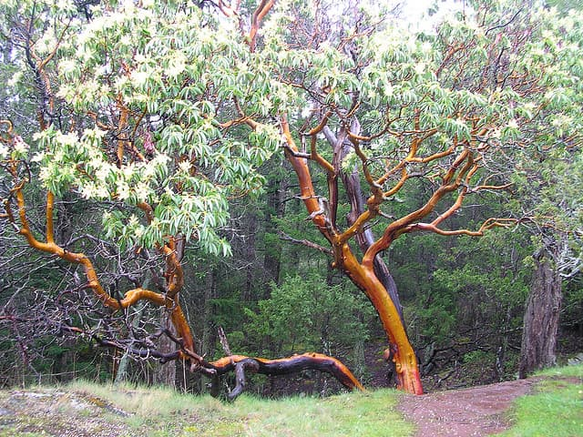

Então, a Apple lançou seu óculos de realidade aumentada, Apple Vision Pro. Eu é que não vou perder minha vida humana preciosa criticando uma empresa zilhonária que está cagando e andando pra minha opinião. Desculpem-me pelo português shakespeariano.

Ainda assim, vale a pena investigar melhor a estética da Apple. Essa que acabou influenciando praticamente todas as outras empresas de tecnologia nas últimas décadas.

Por exemplo, a última versão do MacOS se chama Sonoma. É mais uma referência a locais da Califórnia. Por um acaso, vivo nesse condado. E uma das coisas mais comuns aqui são gigantescas árvores centenárias, [Redwood](https://www.nps.gov/redw/learn/nature/about-the-trees.htm) e [Madrones](https://en.wikipedia.org/wiki/Arbutus_menziesii) — minhas preferidas.

Madrones são suaves ao toque. Parecem usar um desses filtros de “consertar” peles do Instagram. Seus caules são quase alaranjados, incríveis de se observar ao sol da manhã. São cobertos por uma fina camada de material que (até onde sei) pode ser usado pra combater os efeitos alérgicos que as _bad-boys_ locais, [poison oaks](https://en.wikipedia.org/wiki/Toxicodendron_pubescens), causam em alguns humanos.

_Madrones, as dançarinas da floresta._

Isso é Sonoma.

A cidade, em si, tem as costumeiras casas de madeira. A vegetação é abundante por todos os lados. As estradas passam no meio da floresta. São quase como túneis, desviando de troncos enormes.

Ocasionalmente, você passa por uma pequena loja de ferramentas que parece ter saído de algum filme de Sergio Leone. É fácil encontrar _hippies OG_, vivendo em casas isoladas, cercadas de tratores velhos e bandeiras com o símbolo da paz.

Já a estética da Apple está mais pras espaçonaves de [Alien Covenant](https://en.wikipedia.org/wiki/Alien:_Covenant). Mais Seul, na Coréia do Sul, do que Califórnia. Os materiais mais usados pela empresa são vidro, alumínio e plástico. A coisa mais orgânica parece ser camurça ou couro super processado, branco e cinza. No geral, é como um Blade Runner depois da faxina (ou da água sanitária). Hospital, não floresta.

No Apple Vision Pro, os ícones aparecem como que à frente do usuário. Ele precisa reaprender a lidar com o espaço e a gesticular. Mas não é como dançar. Menos ainda, como executar [mudras](https://en.wikipedia.org/wiki/Mudra). Nas fotos de divulgação do produto, o olhar que vemos pelos óculos é o do _multitasking_, quase que a expressão de alguém alucinando.

Você sai do mundo naturalmente imersivo pra tentar experimentar uma simulação de imersão via mundo digital. Em vez de quebrar a quarta parede, a Apple tenta construir a parede perfeita, translúcida e imaculada.

Não estou criticando. Há quem goste dessa estética. Mas quem? Um grupo isolado, capaz de (e disposto a) pagar por esses aparelhos? Pessoas culturalmente apaixonadas pela estética que lembra a da eugenia, na sua busca pela pureza? E que consideram essa prática como “futurística” e empolgante? Não sei.

Não parecem ter muito a ver com os habitantes da real Sonoma. Lá, você encontrará barbudos homéricos, tatuados, na praça, em frente a um supermercado, vendendo roupas usadas. Pessoas que, sorrindo, farão piadas como: “Ei, não enrola, leva essa jaqueta logo que eu quero abrir espaço nessa prateleira”.

Enfim, eu não vejo como a Sonoma de Sonoma vai adotar a Sonoma da Apple. Devo estar errado. Na minha visão restrita, a empresa está se alienando cada vez mais das condições do planeta e da diversidade das pessoas. Talvez seja efeito colateral daquele _campus_ isolado, cheio de vidro e concreto.

Mas posso garantir: se é pra abraçar alguma coisa, eu ainda prefiro uma Madrone do que um ícone.
