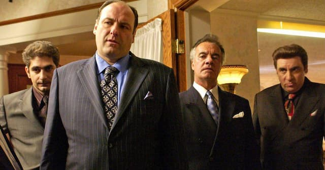

_Os Sopranos. Tudo em família._

Alô, como você está? Eu vim votar em SP. E fazer uns favores para a família.

Curioso: ao usar essa frase, automaticamente penso em filmes de mafiosos. Vejam o tamanho da minha formatação cultural.

Acaba que minha tarefa principal é lidar com a burocracia de estar na casa dos outros. É que minha família é um tanto obsessiva. Você vai fazer um arroz e parece que vai cuidar de um reator nuclear: “não toque nisso, cuidado com aquilo, verifique aquele procedimento”. É uma tensão constante.

Meu pai chegava a ser engraçado. Lembro-me de andar pela casa sentindo seu olhar. A qualquer momento viria uma correção: peguei a faca do jeito errado (o que poderia causar um acidente), esqueci de fechar uma porta (assalto), etc. Boas intenções, mas um jeito sufocante de viver.

Obviamente, desenvolvi uma sensibilidade para, como se diria em programação, “If This, Then That”. Foco nos processos, em como as coisas se encadeiam para funcionar e, em especial, o desejo de evitar riscos.

Tanto que, outro dia, me acusaram de “andar nas sombras”, agir como um fugitivo. Em tese, ninguém sabe exatamente o que estou fazendo ou pensando. E não deixa de ser verdade. Vou trabalhar nisso.

Esse tipo de comportamento causa muita insegurança e estresse nos controladores. Porque **o desejo de controle é algo sem fim**: quanto mais você organiza, mais precisa organizar, mais buracos acha nas regras, mais energia gasta na manutenção do seu estilo de vida.

E, de repente, surge alguém que, aparentemente, segue todos os protocolos, mas parece não acreditar neles. Ou pior: apenas tolerá-los educadamente.

Isso reativa a **culpa do controlador**. Afinal, boa parte dos controladores teme ser, na verdade, um torturador. Muitos têm a pele extremamente fina. E acabam precisando criar uma parede de justificativas e racionalizações para segurar o peso da sua personalidade.

Enfim, o pessoal aqui é legal. Eu é que sou cheio de teses. Seguem os links da semana, antes que eu invente outras.

* * *

## A outra hora do diletante

Diletantismo é legal, ruim ou apenas confuso? [Benjamin Erret analisa o fenômeno](https://wit.substack.com/p/the-wits-guide-to-dilettantes) e conta um pouco da história dessa atitude diante do conhecimento.

* * *

## Podcast

[Como a sociedade nos sexualiza](https://podcasts.apple.com/us/podcast/how-society-sexualizes-us/id1081584611?i=1000580295957), no Vox Conversations. Os sofrimentos e desafios cotidianos de ter que gerenciar uma identidade. Em especial quando ela é baseada em conceitos sobre a sexualidade. É um assunto infindável. Quanto mais exploramos, mais questões surgem.

* * *

## Pessoas e ideias

- [Documentário](https://youtu.be/hsQi4ouYYzI) sobre o encontro do cineasta Jean-Luc Godard com a atriz Anna Karina e os filmes que surgiram a partir dessa relação amorosa conturbada.
- [Frank Zappa ajudou a inventar o streaming?](https://www.uol.com.br/splash/colunas/leonardo-rodrigues/2022/09/15/quem-inventou-o-streaming-e-desmantelou-a-musica-frank-zappa-tem-culpa.htm)
- [A arte nostálgica da classe média milennial](https://www.youtube.com/watch?v=LcCTnCP91bo). Acaba que é uma interessante análise dos valores e expectativas da geração que está no poder via tecnologia.

* * *

## Música

- [10th Street](https://mightyeye.bandcamp.com/releases) é o disco de um coletivo de músicos de Nova Yorque focados em recriar o funk de _big bands_, no estilho trilha sonora de filmes _blaxploitation_. As melhores faixas são [E.A.R.L.‘s Theme](https://mightyeye.bandcamp.com/track/e-a-r-l-s-theme), [Phill’s Groove](https://mightyeye.bandcamp.com/track/phils-groove) e [Moodie’s Basement](https://mightyeye.bandcamp.com/track/moodies-basement).
- De vez em quando, me vejo atraído por um _soul_ com sintetizadores oitentistas. Tipo [Chrome Springs Eternal](https://mofunkrecords.bandcamp.com/album/chrome-springs-eternal), de XL Middleton. Suas músicas poderiam servir de base para os primeiros rappers, como o Kurtis Blow.
- Rock baseado em guitarras, misturado com sons do Oriente Médio? Não, não é o King Gizzard. É o [Al-Qasar](https://alqasar.bandcamp.com/album/who-are-we), cujo disco “Who Are We?” conta com participações de Jello Biafra (Dead Kennedys) e Lee Ranaldo (Sonic Youth).
    
    
    
- Esse conceito deu um _bug_ na minha cabeça: _surf-goth music_. Se liga na capa do [disco, acima](https://desmonddoom.bandcamp.com/album/surf-goth-ep). [Desmond Doom tem um canal no YouTube](https://www.youtube.com/c/DesmondDoom). Está mais para gótico _lo-fi_. Mas só a ideia já valeu.
    
- [Essa faixa](https://davegraney1.bandcamp.com/album/dave-graney-clare-moore-in-a-mistly) do australiano Dave Graney dá aquela perturbadinha tensa gostosa, tipo Sonic Youth. Mas, de repente, aparecem umas micro progressões harmônicas semi-alegres que não fazem o menor sentido. É como se prometesse uma resolução e puxasse o tapete rapidinho. Interessante.
- Que aula de produção, timbragem e mixagem, esse disco do [Klawo](https://klawo.bandcamp.com/releases). Preste atenção na ambiência dos instrumentos acústicos. Espaço e dinâmica são coisas incríveis.

* * *

## Ferramentas

- Precisa embedar tweets, mas não quer destruir a performance do seu site? Use o [Bedkit](https://bedkit.app/). Ferramenta criada pelo mesmo desenvolvedor do sistema de newsletters [Buttondown](https://buttondown.email/).
- Finalmente, um [gerador de QR Code](https://www.qrcode-monkey.com/) bacana.
