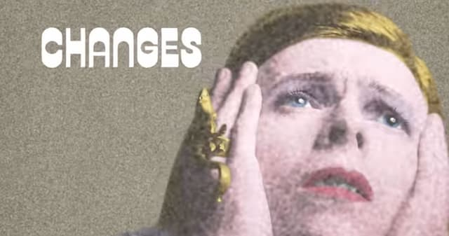
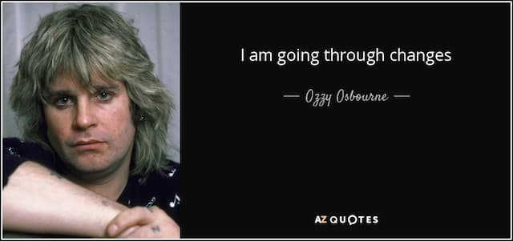

_David Bowie, ch-ch-changes._

Depois de dois anos de produção contínua de newsletters, podcasts e [até vídeo](https://www.youtube.com/c/eduardofernandex/), vou tirar um mês de férias. Se você chegou agora, confira as [edições anteriores](https://eduf.me/newsletter).

Confesso que ando meio **cansado de Internet**. E isso acaba se refletindo na criação, que fica mais mal-humorada, arrastada, repetitiva e superficial. Então, está na hora de uma “pausa disruptiva”.

E, ahá, chegamos ao nosso assunto principal.

Nesta semana, um post de [Adam Mastroianni](https://experimentalhistory.substack.com/) viralizou no Hacker News. Chama-se “[As Cinco Ferramentas do Design Hedônico](https://experimentalhistory.substack.com/p/the-five-tools-of-hedonic-design)”. O texto trata de mais um daqueles termos que psicólogos contemporâneos criam para reciclar ideias antigas. No caso, “[esteira hedônica](https://en.wikipedia.org/wiki/Hedonic_treadmill)”.

Ou seja: “we can’t get no satisfaction”. Por melhor que seja a situação, sempre buscamos o próximo platô de prazer. É como um ciclo: hábito, tédio, comichão de identificar defeitos, criação de novos objetivos.

Mastroiani sugere cinco estratégias para suavizar esse mecanismo:

1. **Interrupções** - quebrar suas atividades em tarefas menores e criar pausas entre elas. A ideia é interrompê-las para “refrescar” a atenção e o interesse.
2. **Encerramento** - finalizar um projeto antes que ele fique chato. Assim, cria-se uma sensação de “quero mais”, em vez de “tive o suficiente”.
3. **Variações** - criar formas diferentes de fazer a mesma coisa.
4. **Reciclagem** - quando sabemos o momento certo de parar, surge a nostalgia e a possibilidade de _revivals_ futuros.
5. **Picos e finais** - não somos bons em analisar o encadeamento de processos. [Tendemos a memorizar apenas os melhores ou piores “momentos de pico” das atividades](https://journals.sagepub.com/doi/abs/10.1111/j.1467-9280.1993.tb00589.x?casa_token=ayr5Kf_FekgAAAAA%3AFNZ9vd-OFuwj_RgPtSMrGRn0S7sfnBBBOBJ1h0LghDKMiLkJvut6S81Swj67OzVDBXiGxKoQA26S&journalCode=pssa). Os finais são especialmente importantes. Algo até pode começar mal, mas é bom que **termine bem**, porque é disso que nos lembraremos.

Enfim, esse é um velho senso comum aplicado universalmente. De exercícios físicos até religião. O que me lembra do conceito de [Zona Autônoma Temporária](https://en.wikipedia.org/wiki/Temporary_Autonomous_Zone), do polêmico Hakim Bey. E, claro, da análise da **impermanência**, que os budistas vêm fazendo há milhares de anos.

Nossas atividades estão em constante transformação. O próprio início já contém a decadência. [O sucesso é o começo do fracasso](https://eduf.me/sucesso-pode-ser-o-comeo-do-fracasso/). Por mais estáveis que se pareçam, elas são formadas por partes interdependentes que também se transformam e se recombinam.

O problema da esteira hedônica é que **acreditamos nela**, achamos que **precisamos mudar**. Não reconhecemos o **processo mental** de deterioração do entusiasmo e da criação de novos desejos. Apenas queremos seguir o fluxo da ansiedade e do descontentamento contínuo.

Daí os limites das ideias de conservadorismo e de revolução. Como tudo está em constante mudança, a “disrupção” é o estado natural. Assim, também não há como ser conservador _strictu sensu_.

Quem manda aqui é a interdependência, que é tão vasta e complexa que pode tornar reacionários em revolucionários e vice-versa.

O que nos resta é entender os fenômenos como **Ilusões Temporárias Aparentemente Autônomas**. Fazer nossas apostas, identificar e corrigir as falhas rapidamente. E saber quando **não agir**, quando esperar. Aqui não há espaço para simplificações: parar também pode ser revolucionário.

Enfim, tudo para justificar minhas férias. Que horror. Até 14 de setembro. Cuide-se.

PS -- A newsletter para apoiadores ainda deve chegar nessa sexta.
