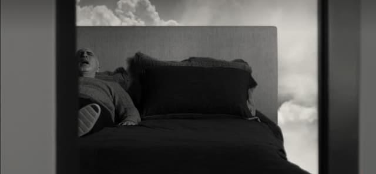

_Hey, ho. Let’s go. Strawberry fields forever._

😮 Afe! O que aconteceu? O que a Texto Sobre Tela está fazendo no Substack?

Já respondo. Antes, vamos dar umas voltas.

* * *

## Revolução ou reforma?

Em relação à prática diária da criatividade, há (basicamente) duas atitudes:

- **Beatles** - Reinventar-se constantemente. Procurar novas fronteiras. Abandonar as anteriores. É uma postura, digamos, mais revolucionária.
    
- **Ramones** - Reformar uma fórmula ao longo dos anos. Aplicar mudanças com muita parcimônia.
    

Recentemente, descobri uma terceira: você deseja ser (ou acha que é) Beatles. Mas, na prática, é Ramones.

Consciente ou inconscientemente, alimenta essa inquietude, curiosidade e desejo por mudança. Porém, os hábitos e a correria do cotidiano levam-no ao reformismo.

É mais ou menos o que acontece comigo.

Esse não é (necessariamente) um julgamento de valor. São atitudes diferentes, com seus pros e contras.

O interessante é notar esse estado intermediário **entre o desejo e a prática**. Ele pode levá-lo a certa ansiedade (“desequilíbrio nos ventos”, diriam alguns budistas). E daí você sai trocando os móveis da casa, muda de visual e até… migra de plataforma.

## Espelho feito de letras

Escrever (mesmo que sobre tecnologia) é um estado de desvelamento contínuo. Como jogar uma bola de tênis na parede – ela quica de volta. Você escreve e é escrito pela escrita.

Começa o texto achando que ele será anarquista. Quando vai revisar, percebe que é positivista. Três dias depois da publicação, questiona se foi você mesmo que digitou aquele diabo.

**A criação é o ato arrogante mais humilde que existe**. Você se dispõe a ser um tipo de organizador. E, assim que começa a manejar as ferramentas, descobre-se o ente mais desorganizado que existe. A cada certeza, dez dúvidas.

A tela do computador te suga e te expele. Você basicamente reage ao próprio processo de criação. Assim, _compor_ um texto é um tanto como quebrar um para-brisa (abrem-se inúmeras fissuras) tentando colá-lo simultaneamente.

Ao extrair sentido desse processo, você cria narrativas a respeito de si. E estas mudam constantemente. É um **fractal recursivo**, para usar um termo obscuro.

## Mas e o Substack?

Está vendo? Era para explicar a migração pro Substack e olha onde fui parar.

Primeiro: **nada muda**, tanto para assinantes premium quanto para os gratuitos. Preços, entregas, tudo igual para quem já assinava.

E continuo seguindo a **estratégia centrífuga de publicação**, [conforme expliquei aqui](https://www.youtube.com/watch?v=COq2qCJ7NrM). Se o Substack mudar as regras, tudo está [no meu site](https://eduf.me/). Zona Autônoma Temporária.

A ideia da migração surgiu de dois desequilíbrios: nos ventos e nas finanças. O antigo sistema de publicação começou a ficar pesado, confuso e… caro. Como minha operação ainda não é sustentável, precisei baixar custos.

No começo, pensei em mudar para o [Beehiive](https://www.beehiiv.com/), um excelente concorrente do Substack. Mas também sairia caro. Então, se tolero [YouTube](https://www.youtube.com/@edufme) e [Anchor](https://anchor.fm/monoestereo/), por que não o Substack? Basta ter cópias do material no meu site.

E, claro, se você realmente quer receber o material extra, mas não pode pagar por ele, é só me pedir, respondendo a este e-mail. Nem precisa se justificar.

Enfim, espero que você não se importe com a mudança e continue seguindo a newsletter.

* * *

E, agora, sim, vai começar a edição de hoje. Seguem os links.

* * *

_O terapeuta Phill Stutz, boquiaberto, dormindo nas nuvens._

## Filmando o terapeuta

Hesitei bastante antes de ver [O Método de Stutz](https://www.netflix.com/title/81387962), documentário que o conhecidíssimo comediante [Jonah Hill](https://en.wikipedia.org/wiki/Jonah_Hill) fez sobre seu terapeuta, Phil Stutz.

Tendo passado por algumas experiências estranhas com psicólogos (um, inclusive, me deu _ghosting_), não quis ler absolutamente nada sobre Stutz e [suas ferramentas](https://www.thetoolsbook.com/), como preparação. A ideia era assistir ao filme como se fosse ficção. Afinal, num certo sentido, sempre é.

Acaba que fui fisgado pelo tom constrangedor, humorístico, vulnerável e meio absurdo do documentário. Stutz tem 74 anos, convive com o mal de Parkinson, é um piadista e não exatamente elegante.

Um dos momentos mais tensos acontece quando o terapeuta brinca que faz sexo com a mãe de Hill. No outro dia, o diretor coloca Stutz na frente dela. E lhe conta o ocorrido. Na frente das câmeras. Cringe é pouco.

O filme começa meio como “seita”. Mas, aos poucos, se dissolve em constantes golpes contra a quarta parede. Torna-se uma relação (teatral) de desnudamento mútuo, mais do que um comercial das ideias de Stutz. Só por isso, já meio que vale a pena.

Sobre o trabalho do terapeuta, em si, deixo para especialistas julgarem.

* * *

## Tech

- Navegadores são um dos poucos tipos de aplicativos nos quais desconfiamos de inovações. Em um [perfil para The Verge, o desenvolvedor veterano Darin Fisher](https://www.theverge.com/2022/10/31/23428862/arc-browser-web-company-darin-fisher), ex-Netscape e ex-Google, conta como resolveu enfrentar o conservadorismo desse mercado e apostar na startup The Browser Company, que tenta [reinventar a roda](https://www.theverge.com/23462235/arc-web-browser-review) com o [Arc](https://arc.net/).

## Ferramentas

- [Nicheles](https://nicheless.blog/) é mais uma plataforma super minimalista de micro-blogging. É como se o [Write.as](https://writefreely.org/) e o Tumblr tivessem um filho.
- [Feedle](https://feedle.world/) é uma ferramenta de busca (sem anúncios) focada em blogs e podcasts. Não, não é como o velho [Technorati](https://en.wikipedia.org/wiki/Technorati). Mas é possível “assinar” (via RSS) os termos procurados.
- [Pixel Vibe](https://pixelvibe.com/) é tipo o [Unsplash](https://unsplash.com/), só que para imagens geradas por Inteligência Artificial.

## Cultura

- Que o Nepal é um dos locais mais singulares do planeta, isso é fato. [A começar pelos aeroportos](https://www.youtube.com/watch?v=SCMdb-EcsjY). Mas, [segundo a BBC](https://www.bbc.com/future/article/20220804-kusunda-the-language-isolate-with-no-word-for-no), o país hospeda uma linguagem que não usa a palavra não. E nem possui conceitos dualistas para direita e esquerda. Se entendi direito, as pessoas se entendem por relatividade, contextos e probabilidades. Parece coisa de Jorge Luis Borges.
- Se o escritor norte-americano, Kurt Vonnegut, estivesse vivo, faria 100 anos em novembro. [Perfil dele na The Critic](https://thecritic.co.uk/issues/november-2022/remembering-an-effervescently-affable-man/).

## Música

- Playlist só com bandas pós-punk e darkwave brasileiras? [Temos](https://www.youtube.com/watch?v=dGt8RvvcdtA).
- [Irresistível reedição de um compacto](https://nyctrust.bandcamp.com/album/just-love-one-another) de 1971 do The Jungle Rat USA, uma daquelas bandas de funk / soul que fariam bonito no programa de rádio [Downtown Soulville](https://wfmu.org/playlists/SV). Isso sim é que é black friday.
- Não sabia que o baterista Damon Che, criou um [canal no YouTube](https://www.youtube.com/@DonCaballeroOfficial) para a clássica banda de math-rock Don Caballero.
