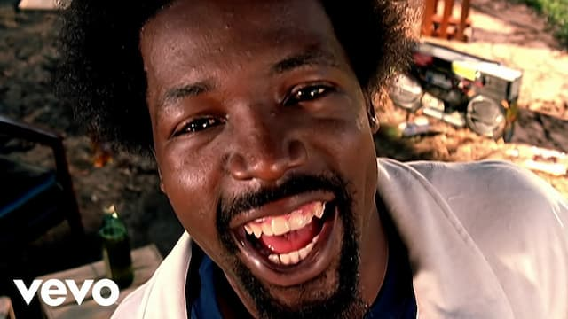

_Eu estava tentando performar, then I got high._

Hoje, 20/04, supostamente é um dia celebrado pelas pessoas consumidoras regulares de maconha. Ainda que não seja uma delas, tive lá minhas experiências com a erva. Só não me lembro bem de quando.

De qualquer forma, certa vez, estava nos EUA, num desses estados que permitem o consumo recreativo da substância. Neles, o capitalismo já assumiu o controle (tanto que se fala até em [Silicon Valley da Cannabis](https://www.youtube.com/watch?v=GhTYI3DeNgA)). Adeus, romantismo.

No meio de infinitas bugigangas e produtos canábicos questionáveis que uma loja oferecia, resolvi experimentar um refrigerante turbinado com THC. Parecia ser uma dosagem mínima. Então, sorvi o unguento de maneira bem casual.

Na sequência, teria que jantar com quatro pessoas. O que eu não sabia era que duas delas já haviam comido quantidades bem maiores da erva. Ou seja, apenas um de nós estava “normal”. Para facilitar, vamos chamá-lo Bob.

Preciso confessar o motivo de ter tomado o refrigerante: eu imaginava que a conversa durante o jantar seria extremamente tediosa. O problema não era exatamente escapar dela, mas de outro problema. É que, quando entediado ou socialmente ansioso, tendo a sequestrar conversas. Encarno o exú-Wikipedia.

Em especial depois da solidão da pandemia, todos estamos descalibrados socialmente. Assim, a prática de monopolizar conversas se popularizou ainda mais. E seguindo diversos modelos:

- **Entertainer** - a pessoa não consegue parar de se mostrar culto e "interessante".
- **Ativista** - a pessoa não para de denunciar atrocidades de alguma empresa ou governo (também conhecido como “doom scrolling sem scrolling”).
- **Curador** - a pessoa dá "dicas" não solicitadas o tempo todo.
- **Eterno Divã** - a pessoa detalha todos os seus traumas de infância, onde quer que vá, para qualquer interlocutor.
- **Autodepreciativo** - a pessoa ressalta (comicamente ou não) todos os seus maiores defeitos.
- **Amazon** - a pessoa vem, entrega uma opinião e depois abandona a conversa, deixando de prestar atenção nos outros e/ou fugindo para o Planeta Celular.

Enfim, acontece. Paciência. Empatia. Fora que, hoje, é muito difícil ouvir. Há todo um treinamento cultural e tecnológico para imediatamente reagir, performar e compartilhar. Silêncio é quase uma ofensa ou empecilho.

Mas onde é que isso se conecta com a cannabis? Já explico.

Quando chegamos ao jantar, booom. A coisa bateu. Cada um de nós estava num estágio diferente de conexão canábica. Uma das pessoas virou uma espécie de emoji. Este aqui: 😁. Às vezes, migrava para este: 🤣.

O problema era que outra, já no papel de _performer_, foi para o extremo oposto: resolveu compilar e expor todas as desgraças do mundo, de uma só vez. Imagine a situação: uma tentando provar que a Guerra da Ucrânia é o começo de uma era de trevas prevista por Nostradamus. Outra, congelada num sorriso de emoji.

E eu? Hmm. Eu estava no modo confortavelmente passivo, feliz ao perceber que o THC tinha freado minha necessidade de gerenciar a conversa. Havia imensos silêncios constrangedores, frases do mais puro "cringe", mas, por mim, tudo bem, deixa para lá, beleza.

Quando o silêncio se prolongava demais, eu identificava como problema, mas não reagia. Então, Bob surgia e salvava o jantar. Ele se esforçava para fazer perguntas pertinentes: “é mesmo? E como Nostradamus descreveu as bombas nucleares?” Guerreiro.

Do meu lado, só conseguia pensar: "Te amo Bob! Como você é colaborativo!" Era um imenso alívio não ter que performar, comentar ou compartilhar.

Hoje, longe do THC, me ocorre que, talvez, o Bob é que estivesse em apuros. Eu poderia ter sido menos omisso. Mas, sei lá, observar e ficar quieto foi tão relaxante e esclarecedor.

Talvez seja até uma arte perdida, em meio a tantas empresas garimpando cada gota de conteúdo, transformando personalidades, deficiências, gafes, excentricidades, qualquer coisa, em produto.

O que me leva a acreditar que, afinal, meu uso da cannabis naquela noite não foi recreativo. Foi terapêutico. Sou grato e tal. Mas prefiro não precisar de substâncias para isso. Produto para calar a boca? Só me faltava essa.
