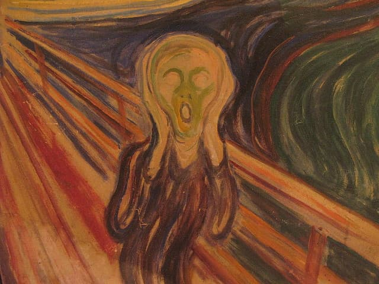

<iframe src="https://anchor.fm/monoestereo/embed/episodes/Dia-da-sofrncia-e1lvake" height="102px" width="100%" frameborder="0" scrolling="no"></iframe>

Hoje é [Chokor Duchen](https://www.rigpawiki.org/index.php?title=Ch%C3%B6khor_D%C3%BCchen). É uma data comemorativa pros budistas. É o aniversário do dia em que o Buda histórico deu seu primeiro ensinamento, há mais de 3 mil anos. E, como se sabe, ele começou falando sobre sofrimento. Que, coincidentemente, era o assunto de hoje mesmo.

Nossa cultura não nos prepara pra lidar com o sofrimento. Provavelmente, essa é uma das maiores lições deixadas pela pandemia.

Na escola, eu, pelo menos, aprendi alguma matemática, a visão branca e europeia da história e até uns rudimentos de ciência.

Mas, feliz ou infelizmente, nunca estudei matérias como “lidando com pensamentos obsessivos”, “estágios da ansiedade”, “como pedir ajuda da comunidade”, “como estabelecer limites”, “como se recuperar de críticas injustas” ou “como pensar fora da sua bolha”.

Perceba que eu disse “feliz ou infelizmente”. É que eu não sei ao certo se nossa educação tecnicista, baseada na cultura do atropele, ou seja atropelado, conseguiria sequer imaginar boas formas de falar sobre saúde mental. É capaz que essa educação mais atrapalhasse do que ajudasse.

Ou melhor: provavelmente, a gente prefere delegar o gerenciamento do sofrimento pro mercado. Tipo criar aplicativos, drogas milagrosas, comprar livros com “dicas”, etc.

Ou delegar pra indústria do entretenimento. Postar selfies de “miséria chique” no Instagram, arranjar briga no Twitter, pagar caro em eventos pra ver atores gringos entediados, passar o dia escrolando no TikTok. E por aí vai.

Pra mim não funciona. Mas quem sou eu pra julgar?

No mundo tecnicista, a gente tende a pensar em sofrimento como uma espécie de falha. Algo deu errado. Como assim, não estou feliz? E o passo seguinte é culpar alguém. De modo geral, culpar si mesmo: “eu não me esforcei o suficiente”. O que até pode ser verdade, mas é apenas **um aspecto** do assunto.

Muitas culturas além da nossa conseguiram entender que sofrimento é algo sistêmico e sazonal. Os ensinamentos budistas, por exemplo, começam a partir dessa máxima: “conheça o sofrimento”. Aprenda como ele funciona, em vez de apenas sair correndo desesperado.

Em outras palavras, sofrimento faz parte. Não tem como fugir, mas é possível aprender a conviver com ele, a extrair conhecimento dele, a processá-lo de diversas formas.

É como a mudança das estações, como a gravidade, como o envelhecimento e a morte. Você pode se abrigar, pode usar um avião, pode se exercitar e cuidar da saúde. Mas, cedo ou tarde, novas cepas dos problemas vão surgir.

A gente gera sofrimento ao buscar felicidade e gera felicidade no meio do sofrimento. Parece que a gente é bem ineficiente na hora de distinguir uma coisa da outra. De qualquer forma, o sofrimento nem sempre é absoluto, rígido e impenetrável.

Então, aqui na minha mente de _podcaster_ palpiteiro, parece que um dos treinamentos mais eficazes que poderíamos fazer, desde crianças, **é aprender a não atrapalhar a nós mesmos**.

E uma das maneiras mais eficientes de se sabotar é criar narrativas megalomaníacas do tipo: só acontece comigo. Ou seriados: hoje pisei num prego, meu carro pifou na semana passada, as pessoas me odeiam, minha família é um caos, meu emprego é um lixo etc.

Espera. Cada coisa é uma coisa. Quer dizer, ao mesmo tempo, todas elas se conectam. Mas, ok, vamos chorar, beleza, ninguém aqui é feito de alumínio e com chip de última geração. Mas vamos por partes. Conhecer o sofrimento. Essa é uma das mensagens do Chokor Duchen.
