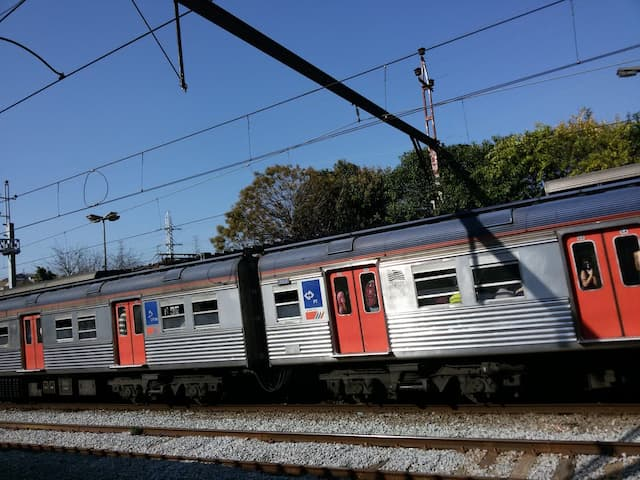
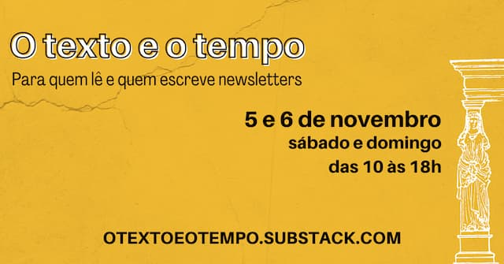

_Trem da CPTM, na periferia de São Paulo._

São Paulo, 02 de outubro de 2022, 8 da manhã.

//Plim.//

Aqui estou mais um dia, sob o olhar entediado do vigia.

//Plim.//

Diferentemente do [clássico dos Racionais MC's](https://www.youtube.com/watch?v=MZzl8qYF_qY), o guarda era apenas o da [CPTM](https://www.cptm.sp.gov.br/). Eu partia de Jundiaí para votar em Pirituba – bairro do noroeste de SP onde cresci e vivi por 28 anos.

Apesar de morar há 15 na Serra Gaúcha, nunca transferi minha zona eleitoral. Alguma parte de mim não aceita romper o vínculo com a periferia de SP.

No trem, meu narrador compulsivo interno queria transformar a votação num _road movie_. Ou melhor: _rail movie_. Mais uma vez eu teria de escorrer pelas veias ferroviárias abertas daquele pedaço de América Latina.

Novamente observaria a velha dinâmica entre homem e natureza. O mato tentando retomar o espaço roubado pela CPTM. As árvores abraçando os cabos de eletricidade. Fungos criando padrões no concreto. Mais um pedaço de plataforma corroída pelo tempo.

A dinâmica humana também surge nas incoerências de arquitetura e design. As estações são um testemunho do convívio entre diferentes eras da tecnologia e das mudanças de valores estéticos. Em menos de meia hora, você passa da art déco para a Bauhaus. Do grafite evangélico para a propaganda esquecida num display sujo.

E a arqueologia não para. Desenterra figuras políticas esvaziadas de lembrança, como Baltazar Fidélis e Franco da Rocha. Expressões indígenas descontextualizadas, como Botujuru (“Boca dos Ventos”) e Perus (“à força”). Ou nomes singelos como "Vila Clarice".

Dentro do trem, eu me pegava no velho costume de temer pelos meus pertences e de desconfiar de todas as pessoas. Viéses, preconceitos e hábitos.

Mas, agora, o medo era diferente. Antes, temíamos que roubassem nossos celulares. Hoje, que roubem nossas mentes.

A pessoa à sua frente pode estar lendo (ou ouvindo) mensagens de grupos de extrema-direita. Que tipo de desinformação passa por aquele fio e vai para os ouvidos?

Observando minha própria mente, tudo era julgamento e construção de personagens. “Aquele ali só pode ser bolsonarista. Deve estar a caminho de cometer um crime contra o planeta”.

Respiro. O pensamento volta para onde saiu.

Essa é tragédia que ideologias extremas causam: mesmo os que tentam não ser adeptos acabam contaminados. Afundam no clima de desconfiança, animosidade e medo.

A velha paranoia do _sapiens demens_ se amplia ainda mais. Então, é preciso lidar com a _metaparanoia_ de ter de ficar atento aos pensamentos extremistas surgindo na própria cabeça.

Como olhar para as pessoas e ouvir seus medos? Como enxergar além da bravata? Em especial porque ela é constantemente ampliada pela desinformação cotidiana circulando via tecnologia. Como conseguir rachar a parede de raiva e de discursos simplistas?

Infelizmente, não será agora, nos 45 do segundo turno, que seremos capazes de bloquear o desejo de consumir e espalhar desinformação. Isso foi cultivado por décadas. O desejo pela conveniência e pelo “gratuito” começa a cobrar sua conta.

“Leia essa revista para parecer mais inteligente”, chame aquele “especialista” para falar no telejornal, “você só tem 5 minutos para dizer o que precisa”, “tem que caber em 100 palavras”, “para vender, é preciso criar um produto que fale para a emoção das pessoas”, “seja espontâneo”, “consiga mais seguidores”, “crie um aplicativo _formador de hábito_”. “Grite mais alto!”

Ao longo dos anos, [houve um cultivo sistemático de ambientes propícios à proliferação da extrema-direita](https://www.youtube.com/watch?v=EcPFRq8wo-I). Uma composteira do ódio.

Agora, nos vemos praticamente obrigados a usar as mesmas ferramentas para remediar uma tendência mundial de radicalização. No processo, somos contaminados pela urgência, velocidade e lógicas da comunicação em rede.

A ausência de auto-reflexão, a recusa a olhar “para dentro”, é o que nos torna, também, extremistas. E amplia a **paranoia mútua**. Nos transforma em criadores de narrativas, sozinhos, isolados, imaginando de onde virá a próxima tragédia. Daí a necessidade de procurar uma comunidade de paranoicos para chamar de sua. Ou um herói salvacionista… o mito, o macho alfa.

Não. Nós somos a vida, como as árvores, os fungos, o tempo. Ninguém precisa se limitar à pseudo organização do pensamento de aço e concreto.

Enfim, no sistema de som do trem, ouço um _lick_ de guitarra, seguido por uma voz feminina: “estação Pirituba, desça pelo lado esquerdo do trem”. Pelo menos isso, a saída não é pela direita.

* * *

## O unboxing da sua inbox!

Não se esqueça, nos dias 5 e 6 de novembro vai acontecer [O Texto e o Tempo](https://otextoeotempo.substack.com/). Vou dar uma oficina sobre _indie web_ e como produzir conteúdo que vá além das redes sociais. Não me deixem sozinho, tenho problemas com rejeição. Confira a [programação aqui](https://otextoeotempo.substack.com/p/programacao), que ainda tem Aline Valek, Gaía Passarelli, entre muitos outros.
