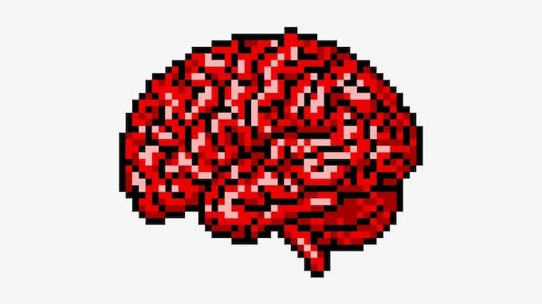

Pelo jeito, nessa semana, serei pautado novamente pelas redes sociais. É que preciso desenvolver melhor algumas ideias do [episódio sobre o Instagram do meu podcast](https://eduf.me/saude-mental-no-instagram/).

## O raciocínio

- Sim, **é importante que a cultura se autocorrija constantemente**. Ou seja, que altere suas metáforas, pronomes, amplie sua capacidade de perceber que a linguagem cotidiana pode exprimir racismo, especismo e viés político.
- Porém, não podemos ser ingênuos. O processo de correção também revelará ideologias, pontos-cegos e interesses políticos.
- Toda mudança gera consequências, por vezes inesperadas. Ou até pioram a situação inicial. Ainda assim, isso é o que os humanos fazem: tentar até acertar.

Resumindo: sim, precisamos regulamentar as redes sociais. Porém, isso não será o suficiente. E pode ser igualmente perigoso.

## Fortalecer os "usuários"

Tentar APENAS regulamentar é como colocar couro no planeta inteiro em vez de usar sapatos. Ou seja: uma tarefa ineficiente e infinita.

Assim, é importante **também** fortalecer as pessoas para lidar com situações de conflito. Ajudá-las a ter auto-eco-conhecimento (conhecimento de si, da dinâmica da sociedade e da inter-relação entre ambos).

Lembra da velha e boa educação? Afinal, esse é o assunto aqui. As redes sociais não podem assumir o papel das escolas e educadores.

## Dando um exemplo

Não basta combater a prática do bullying. É preciso criar redes de suporte psicológico, tanto para a vítima quanto para o algoz – que, geralmente, é vítima de outro bully, em casa. Ou seja: partimos do pressuposto de que todos os problemas são multifacetados e possuem várias possibilidades de _intervenção_.

As redes sociais podem ser um bullying institucionalizado. Ou melhor, a exploração capitalista da lógica do bullying. E isso não vale apenas para o Instagram ou só para as adolescentes.

Por exemplo, o ambiente energético e cognitivo criado em torno do Twitter parece nos convencer de que o bullying é um discurso não só normal como necessário: se você não está esbravejando ou ridicularizando, você é conservador ou reacionário. [Jaron Lanier vem nos alertando sobre isso já há alguns anos](https://www.amazon.com.br/Argumentos-Deletar-Agora-Redes-Sociais/dp/855100395X?__mk_pt_BR=%C3%85M%C3%85%C5%BD%C3%95%C3%91&dchild=1&keywords=jaron+lanier&qid=1632320220&sr=8-1&linkCode=ll1&tag=eduf-20&linkId=199733aacbfefd7bea7f736d5fdec4d9&language=pt_BR&ref_=as_li_ss_tl).

Portanto, ao conviver com as redes sociais, gradualmente, tendemos a perder a capacidade de acompanhar argumentações mais lentas, concatenadas e complexas. Nos acostumamos ao [viés binário](https://freakonomics.com/podcast/nsq-binary-thinking/), à mente [booleana](https://www.tecmundo.com.br/programacao/1527-logica-booleana-saiba-um-pouco-mais-sobre-esta-logica-e-como-ela-funciona.htm) (ou sim, ou não).

Também ficamos **hipersensíveis à energia e à velocidade da comunicação**, cegos à construção concatenada do raciocínio. Tal é a profundidade da colonização mental que as redes sociais atingiram nos últimos anos.

Mas é melhor parar por aqui. O texto já está enorme. É bom desenvolver as ideias em microdosagens, pílulas frequentes. Senão… overdose.
