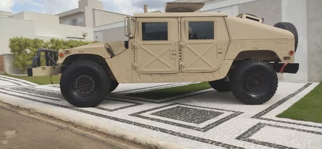
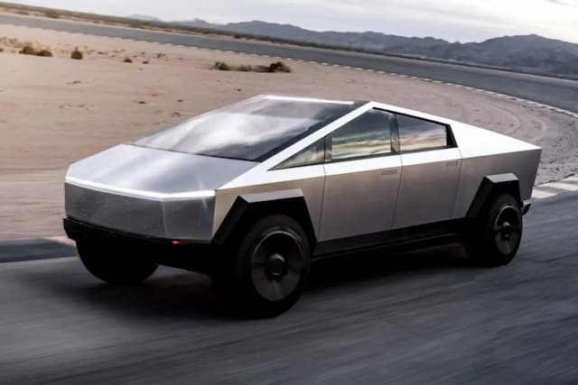
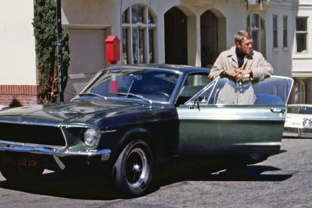

_Humvee, veículo militar norte-americano._

Já contei que pretendia ser _designer_ de carros? Ah, esses desejos de infância.

Eu não percebia na época, mas minha família orbitava em torno de automóveis. Vivíamos uma vida frugal, mas trocávamos de carro anualmente.

Na verdade, meu pai era meio obcecado. Era sócio de uma agência de revenda de autos. Assistíamos à Fórmula 1 na TV. Tínhamos revistas especializadas em casa, mas não muitos livros de história ou literatura.

Meu pai só comprou um vídeo cassete no consórcio, depois de muita insistência dos filhos. Porém, às vezes, surgia com um carro zero. E fazia questão de chamar a família para ver. Até Dodge Charger 1970 ele teve. Era seu jeito de comunicar “sucesso”.

_Cybertruck, da Tesla, que parece ter saído de um videogame antigo._

Corta para 2022. Nunca tirei carteira de motorista. Nunca possuí um automóvel. Sou do tipo que leu [Apocalipse Motorizado](https://observatoriodabicicleta.org.br/acervo/apocalipse-motorizado-a-tirania-do-automovel-em-um-planeta-poluido/) nos anos 2000 e acabei de ouvir uma [entrevista de Paris Marx](https://podcasts.google.com/feed/aHR0cHM6Ly93Zm11Lm9yZy9wb2RjYXN0L1RELnhtbA/episode/aHR0cHM6Ly93d3cud2ZtdS5vcmcvcGxheWxpc3RzL3Nob3dzLzExNzk2Nw?hl=en-BR&ved=2ahUKEwipjsLWgZn5AhWOSLgEHZxbAbcQieUEegQIAxAF&ep=6) sobre seu novo livro, [Road To Nowhere, What Silicon Valley Gets Wrong About the Future of Transportation](https://www.versobooks.com/books/3995-road-to-nowhere).

Desconfio de carros sociológica, política, moral e, pelo jeito, psicologicamente. _Fleud exprica_.

Quando morei no Itaim Bibi, em SP, achava curioso ouvir caríssimos carros turbinados, que aceleravam loucamente… de um semáforo ao outro. Era como tentar encaixar um tubarão num aquário.

Porém, mais triste é ver como, em época de desastre climático, muitos pais ainda compram carros de brinquedo para os filhos. Naturalmente, algumas crianças adoram quebrá-los, como se estivessem se preparando para virar personagens [daquele filme de David Cronenberg](https://en.wikipedia.org/wiki/Crash_(1996_film)).

Ainda hoje, depois de tantas mudanças nas políticas identitárias, o culto aos carros continua a ser embedado em nossos inconscientes desde a infância.

Não é uma vergonha, não é _cringe_ ter um supercarro: é inevitável, é necessário. É um direito, me deixe! Vou clicar em _unsubscribe_.

Tudo isso para dizer que ainda me interesso pelo _design_ de carros.

E é por isso que o fenômeno SUV (45,9% da frota nos EUA, em 2021) me chama atenção. Esse [tipo de automóvel](https://en.wikipedia.org/wiki/Sport_utility_vehicle) é abertamente inspirado nos veículos militares da Segunda Guerra Mundial.

_Mustang e McQueen. Que amor._

E o que faz a classe média e a elite dos países desenvolvidos **desejarem** SUV’s? A cultura de proteção, de isolamento da cidade e da pobreza é clara desde os primórdios do automóvel (né, [Gary Newman](https://www.youtube.com/results?search_query=cars+gary+numan)?). Mas agora usa um _design_ cada vez mais militarizado.

“Coincidentemente ou não” – como diria um conhecido político –, vivemos numa época bélica e permeada de discurso fascista.

Se o símbolo da masculinidade motorizada dos anos 60 era o [Ford Mustang de Steve McQueen](https://en.wikipedia.org/wiki/Bullitt), parece que, hoje, estamos caminhando cada vez mais para as [Humvees](https://en.wikipedia.org/wiki/Humvee). Ou até para helicópteros.

* * *

PS - Para entender um pouco melhor porque parece impossível viver sem carros, visite o canal do YouTube [Not Just Bikes](https://www.youtube.com/c/NotJustBikes), que já recomendei aqui para os assinantes _premium_.
