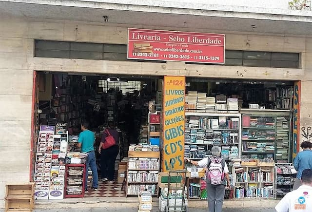

 _Uma das “cidades” em que eu morava, nos anos 1990._

Ontem foi aniversário de São Paulo. Quase escrevi sobre ser paulistano. Porém, ao começar, percebi que a coisa não seria tão simples. É que, ok, eu nasci e vivi nessa cidade até 2008 e voltei em 2021. Mas em quais São Paulos, afinal, eu vivi? E para quais retornei?

Explico.

Fui criado em Pirituba, bairro classificado oficialmente como da zona norte. Mas os habitantes insistem em se considerar da Zona Oeste. Tanto que há até um conhecido grupo local chamado [RZO](https://www.youtube.com/watch?v=_AycHaPQJG0) (Rap Zona Oeste). Então, a complicação começa por aí: **o território da identidade nem sempre é o mesmo da descrição geográfica**.

Talvez por conta do tamanho oficial da cidade, é mais fácil se identificar com um bairro do que com toda SP. Você pode passar uma vida inteira num microcosmo, com seus sotaques e toda uma rede de circulação para os bairros mais próximos.

Também há essa ferida aberta na cidade, chamada Rio Tietê / Pinheiros. Para muitos, atravessar de uma margem à outra, enfrentar as pontes e marginais, exige todo um esforço de planejamento, cálculo de custos e horários. É preciso saber bem o que se está fazendo. Mesmo na época dos GPSs, errar uma simples entrada pode levá-lo muito longe ou até mesmo a enfrentar perigos inesperados.

Assim, boa parte dos paulistanos é levada a pensar na cidade como um perigo eminente ou até mesmo um obstáculo. Dos ônibus aos carros blindados, é uma epopeia de deslocamento a ser enfrentada.

Durante a infância, eu não podia brincar na minha rua, por medo de ônibus e assaltos. Tinha que ir para as vias paralelas. Assim como eu, muitos cresceram com a ideia de que precisam se defender da cidade.

Só fui aprender mesmo a usufruir da urbe por volta dos 25 anos. Mudei-me para a Avenida Paulista e passei, ativamente, a explorar as ruas de todo o centro. Nunca fui [assaltado por trombadinhas](https://www.youtube.com/watch?v=noTIgm7btjY), mas sempre estava de olho, elegantemente paranoico.

## Cidade? Que cidade?

Mesmo na adolescência, quando não havia Internet, o conceito de viver numa cidade já era uma ilusão. Meus _habitats_ eram os sebos da Liberdade, da Rua Xavier de Toledo, a Galeria do Rock (nunca me senti autorizado a entrar na biblioteca Mário de Andrade).

Nesses lugares, eu alimentava meu planeta particular, cheio de franceses, ingleses, alemães e até alguns espanhóis. Mas não os que eu tinha em casa, meus avós, vindos do interior de Granada.

No caminho de volta para Pirituba, que durava cerca de uma hora e meia de ônibus, preferia olhar para capas de discos em vez das janelas. Então, em que tipo de cidade eu vivia?

## Os espaços digitais

Hoje, as coisas mudaram bastante. Vivemos nessa multiplicidade de espaços, conectados via celulares e Internet. Até mesmo o Uber, Waze e Google Maps mudaram muito da experiência que temos dos espaços urbanos: ficamos mais focados.

Temos uma missão a cumprir e um sistema que tenta eliminar todos os percalços do caminho. Mas isso também custou os acidentes felizes, as descobertas inesperadas.

Se você não mudou o sotaque da narradora do GPS, a experiência parece a de um estrangeiro guiando outro. Um estrangeiro técnico, _connoisseur_.

Por um lado, mesmo antes do _lockdown_, viver na cidade já era uma situação um tanto abstrata. Mas, agora, parece ainda mais: vivemos num bairro, pedimos comida árabe (por exemplo) usando um aplicativo, cujo servidor está hospedado nos EUA. E quem entrega o pacote (ainda) é um migrante, usando uma bicicleta fabricada na China.

Enquanto isso, pensamos num “metaverso”, como se fosse uma novidade. Daqui a pouco, teremos ainda outros territórios interdependentes para sobrepor aos diversos que habitamos.

O que não parece mudar é a velha apreensão, a paranoia cool: o perigo pode estar na próxima esquina. É sempre o discurso agridoce do “aproveite, mas não dê mole”.
