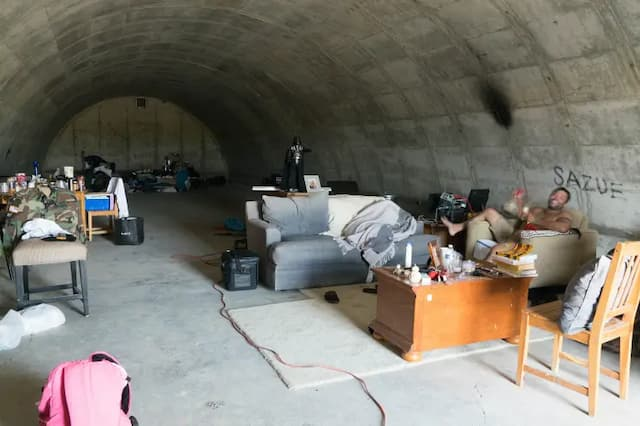

Há muita gente pensando seriamente sobre o que fazer após o fim iminente da nossa civilização. Quer dizer, não sei se “seriamente” é a palavra certa, mas, enfim, alguns bilionários já começaram [a construir seus refúgios](https://www.youtube.com/watch?v=uQin210ZBAQ) na [Nova Zelândia](https://www.bloomberg.com/news/articles/2020-04-19/-we-needed-to-go-rich-americans-activate-pandemic-escape-plans). E há até quem ofereça aluguéis turísticos pré-apocalípticos, os [AirBnBunkers](https://www.youtube.com/watch?v=vu969OoRnW4).

Mas e o resto de nós? Como nos preparar para sobreviver às consequências do aquecimento global? Ora, matriculando-se na [Post-Apocalypse School of Teeside](https://thepast.org.uk/). É uma espécie de escola alternativa, sediada no norte da Inglaterra.

Seu currículo é focado em [permacultura](https://pt.wikipedia.org/wiki/Permacultura), em preparar os alunos para plantar sua própria comida, purificar água, distinguir entre plantas venenosas e nutritivas, se virar sem eletricidade, etc. De longe, parece uma versão turbinada do escotismo.

Conheci o projeto a partir de uma [entrevista com a fundadora](https://www.teamhuman.fm/episodes/lisa-lovebucket), a poetisa e ativista [Lisa Lovebucket](https://twitter.com/lisa_lovebucket) (foto abaixo). Aliás, que nome: “balde de amor”.

Ao longo da conversa, eu já esperava o momento em que Lovebucket começaria a mencionar o assunto segurança. E, então, surgiriam homens brancos fascistas com roupas militares carregando metralhadoras. Mas, aparentemente, as habilidades de defesa que a escola ensina são bem mais prosaicas, como fazer fogo com o mínimo de fumaça para não chamar atenção de predadores.

Não estou fazendo um _publi_ do empreendimento, que me lembrou do grupo de teatro do [seriado Estação Onze](https://eduf.me/a-tecnologia-acabou-e-agora/). Na real, tendo a desconfiar de sobrevivencialismo, seitas, comunidades hippies e utopias de artistas.

Mas a entrevista me fez pensar nessa encruzilhada na qual a nossa geração está entocada: ou embarca num [futuro tecnocrático](https://podcasts.apple.com/us/podcast/can-we-tech-our-way-out-of-climate-change/), ou se destreina do Modernismo. Se optarmos pela segunda opção, precisaremos dissolver o culto ao “progresso” e olhar com menos preconceito para o passado, para tradições muito antigas.

A [hustle culture](https://www.forbes.com/sites/forbesbusinesscouncil/2022/03/31/hustle-culture-can-be-toxic-heres-how-to-navigate-it-successfully/?sh=1602f33e44e1) realmente teria de brochar para conseguirmos **pelo menos entender** debates muito antigos sobre temperança, autocontrole, contentamento, uso equilibrado do corpo (esportes, artes marciais, disciplina), integração com a diversidade de espécies, não-linearidade do tempo etc.

Será que o futuro está mesmo no passado? Não sei. Mas me pergunto como seria viver sem noções confortáveis como as de progressistas _versus_ reacionários. Imagine a decepção de perceber que não se pode dividir o mundo em categorias tão vagas.

Que outras identidades teremos que criar quando os modelos mentais do Modernismo ruírem? Eu começaria minha preparação para o pós-apocalipse por aí. E por estocar uns pacotes de [genmaicha](https://pt.wikipedia.org/wiki/Genmaicha).

* * *

**Update:** ao dizer que desconfio de sobrivencialismo, seitas, comunidades hippies e utopias artistas, não estou negando a utilidade da vida em comunidade, nem de práticas como as ensinadas na Escola de Teeside. Eu mesmo vivo num templo budista há 15 anos, sou um estudante (bem amador) de permacultura e perdi a conta de quantas utopias artistas tentei fundar ou participar. Certamente, também não defendo o industrialismo. Meu ponto aqui é que comunidades também podem ser afetadas pela _hustle culture_ e até fascismo. Acho que temos bastantes exemplos disso na história.
