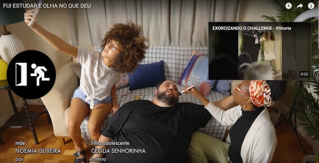

_Cena da Porta dos Fundos, no seu ambiente natural, o YouTube._

Dia desses, o algoritmo do YouTube me recomendou [um vídeo](https://www.youtube.com/watch?v=7SKQJcR1AtI) da Porta dos Fundos. Nele, um casal critica uma filha adolescente. Ela teria optado por estudar e encontrar uma profissão “comum”, em vez de se tornar uma YouTuber ou TikToker.

Interessante. Lembrei do atual debate sobre [quiet quitting](https://www.theatlantic.com/newsletters/archive/2022/09/quiet-quitting-trend-employee-disengagement/671436/), que, em tese, já seria uma resposta à [Hustle Culture](https://www.fm2s.com.br/o-que-e-hustle-culture-por-que-e-mais-prejudicial-do-que-util/).

Vários termos estranhos que fazem parte de um mesmo fenômeno: **a perda das fronteiras entre o que é trabalho e o que é… o resto da vida**.

A diversão virou Entretenimento. Assim, é produzida e consumida em ritmo industrial. Tornou-se um fluxo contínuo de metas a cumprir, conscientes ou inconscientes.

Se pensadores do século 19 criticavam a degradação humana de ter que seguir o tempo da linha de produção, hoje acrescentamos outras: scroll infinito, _swipe_ do TikTok, métricas de redes sociais, etc.

O Entretenimento domesticou, disciplinou e controlou a diversão, transformou o prazer em trabalho. E plantou a ideia de que o trabalho **tem que** ser prazeroso.

Então, acabamos fazendo jornadas duplas, triplas e simultâneas. Por exemplo, quando alguém desliga a câmera e segue a reunião on-line enquanto joga videogame ou escrola nas redes sociais. E desenvolve _burnout_ múltiplo.

_Home office_ virou o símbolo maior dessa ausência de fronteiras. O trabalho invadiu tudo, do gerenciamento do _pet_ até do romance. Tudo funciona como uma espécie de emprego.

Então, o que (muitas vezes) acontece quando alguém se torna um praticante de _quiet quitting_? Não aterriza num vácuo cultural. Na verdade, direciona mais tempo para O Entretenimento.

Ou seja: é uma **transferência de patrões**. Do Mr. Corporativo para o Mr. Vale do Silício.

Até mesmo quem opta por uma vida supostamente mais simples e rural, muitas vezes já o faz pensando em como divulgá-la no Instagram.

Não se trata de sentir os pés no chão ou o cheiro do mato, mas de construir uma marca, uma identidade gerenciável. Produzir conteúdo. (Será que [Thoureau](https://pt.wikipedia.org/wiki/Henry_David_Thoreau) faria videolog?)

Fora que, [segundo pesquisas](https://www.amazon.com.br/Dopamine-Nation-Finding-Balance-Indulgence-ebook/dp/B08KPKHVXQ?__mk_pt_BR=%C3%85M%C3%85%C5%BD%C3%95%C3%91&keywords=dopamine+nation&qid=1663763858&sr=8-1&ufe=app_do%3Aamzn1.fos.db68964d-7c0e-4bb2-a95c-e5cb9e32eb12&linkCode=ll1&tag=eduf-20&linkId=582afde87c707a6937771bf5f459f608&language=pt_BR&ref_=as_li_ss_tl), como estamos expostos a estímulos constantes de dopamina, desenvolvemos um **desequilíbrio basal**. Ficamos intolerantes ao tédio, nos frustramos facilmente. Precisamos nos manter excitados continuamente.

E, então, surge tanto o fenômeno da _hustle culture_, quanto o da desmotivação e o _quiet quitting_. Dois lados da mesma criptomoeda – só para atualizar a metáfora.

Hoje, é interessante reler os textos básicos comunistas e as utopias do século 19 que imaginavam como seria a superação do trabalho. Como funcionaria um mundo em que teríamos tempo livre para artes, filosofia e relacionamentos?

O que surgiu foi o oposto: **tudo virou trabalho**. Tempo livre se tornou economia de atenção. Home office virou Total Office. Escritório de bolso. Escritório universal.

Aos poucos, perdemos o **espaço mental** necessário para **diferenciar** o que, afinal, nos diverte do que é compulsão, síndrome de abstinência e necessidade de escapismo.

O que estamos _quiet quitting_ aqui é a diversidade e a riqueza de ser humano, vivendo num planeta.

Ou algo assim.
