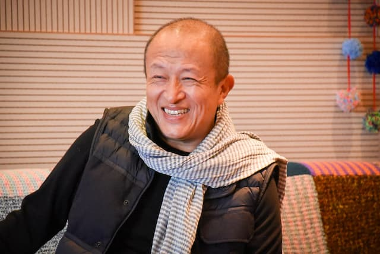

_Dzongsar Khyentse Rinpoche, ou [Khyentse Norbu](https://www.imdb.com/name/nm0634897/)._

Ontem, assistindo a uma [palestra de Dzongsar Khyentse Rinpoche](https://www.youtube.com/watch?v=yaXASFZc2Kw), lembrei-me de quando jantei com ele, há alguns anos. Mas, antes de contar essa história, vamos para outro jantar. Esse com Roberto Civita o, então, dono da Editora Abril.

## Falando para relaxar

2007: eu acabara de pousar na (então) poderosa Abril, como editor do site da Superinteressante. Na época, a revista era um dos maiores sucessos da casa.

Civita queria conhecer algumas equipes. E, como havia muita expectativa / apreensão sobre como a Internet mudaria o mercado editorial, disseram que eu não poderia fugir desse jantar. Ok. _Amen_, Regininha, _amen_.

Assim, eu e mais 6 pessoas fomos para a gigantesca sala de jantar de Civita — parte de um escritório que ocupava um andar inteiro.

Na mesa, o desconforto era geral. Não por conta de Civita, que era cordial, com sua voz de baixo-profundo. É que se manifestou o DNA de humildade brasileira diante do colonizador, o adestramento histórico de tentar agradar o patrão. Todos nós travamos, exceto o gente-finésima, [Denis Russo Burgierman](https://twitter.com/denisrb).

Em poucos minutos, o desconforto migrou do silêncio para a incessante tagarelice. Nunca se viu tanta gente esperta num só lugar. Ainda era o DNA brasileiro: falávamos para, de alguma forma, provar que “merecíamos” estar ali e subir de vida.

Porém, quem diria, hoje a Abril está atolada em dívidas, muitas revistas se dissolveram, alguns prédios da editora foram vendidos e até Civita morreu em 2013.

_Jump cut_ para Khyentse Rinpoche.

## Silenciar para relaxar

Lá estava o Eduf, de [Pirituba](https://pt.wikipedia.org/wiki/Pirituba), sentado à mesa com um dos mais importantes professores budistas da atualidade (e de todos os tempos).

Ele é conhecido por ser brincalhão e informal, o que pode levar à falsa conclusão de que seja manipulável, como uma celebridade comum. Por exemplo, consciente ou inconscientemente, você poderia _tentar_ inflar seu próprio ego, apenas por estar por perto de Rinpoche.

“Veja” bem, tentar.

A conversa começou no futebol, que ele adora e conhece bem. Já eu, tenho uma vaga lembrança de que é algo que envolve pessoas correndo atrás de uma bola.

Alguns dos colegas de mesa conseguiram se engajar. Mas, à medida que Rinpoche se aprofundava, ficou claro que falávamos sobre algo que não entendíamos. O primeiro a ser honesto foi um colega chileno. Ele apenas sorriu e disse “desculpe-me, não acompanho futebol”.

Então, migramos para a política. Aí comecei a tentar entreter o Rinpoche (já que sou formado em Ciência Política).

Evidentemente, os assuntos que abordamos eram complexos. E Rinpoche é um provocador nato: se ele percebe que você é esquerdista ou direitista (ou qualquer “ista”), ahh, ele apontará seus pontos fracos. Chegará nos substratos emocionais das suas opiniões, revelará aquilo que você reprime e expressa como “inteligência” e “estou do lado certo”.

Gradualmente, todos fomos caindo. Até os alunos mais próximos dele. Em certo ponto, pensei: “O que estou fazendo? Querendo entreter o Manjushri?” Desisti do meu esquema de aquisição de autoestima.

E, simplesmente, surgiu um silêncio natural, _nada constrangedor_. Pelo contrário: um conforto de não ter assunto, de não falar. Um certo relaxamento, sem aquele nervosismo do jogo do entretenimento.

Até que Rinpoche apenas sorriu e se levantou: “muito obrigado. Foi um excelente jantar”.

So it goes.
