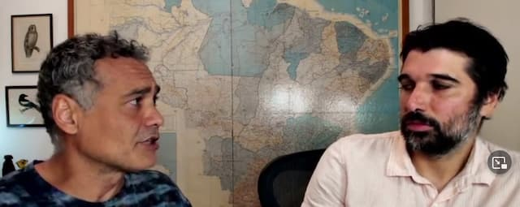

Alô, tem alguém aí? Um salve para você que parou seu feriado, carnaval ou descanso para ler este e-mail. Esta é uma amostra grátis da Texto Sobre Tela de sexta, que vai para os assinantes premium. Se você quer ser um deles, [clique aqui.](https://buy.stripe.com/aEUaGOgIJa1XgPS28b) Custa apenas R$10 por mês.

* * *

## A dica do dia

**Boletim do Fim do Mundo**, o [Otimismo Apocalíptico de Sidarta Ribeiro](https://www.youtube.com/watch?v=YSOsdZgV9As). Debate entre Bruno Torturra e o neurocientista brasiliense. É possível manter algum otimismo no meio da transição que vivemos hoje no planeta? Os dois citam o livro de David Graeber, [The Dawn of Everything](https://www.amazon.com.br/Dawn-Everything-New-History-Humanity/dp/0374157359?crid=90BFFUOPBFZA&keywords=david+graeber&qid=1650627672&sprefix=david+graeber%2Caps%2C2768&sr=8-1&ufe=app_do%3Aamzn1.fos.db68964d-7c0e-4bb2-a95c-e5cb9e32eb12&linkCode=ll1&tag=eduf-20&linkId=073f02a4f3ad17f89a672cc554d8ee90&language=pt_BR&ref_=as_li_ss_tl), recomendado aqui há algum tempo.

## Quadrinhos

**Angeli se aposentou nesta semana.** O cartunista foi [diagnosticado com afasia](https://www1.folha.uol.com.br/ilustrada/2022/04/angeli-se-despede-da-carreira-de-cartunista-e-encerra-uma-era-dos-quadrinhos-no-brasil.shtml). Comecei a ler HQ via Asterix e [O Fantasma](https://pt.wikipedia.org/wiki/O_Fantasma). Mas, definitivamente (para o bem ou para o mal), foi o trabalho de Angeli que mudou minha vida. Ele me apresentou ao mundo dos fanzines e da contracultura. Então, fica aqui meu respeito.

⊶⊷⊶⊷

**Alan Moore ensina a escrever.** O autor de Watchmen elaborou um [curso de escrita para a BBC](https://www.bbcmaestro.com/courses/alan-moore/storytelling). Tem 6 horas e custa R$ 300. 🤔

⊶⊷⊶⊷

**É possível separar o autor da obra?** Devemos evitar arte criada por pessoas doentias? [Vídeo do canal Quadrinhos na Sarjeta](https://www.youtube.com/watch?v=i5RLvJ6ZeTU) traz algumas reflexões históricas interessantes (paciência com as idiossincrasias de YouTube). Para quem tem conexão com as ciências humanas.

* * *

## Tech

**Web3 chegando ao cinema.** Enquanto a [Netflix afunda](https://www.morningbrew.com/daily/stories/2022/04/20/netflix-stock-collapses), o cineasta [Steven Soderbergh](https://www.indiewire.com/2022/04/steven-soderbergh-grant-decentralized-pictures-1234714170/), resolveu investir na [Decentralized Pictures](https://decentralized.pictures/), projeto sem fins lucrativos de Roman Coppola, que [incentiva cineastas por meio de vendas de NFTs](https://youtu.be/Prq6zGiHsbI). Só vale para filmes em inglês, claro.

⊶⊷⊶⊷

**Mem.** Existem programas de notas para (quase) todos os gostos. Eu só queria algo assim: captura rápida, gerenciamento zero. Ou seja, digitar numa interface mínima e o programa se encarregar de salvar, sincronizar, taguear e organizar as notas. Além de ter um bom sistema de busca, claro. O [Mem](https://get.mem.ai/), em sua versão paga, Mem X (beta), usa inteligência artificial para fazer essas coisas. Ainda é um produto imaturo (faltam dark mode, uma conversão mais consistente de Markdown, entre outras coisas), mas bem funcional. Vou acompanhar a evolução do aplicativo.

⊶⊷⊶⊷

**Ubuntu 22.04.** Resolvi atualizar o Ubuntu na minha máquina para a nova versão de suporte longo, que deve sair hoje. Está rodando bem aqui, com o Gnome 42, além de [outras melhorias](https://www.omgubuntu.co.uk/2022/04/ubuntu-22-04-video-jammy-jellyfish). Por enquanto, parece consumir um pouco mais de bateria. E [fique de olho se você faz dual boot](https://diolinux.com.br/tutoriais/ubuntu-22-04-com-dual-boot.html) no seu computador -- eu faço e aqui não deu problema algum.

⊶⊷⊶⊷

**Browserflow.** Automação é legal. Mas dá preguiça de configurar e de manter ao longo do tempo (serviços mudam, sistemas se atualizam e as automatizações precisam ser manualmente corrigidas). Mas, se você é mais diligente que eu nessa área e usa o Chrome, pode tentar [essa extensão](https://browserflow.app/), que promete automatizar tarefas on-line sem precisar de serviços como IFTTT ou Zapier.

* * *

## Política

**Manipulação memética.** Se você ainda tem dúvidas de que a cultura dos influencers precisa ser questionada, leia “[Como plantar um meme](https://www.patreon.com/posts/how-to-plant-64821014)”. O texto explica, em _muitos_ detalhes, como as redes sociais estão ficando obsoletas e a manipulação política vai migrando para os chats privados. Bom para ver junto com o documentário [Feels Good Man](https://en.wikipedia.org/wiki/Feels_Good_Man). E lembrar que existe vida fora da Internet, claro.

⊶⊷⊶⊷

**Como evitar a 3a. Guerra, por Noam Chomsky.** Está muito eufórico hoje e precisa de uma dose de depressão? Então leia essa [entrevista do linguista norte-americano](https://www.currentaffairs.org/2022/04/noam-chomsky-on-how-to-prevent-world-war-iii), colocando a atual guerra na Ucrânia num contexto maior da história dos conflitos imperialistas. E como o governo dos EUA está de olho na China.

* * *

## Música

**Need a job, need a job.** Eu adoro a voz e o estilo de tocar bateria de Amy Farina, do The Evens e da sua continuação natural, o Coriky. Em ambas as bandas, ela toca com o marido, Ian MacKaye (Minor Threat e Fugazi). Se você não conhece o Coriky, [comece por aqui](https://www.youtube.com/watch?v=EheoKU0JLlY). Do Evens, minha preferida é [Wanted Criminals](https://www.youtube.com/watch?v=tM82zEsvAfE).

⊶⊷⊶⊷

Se minha empresa promovesse **Experiências de Música e Dança**, acho que eu escolheria [algo assim](https://mocamborecords.bandcamp.com/album/agent-sentimental-b-w-postcard-from-bangladesh?from=discover-top) (totalmente trilha sonora de momento WTF no emprego). Ou [assim](https://bacaorhythmandsteelband.bandcamp.com/album/55). Já se o RH quiser, por algum motivo, promover uma festa de cumbia, [sugiro esses clássicos](https://rocafortrecords.bandcamp.com/album/cumbia-sabrosa-tropical-sound-system-bangers-from-the-discos-fuentes-vaults-1961-1981?from=discover-top). Se você trabalha com viagens no tempo e se pegar preso nos anos 50, tente [esse disco inteiro](https://martaren.bandcamp.com/album/stop-look-listen?from=discover-top). Just in case.

⊶⊷⊶⊷

E essa [música nova do Jack White](https://www.youtube.com/watch?v=WOZwxqQlyLg), hein? Interessante. Mas quando ele vai voltar a usar timbres de guitarra que não se pareçam com peidos?
