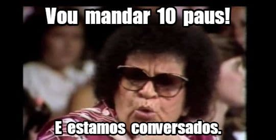

[Assine djá! É só R$ 10 por mês](https://buy.stripe.com/aEUaGOgIJa1XgPS28b).

## Budismo

Yongey Mingyur Rinpoche [está agendado para ensinar em SP, no final de junho](https://www.odsalling.org/eventos/mingyur-rinpoche/). Enquanto isso, ele fala sobre [a diferença entre awareness e mindfulness](https://www.youtube.com/watch?v=zI0awDyG-1s), no YouTube.

## Tech

### Memento mori

Quando os primeiros memes começaram a surgir, eu achava que eram cartuns para quem não se arriscava a desenhar -- uma espécie de democratização do humor. Mas, aos poucos, eles viraram de [arma cultural e política](https://en.wikipedia.org/wiki/Feels_Good_Man) a até [profissão](https://www.b9.com.br/shows/braincast/braincast-449-como-melted-videos-hackeou-o-mercado-do-meme/). Hoje, está cada vez mais difícil diferenciar humor, marketing, jornalismo e manipulação. Então, faz sentido uma ferramenta que [crie memes via inteligência artificial](https://www.supermeme.ai/). O desejo de automatizar é o primeiro indício de esvaziamento do sentido.

### Domando imagens

Precisando [limpar fundos de fotos](https://letsenhance.io)? Melhorar [a resolução](https://www.magiceraser.io/) delas?

### Confusão artificial

A Meta [liberou na web](https://www.technologyreview.com/2022/05/03/1051691/meta-ai-large-language-model-gpt3-ethics-huggingface-transparency) sua nova linguagem de Inteligência Artificial. Interessante, considerando que [vazou um documento da empresa](https://www.vice.com/en/article/akvmke/facebook-doesnt-know-what-it-does-with-your-data-or-where-it-goes) admitindo que seus analistas não sabem muito bem para onde vão tantos dados dos usuários.

### Faxina na Internet

Uma [detalhada proposta](https://cleanuptheweb.org/) para usuários e desenvolvedores para tentar livrar a web de tanta propaganda e tecnologias intrusivas.

### Migrações pós-Twitter

Tenho a impressão de que muita gente que está [trocando o Twitter pelo Mastodon](https://www.youtube.com/watch?v=RCRiGKlFikE), na verdade está procurando algo como o [Micro.blog](https://micro.blog/).

### Liberaland

Os fãs de crypto resolveram criar sua Wakanda ou Terra Prometida, a [Liberaland](https://www.youtube.com/watch?v=MEZLhx-9wD0).

## Música

- [O Shfl](https://theshfl.com/) traz guias para se aprofundar sobre diversos gêneros musicais: as origens, os principais discos, os ignorados etc.
- [This much I know to be true](https://www.thismuchiknowtobetrue.com/) é um documentário sobre a longeva parceria entre Nick Cave e Warren Ellis. Dia 11 nos cinemas dos EUA. Depois, deve aparecer na web.

## Jornalismo

Se estivesse vivo, o escritor Otto Lara Resende faria 100 anos agora. O [Portal da Crônica Brasileira fez um texto comemorativo](https://cronicabrasileira.org.br/res-do-chao/16715/um-cafezinho-com-otto). Não sou superfã, mas acho que ele representa bem uma certa mística, um romantismo em torno do jornalismo brasileiro do século passado.

## Design

Como a arquitetura, a moda e o design foi ficando [cada vez mais minimalista.](https://astralcodexten.substack.com/p/whither-tartaria?s=r)
