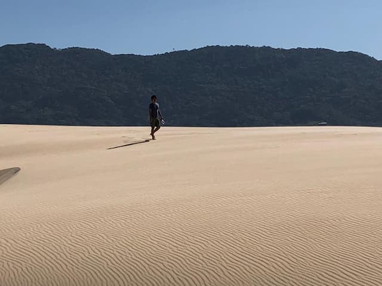

Um inesperado _plot twist_ na minha vida me trouxe para viver um mês em Garopaba. Que lugar mais deliciosamente esquizofrênico. De onde escrevo, parece que voltei para a Serra Gaúcha. Porém, em apenas 700 metros, [dunas gigantescas engolem uma estrada](https://www.tripadvisor.com/Attraction_Review-g303577-d2402563-Reviews-Dunas_do_Ouvidor_e_do_Siriu-Garopaba_State_of_Santa_Catarina.html). Um pouco depois, está o mar catarinense, gelado e vazio (nesta época do ano). Em alguns meses, será possível até observar baleias. Estou ficando ninja em comprimir despesas. Brinco de [Paul Atreides](https://en.wikipedia.org/wiki/Paul_Atreides) nas horas vagas. Como se diz por aí, de tédio eu não morro. E seguem os links da semana.

* * *

## Budismo

Dzongsar Khyentse Rinpoche deve ensinar sobre "Como se divertir", no dia 31/05, às 7h30, horário de Brasília. O [Siddhartha's Intent Brasil](https://www.instagram.com/siddharthasintentbrasil/) ainda não divulgou o link. Mas vale ficar de olho no [Instagram](https://www.instagram.com/siddharthasintentbrasil/), para mais informações. Pelo jeito, Rinpoche deve continuar o ciclo de ensinamentos sobre [Bhumisparsha](https://siddharthasintent.in/bhumisparsha/), "tocando a terra", que falam sobre ser budista vivendo fora de monastérios, lidando com o caos cotidiano.

## Política

### O trigo corrompeu a humanidade

> O trigo certamente facilitou o surgimento do Estado. Como explica James C. Scott, co-diretor do programa de estudos agrários da Universidade de Yale: 'Apenas os grãos podem servir de base para impostos, já que são visíveis, divisíveis, tributáveis, podem ser armazenados, transportados. São 'racionais'.'

O historiador da agricultura, John Lewis-Stempel, conta [como o trigo possibilitou o surgimento da vigilància e da tirania](https://unherd.com/2022/03/wheat-has-corrupted-humanity/). Celíacos de todo o mundo, uní-vos.

## Vida

Em 2016, estive no Tibet. Como ainda comia derivados de leite e não me importava com colesterol, praticamente gostei do [chá preto, salgado, com manteiga de iaque](https://www.youtube.com/watch?v=blT7JeeaCIs), consumido na região. Ainda prefiro os verdes, japoneses, [em toda sua variedade](https://www.youtube.com/watch?v=0XtC8PnqE7s). Mas me lembrei do assunto porque, finalmente, experimentei o [chá preto, fermentadão e cítrico Tailandês](https://www.youtube.com/watch?v=WqbLc_6D-sA) (sem leite). É bom. Mas me desenvolveu um pouco de FOMO em relação a [outras tradições que ainda não experimentei](https://www.youtube.com/watch?v=ZgvO--dGLjY) direito.

## Música

- Talvez você saiba que Kim Gordon, ex-baixista do Sonic Youth, lançou um [disco solo](https://www.youtube.com/watch?v=TJl_9a6dp4g&list=PLZqsyBiYZFQ2Ju3zozDjDehsj-ZpzC7cX) em 2019. Uma pandemia depois, ela começou a tocá-lo ao vivo. Os [primeiros registros](https://www.youtube.com/watch?v=UlR0-aTjc7M) soam bem poderosos.
- [Diana Ross + Tame Impala](https://www.youtube.com/watch?v=jv8rtXBJxM4). Poderia tocar na Antena 1 Fm.

## Tech

### Google Docs da web3

[Skiff](https://skiff.com/) é um cruzamento entre Google Docs, Gmail, Notion e web3, supostamente focado em privacidade. É open source, gratuito e tem [planos premium](https://skiff.com/individual-plans). Você também pode conectar o aplicativo a uma carteira de ciptomoedas. Testei e me pareceu bem interessante. Mas, realmente, eu ainda desconfio de tudo que se apoia em cripto.

### Pacote para criadores

O [Ghost](https://ghost.org/) chegou à [versão 5](https://ghost.org/changelog/5/). O aplicativo nasceu como uma alternativa para o Wordpress. Mas virou uma excelente plataforma voltada para criadores de conteúdo. Além do CMS, ainda vem com estatísticas, área de membros premium e até um gerenciador de newsletters. A versão com hospedagem gerenciada custa a partir de U$ 9 por mês. Mas você pode [baixar e instalar o aplicativo gratuitamente](https://ghost.org/docs/install/), por si mesmo.

### Ferramentas para podcasters

[Descript](https://www.descript.com) é uma ferramenta de edição podcasts (e vídeo), com transcrições automáticas. Outras que venho testando são o [Squadcast](https://squadcast.fm/) e o [Riverside](https://riverside.fm/). Ambas funcionam como Zoom ou Google Meet, só que gravam áudio dos participantes localmente, o que melhora muito a qualidade das entrevistas.

* * *

## Bonus: black power de areia

