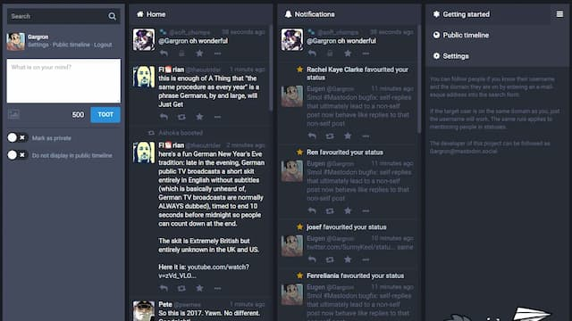

Parece que o tema da semana é a dificuldade com as transições. No governo, no clima (o inverno também não quer passar a faixa) e, claro, no Twitter. Depois que Elon Musk assumiu o poder, houve uma migração em massa para o [Mastodon](https://mastodon.social/), o que vem causando alguns problemas para os usuários antigos dessa plataforma.

Primeiro, porque a maioria dos servidores do Mastodon não é financiada pela Big Tech. E, com um súbito aumento de tráfego, começa a cair e fica lenta.

Segundo e mais importante: os migrantes do Twitter levam seus hábitos e expectativas para o novo ambiente. "Como faço para me engajar na gameficação do meu perfil? Onde estão os contadores de usuários e de engajamento? Como posso influenciar o algoritmo?"

Ooops. Desculpe-me. No [fediverse](https://fediverse.party/) as coisas são um pouco diferentes.

Por enquanto.

_Uma das possibilidades de interface do Mastondon._

Na verdade, aplicativos como o Mastodon foram criados para ser uma alternativa mais saudável (e até mais tranquila) às redes sociais da Big Tech. Sem gamificação. Sem Corporações Babás tentando infantilizar o usuário, mastigando a papinha tecnológica até seus dentes atrofiarem. Pior: não há nem mesmo um servidor centralizado. Não há um único Twitter.com.

No Mastodon, você é convidado a colaborar, a "sujar" as mãos, a customizar, a questionar sua dependência dos esquemas paternalistas das Corporações. Quem diria.

Inclusive, se você quer divulgar teorias conspiratórias ou fazer fama por meio da truculência, pode acabar precisando financiar seu próprio servidor, terá que investir dinheiro e tempo nas suas convicções. Será mais difícil encontrar um mecenas de fascismo e um playground pronto para brincar. Que horror, não é?

Até onde posso enxergar, as comunidades do Mastodon vêm sendo pacientes, compassivas e receptivas com os novos vizinhos. Mas já surgem sinais de conflito: "opa, não traga sujeira da Big Tech para cá". Ou algo como: "então, você se mudou para Três Coroas, não adianta procurar pelo Wal-Mart".

Assim, o processo de migração pós-Twitter lembra uma dessas boas comédias da antiga Sessão da Tarde. Algo que a TV Globo anunciaria num daqueles comerciais empolgados: "Chevy Chase e sua família de Wall Street migram para uma comunidade hippie socialista muito louca. Você vai se divertir muito com as confusões de Uma Migração da Pesada!"

Claro que há gente mudando de tecnologias para tentar renovar suas próprias ideias. Até agora, o fediverso é bem favorável a esse tipo de efervescência. Mas é provável que, conforme for crescendo, também seja invadido por ideologias estranhas.

Por enquanto, sigo observando o Mastodonte ficar cada vez mais pesado. Tomara que ele se torne algo mais na linha de um [Elefante Precioso](https://southernthailandelephants.org/elephants-in-buddhism/): calmo, educado, majestoso e alerta.
