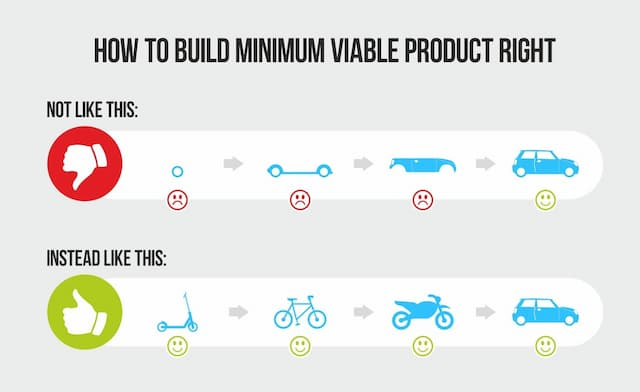

_Imagem mais comum que aparece quando você busca por "produto minimamente viável" no Google. Carro é mais viável que patinete. Não para um ambientalista._

Tenho um _cringe_ _crush_ por _buzz words_ em inglês. Quer dizer, expressões que “se tornam virais” e que são usadas para empoderar e “despoderar” pessoas ou fenômenos. Por exemplo, “buzz word” é uma _buzz word_. Aliás, todo o parágrafo está cheio delas — além de um singelo [cacófato](https://blogdoenem.com.br/gramatica-cacofonia/).

Por exemplo, _edgelord._ É usada para identificar pessoas extremamente provocativas na Internet, em geral, homens. O praticante usa _gatilhos_, como nazismo, misoginia, etc. para enganchar oponentes, como alguém que tenta arranjar briga num bar. Como seria isso em português? Rei do Limite? Tradutores, ajudem-me.

_Pet peeve_ é mais fácil: irritação de estimação. Pois eu tenho uma dessas com a expressão minimamente viável, _minimum viable_, MV, muito usada na área de tecnologia. Você constrói um produto, um escritório, um casamento, um caminho espiritual, tudo MV.

A parte boa é que a ideia de MV combate o perfeccionismo (que é Extremamente Inviável). Faz as coisas andarem. Porém, MV é uma expressão bastante relativa. O que você acha funcional, pode ser o horror para os outros. O seu MV pode ser uma [externalidade](https://pt.wikipedia.org/wiki/Externalidades) disfarçada.

MV parece uma expressão humilde, "só que não". No fundo, pode implicar que sabemos o que deveria ser o produto final, apenas não conseguimos entregá-lo agora. Porém, como qualquer programador bem sabe, quando você lança o produto e vê as pessoas interagindo com ele, só aí descobre o quão errado (ou deludido) estava.

Não é que eu odeie a expressão MV. Pelo contrário: acho até que a condição humana (lá vem) é um constante processo de cair em si, de descobrir o tamanho da sua ingenuidade. Num só emoji: 🤦🏾‍♂️.

Daí a importância do que [Nassim Nicholas Taleb](https://en.wikipedia.org/wiki/Nassim_Nicholas_Taleb) chama de _via negativa_: você constrói muito mais conhecimento ao descobrir o que está errado, é mais fácil saber o que algo _não é_ do que defini-lo corretamente.

MV parece trazer uma promessa de que um dia as coisas ficarão corretas. É uma visão praticamente cristã, de que as coisas podem chegar a um estado de completude, que podem ter um fim claro, uma redenção. Mas, não sei, tudo indica que elas continuarão a se perpetuar, graças à interdependência.

Assim, prefiro algo como _hipótese inicial_ (ou a tradicional _feedback loop_). “Vamos lançar nossa HI e ver como o universo responde”. Que tal? Parece uma expressão mais minimamente viável.
