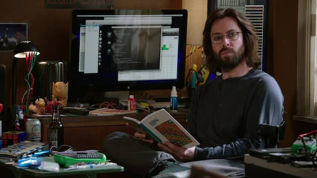

_Bertram Gilfoyle, o desbocado engenheiro da série Silicon Valley._

Hoje aprendi que, na corporativosfera, existe algo chamado "planilha de Learned Lessons" (PLL). Se entendi direito, funciona assim:

1. Dá merda num projeto. A coisa é resolvida da melhor forma possível. Porém, isso causa estresse na equipe.
2. Passado o sufoco, os integrantes são incentivados a descrever (publicamente) as lições que tiraram do episódio.

A parte mais engraçada é a de usar uma planilha. Se a vida lhe oferecer limões, vá para o Excel.

E no que isso pode ser interessante? Ora, é que, evidentemente, muitos profissionais já usam esse documento para outra coisa: desabafar.

Por exemplo, coisas que li numa PLL: "Aprendi que deveria ter consultado Nostradamus antes de salvar aquele arquivo", "que toda a proatividade será castigada", "que fazer bem o seu trabalho leva a ter que assumir as tarefas dos outros".

Ou seja: a tabela que poderia ser um _feedback_ da realidade, uma denúncia de falsas teorias, pode se tornar muro das lamentações. Ou... rede social. Afinal, Twitter, Instagram, Facebook, WhatsApp, Telegram, YouTube, não dão mais conta da nossa fúria. Por que deixaríamos de tomar o poder no Office?

Minha tese é a de sempre: o uso contínuo das redes sociais mudou radicalmente a forma como nos comunicamos _off-line_. Não podemos mais simplesmente dizer: "saia do Twitter" (ou de qualquer outro aplicativo). A plataforma não vai abandoná-lo tão facilmente.

O que aconteceu? Ficamos mais mal-humorados, sarcásticos e provocadores? Aproveitamos cada oportunidade para "rede-socializar" as nossas comunicações?

Não é segredo que a _big tech_ favorece a comunicação agressiva, reativa e manipuladora para gerar mais engajamento. Assim, não é de se espantar que movimentos neo-nazis e fascistas cresçam nesses ambientes. Ou que nos fascinemos por constantes _shots_ de humor agressivo ou tapas entre celebridades.

A grande questão é que tipo de resultado essa constante trivialização da violência cognitiva causará a longo prazo? Ficaremos todos uns [Skrotinhos](https://pt.wikipedia.org/wiki/Skrotinhos) ou [Gilfoyles](https://silicon-valley.fandom.com/wiki/Bertram_Gilfoyle)? Ou, pelo contrário, reagiremos e nos tornaremos Mary Poppins?

Alguém aí conhece algum bom estudo sobre a história da comunicação agressiva? Que evidencias arqueológicas seria possível coletar para traçá-la? É fácil imaginar que ela apareça nas artes e na comédia. Mas quando se popularizou de verdade? Com a comunicação de massas?

Nem sempre foi assim. No passado, até mesmo em guerras, era comum praticar algum tipo de cortesia, com rituais de demonstração de respeito pelo oponente. Então, provavelmente, nossa época é a primeira que extrai riqueza a partir do bate-boca. Estamos na corrida do insulto (assim como já houve a corrida pelo ouro).

Enfim, acho que vou ter que escrever lá no Excel: aprendi que é difícil quebrar os ciclos de frustração, amplificados pelas "plataformas". Pelo contrário, a tendência é transformar tudo em social media.
