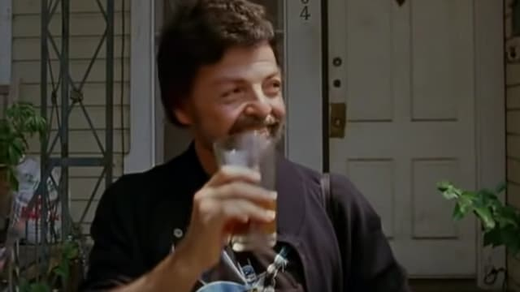
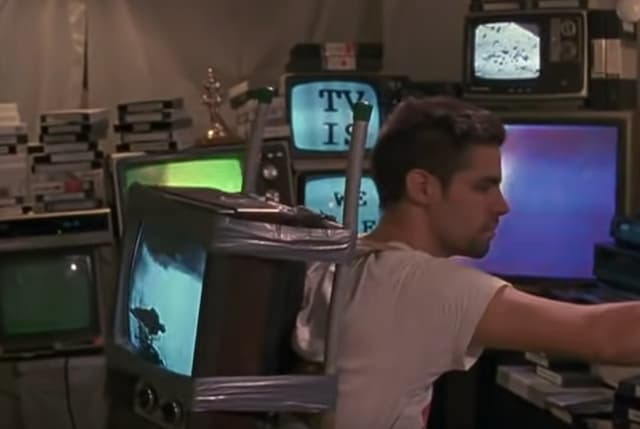

_Tiozinho que fica alugando os outros com suas teorias conspiratórias, em cena de Slacker._

Quando falamos sobre filmes proféticos, de modo geral pensamos no gênero _sci-fi_. Mas quem diria que uma obra, digamos, vagabunda, como [Slacker](https://www.youtube.com/watch?v=b-U_I1DCGEY) conseguisse prever muito do clima social em que vivemos hoje?

Slacker é um filme de 1991, dirigido por [Richard Linklater](https://www.adorocinema.com/personalidades/personalidade-86146/). Não têm história. O espectador apenas acompanha rápidos trechos de conversas de transeuntes, durante um só dia na (então icônica) cidade de Austin, Texas.

Como lembrou o crítico Roger Ebert, Linklater usa um método narrativo surrealista consagrado por Luís Buñuel: seguir um personagem por apenas alguns minutos e, assim que ele interage com outro, migramos para este. A sensação é a de estar espiando um fluxo de interações superficialmente.

Soa familiar? É mais ou menos a experiência de aplicativos como o TikTok. Ou da cultura do _scroll infinito_. A diferença é que, em Slacker, não é preciso dar _swipe_. E, pasme, todo mundo conversa nas ruas, não por meio de telas.

As pessoas gostam de falar, mas parecem não se ouvir. Discursam infinitamente sobre conspirações, ideologias e curiosidades. Formulam teses absurdas sobre o cotidiano. E, cedo ou tarde, querem lhe vender uma camiseta. Ou algum produto “alternativo”, como os fluidos vaginais de Madonna.

Supostamente, esse é um filme para sacanear os personagens (então pitorescos) de Austin: o tiozinho anarquista que simpatiza com um assaltante, o atendente de livraria obcecado com o assassinato do presidente Kennedy – e que tenta promover seu próprio livro independente – e por aí vai. Mas a brincadeira atinge um alvo bem mais amplo.

## Anedota cultural

Linklater acabou prevendo a cultura dos _influencers_ e o clima político conspiratório de hoje em dia. Mas, especialmente, percebeu a ascensão da anedota cultural.

Antigamente, apenas os _nerds_ pareciam precisar engolir enciclopédias e, eventualmente, colocá-las para fora – com diferentes níveis de precisão.

Hoje, muitas das nossas conversas cotidianas passam por essa **troca de conhecimento vago**, usada para impressionar ou, simplesmente, aliviar a tensão do silêncio.

Linklater previu que as conversas de elevador se nerdificariam muito nas últimas décadas. Viramos máquinas de _fake_ news. Ou pelo menos, de opiniões infundadas e duvidosamente fundamentadas.

## Eu não nasci para trabalho

O cineasta também percebeu a aversão ao trabalho que, depois, seria associada à geração Z. Ironicamente, chamou o filme de Slacker (“preguiçoso”). Porém, acompanha personagens extremamente ativos. Só que apenas em relação às suas obsessões e ao entretenimento.

Há muitas pessoas empregadas no filme. Mas quase todas praticando o que hoje chamamos de _quiet quiting_. Ou tentando jeitos alternativos de ganhar dinheiro, como no caso da traficante de fluidos de Madonna, precursora das _influencers_ que vendem suas flatulências aos seguidores.

Slacker previu nossa atual economia da tosquice, o trabalho super informal, baseado no convencimento, no marketing onipresente.

## Nem precisava de celular

Não que Slacker seja exatamente bom, mas é profético. Linklater mostra que os embriões da nossa época já estavam ali. Off-line.

Até porque nasciam da cultura pop, do cinema, das revistas, jornais e, principalmente, da TV.

É por isso que ouvimos o seguinte discurso, proferido por um rapaz obcecado por TV (foto acima):

> “A imagem em vídeo de um evento é muito mais poderosa do que o evento em si… Uma vez vi um esfaqueamento na rua. Não pude pausar para ver os detalhes. Nem ajustar as cores. Eu sequer vi o impacto da faca.”

A vida é “mais real” na TV. Pelo menos para quem se acostumou a observar fatos usando técnicas da indústria cultural.

Aliás, para finalizar com uma anedota sintomática, Slacker foi refilmado em 2011. Uma conhecida rede de cinemas de Austin juntou vários criadores para “remixar” todas as cenas do filme.

Que coisa mais TikTok.
