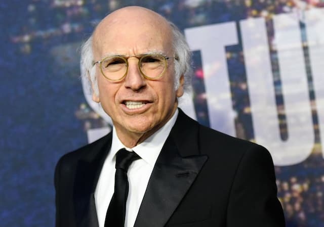

Irasshaimase!

Larry David é o meu comediante favorito. O melhor? O mais importante? Não sei. Sou enviesado demais para julgá-lo, afinal, ele co-escreveu _Seinfeld_, que foi importante durante minha adolescência. Não perco um episódio da série [Curb Your Enthusiasm](https://en.wikipedia.org/wiki/Curb_Your_Enthusiasm) desde sua estreia, há mais de 10 anos.

A 11ª temporada não traz nada novo, mas mantém o nível das outras. Apenas dá um pouco mais de ênfase às dificuldades em se adaptar à cultura _woke_. Como seria diferente? Larry David é o personagem perfeito para mostrar as contradições de um mundo em mudança discursiva: sempre está ofendendo alguém, voluntária ou involuntariamente.

Porém, até onde sei, o que ninguém percebeu ainda é que _Curb_ é o melhor programa infantil desde _Peanuts_.

Como assim? Infantil?

Exato. Mas não no sentido de "vou assistir com meus filhos", estilo _Frozen_.

_Peanuts_ mostrava que o mundo das crianças era, de alguma forma, parecido com o dos adultos: crises, depressão, a ansiedade da busca por uma identidade (até profissional), amores platônicos, desejos obsessivos, etc.

Já _Curb_, mostra como o mundo dos adultos é "infantil". Praticamente todos os personagens, não só Larry David, adoram fazer birra, além de se enrolar em mentiras, em tese, inocentes. Além disso, o pastelão está sempre à mão: brigar rolando na grama, gritar palavras proibidas desaforadamente e por aí vai.

Por exemplo, num dos episódios, David vai passar uns dias na casa de um amigo. O anfitrião lhe diz para pegar o que quiser na geladeira. David escolhe a [última garrafa de água Perrier](https://www.youtube.com/watch?v=Taoh0_08u3s). O anfitrião lhe nega o pedido. Segue-se uma velha e boa ceninha "infantil": pego, não pegue, pego, não pegue. Até que os ânimos esquentam e David deixa a casa.

A mesma lógica ocorre por toda a temporada: praticamente ninguém diz a verdade. E, quando decidem fazê-lo, provocam fluxos cada vez mais complexos de pirraça.

Os personagens sempre infringem alguma norma social não-escrita: sempre deixam de cumprir expectativas e tentam fugir da vergonha do julgamento dos pares. Cuidado com o que você diz, com o que veste, seja um [homem comum](https://youtu.be/vlXJbLXhbGQ?t=131), não cause problemas.

É uma visão bastante clara a respeito da elite: essa gente rica, ociosa e infantilizada. Lembrando que o nicho aqui ainda é mais específico: artistas e gente que se deu bem no _showbuziness_, em Hollywood.

Larry David tem 74 anos, mas, no fundo, parece se sentir numa história da Turma da Mônica. O campinho de futebol virou o campo de golfe, o seleto country club. Só que os planos furados de Cebolinha Clássico visam driblar burocratas da Netflix, do Hulu ou algum funcionário, obeso ou mulher.

Há quem argumente que, afinal, "crescer" é apenas sofisticar as manhas infantis. Faz sentido. Principalmente se você não precisa se preocupar se terá dinheiro para pagar as contas.
