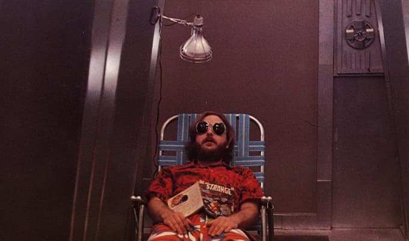

 _Cadeira de praia no espaço._

Aparentemente, boa parte da galáxia já assistiu ao novo Duna. Que bom, assim eu não preciso entrar em detalhes sobre toda a obsessiva jornada cultural do livro de Frank Herbert no Ocidente.

Haja débito cármico: desde seu lançamento, em 1965, essa história vem gastando dinheiro e massa encefálica de muita gente por aí, de David Lynch a [Alejandro Jodorowsky](https://en.wikipedia.org/wiki/Jodorowsky%27s_Dune), sem falar em executivos, críticos, fãs, etc. Será que, agora, finalmente exorcizaremos esse espírito obsessor?

## Bom demais

Claro, a adaptação de Denis Villeneuve é tudo aquilo que, atualmente, se espera de um filme desse tipo: épico e super bem produzido. Mas, num certo momento, você não sabe se está assistindo a Game of Thrones, Foundation, Star Wars ou a qualquer outro. Às vezes, até os atores são os mesmos.

Como diria Byung-Chul Han, talvez isso seja resultado da [Sociedade do Cansaço](https://www.amazon.com.br/Sociedade-do-cansa%C3%A7o-Byung-Chul-Han/dp/8532649963?__mk_pt_BR=%C3%85M%C3%85%C5%BD%C3%95%C3%91&dchild=1&keywords=Sociedade+do+Cansa%C3%A7o&qid=1635348290&sr=8-1&linkCode=ll1&tag=eduf-20&linkId=a7a143c1fdf5e407223abb9dd34c754d&language=pt_BR&ref_=as_li_ss_tl). Ou (alguns de nós, privilegiados) estão simplesmente empanturrados de tanto escapismo.

De qualquer forma, é certo que Duna reforça uma certa fadiga de obras de sci-fi grandiosas. Não é culpa do livro. Nem do diretor. A culpa é do excesso de oferta.

## Punk versus progressivo

Por um lado, esse cenário lembra um pouco o mito da luta entre punk e rock progressivo, que a imprensa cultural espalhou nos anos 1980: quando o virtuosismo técnico e a complexidade imperavam, surgiu a necessidade de cultuar a simplicidade, o improviso, a precariedade e o “faça por si mesmo”.

Por outro lado, a Internet está cheia de amadorismo, circulando numa velocidade incrível — o que também cansa.

Essa é uma encruzilhada cultural, criada pela velocidade de produção e consumo de informação.

O filme de Villeneuve deve ser bom. Mas não deu tempo de perceber. Eram muitas emoções surgindo sucessivamente.

É preciso ser diligente para quebrar a compulsão pela próxima sensação grandiosa. É preciso ter disciplina para aceitar pausar, rever, reler e repensar. Hoje em dia, é como tentar ver a paisagem enquanto se nada contra a correnteza. Difícil, mas possível.

## Lixeiros das galáxias

De qualquer forma, quem seriam os Ramones da ficção científica? Ora, se você me conhece há algum tempo, talvez já saiba a resposta: [Dark Star - A Spaced Out Odissey,](https://en.wikipedia.org/wiki/Dark_Star_%28film%29) de 1974, dirigido por ninguém menos do que [John Carpenter](https://en.wikipedia.org/wiki/John_Carpenter). É o meu filme de sci-fi favorito. O melhor? Certamente, não. Nem precisa ser.

Trata-se da história de quatro hippies barbudões, lixeiros do espaço, que convivem há 3 anos, numa nave. Se você sofreu no isolamento da pandemia, imagine essa situação. Para eles, o espaço é burocrático: um trabalho, não uma aventura tecnológica contra um império.

Até mesmo o computador de bordo é temperamental. Mais para [Bartleby](https://pt.wikipedia.org/wiki/Bartleby,_o_Escriv%C3%A3o) do que para [Hal 9000](https://en.wikipedia.org/wiki/HAL_9000). Em Dark Star, a máquina é pura lógica, pura empáfia discursiva: não basta puxar a tomada, é preciso debater, convencê-la a colaborar. Ela é tão eficiente que se torna uma ameaça à maluca, desorganizada e fedorenta tripulação humana. “Por favor, desarme essa bomba”. ”Prefiro não”.

John Carpenter anda focado na sua carreira de músico, fazendo trilhas sonoras para filmes de suspense. Faz falta. Se é para ser obcecado com Duna, imagine o que seria uma versão do livro dirigida por ele. Alguém teria um [alien-bolha](https://www.youtube.com/watch?v=ZdChZZuutiQ) como animal de estimação?

* * *

[Assista Dark Star, completo, no YouTube.](https://www.youtube.com/watch?v=ocse-0bBfo8)
