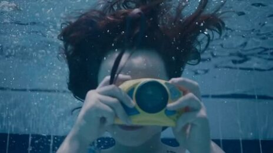
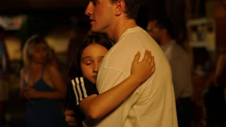

Finalmente consegui assistir a [Aftersun](https://mubi.com/films/aftersun), um dos filmes mais elogiados de 2022. Estreando na direção, a escocesa Charlotte Wells causou um fenômeno interessante: uma onda de críticos e influenciadores repensando as memórias de seus pais. No meu caso, a bola desviou e foi parar em minha mãe.

Mas, espere aí. Deixe-me tentar organizar esse texto.

_Aftersun_ é uma espécie de ensaio sobre a memória. Uma mulher de cerca de 30 anos revisita fragmentos das férias que passou, aos 11, com seu pai depressivo, num hotel meia-boca na Turquia, no começo dos anos 2000.

Para ajudar a reconstruir a narrativa desses dias simultaneamente míticos, nostálgicos e traumáticos, ela conta com gravações feitas em câmeras amadoras da época. Vamos começar por aí.

### O olho de vidro

É interessante notar como a diretora foi cuidadosa em retratar que, no começo dos anos 2000, as câmeras ainda nos eram estranhas, desconfortáveis… e fascinantes.

Pai e filha demonstram tanto repulsa quanto atração a esses objetos que, poucos anos depois, se tornariam onipresentes. Ainda assim, é de se questionar se realmente nos acostumamos a eles.

Funciona um pouco como o mito dos primeiros contatos dos indígenas com espelhos. De repente, aparece um “eu-outro” bidimensional, numa tela. Está ali, mas não está. Não sou _aquilo_. Ainda assim, me acostumei a achar que sou. Essa ilusão causa um efeito de **sucção de atenção**.

Ainda hoje, quando é praticamente impossível fugir das nossas imagens num vidro, nossas “almas” continuam a ser sugadas por lentes. Nos vemos obrigados a parar e checar o que está acontecendo. Tentamos organizar, filtrar, melhorar, esconder defeitos, manipular o que aparece _naquilo_. Não se pode simplesmente ignorar a imagem.

### Sem começo e sem fim

O filme é uma coleção de fragmentos. Um tanto como sonho, memória e delírio. As cenas sempre iniciam um pouco depois do que seria um começo tradicional e terminam bem antes do que seria uma conclusão.

Assim, a relação de tensão e alívio do espectador migra para outro nível, digamos até mais _participativo_. Por exemplo, numa das cenas, há indícios de que o pai talvez tente se suicidar. E, então, há um corte brusco. Não vemos o que acontece. Só relaxamos alguns minutos depois, quando o homem aparece capotado na cama.

Minha tese é a de que _Aftersun_ reflete o tipo de _storytelling_ promovido pelo trauma: o **tempo circular**. Alguma coisa que supostamente aconteceu e precisa ser recontada, ruminada, investigada periodicamente. Um momento que insiste em não passar.

### Sem infância

Percebendo o sofrimento calado (mas muito visível) do pai, a protagonista do filme, Sophie, precisa renunciar à própria infância. Vira a cuidadora do adulto.

Sophie é o entretenimento. É a companhia. Representa a “compreensão”, a estabilidade, a leveza. Não pode expressar seus sentimentos. A prioridade é manter a saúde mental do pai.

Não sei como alguém pode chamar essas coisas de “inocência infantil”. A compreensão de Sophie é extremamente refinada. E prática. Intuitivamente, ela sabe que não adianta falar, é preciso _agir_.

Apenas quando adulta é que precisa se engajar em processos cíclicos e retroativos de explicação. O que, afinal, resulta no próprio filme, essas férias obsessivas que nunca terminaram, propriamente. No calor da hora, Sophie foi bastante eficiente. Isso teve um preço: a repetição.

Como se sabe, ficar preso ao passado parece menos assustador do que viver no presente. Mas isso leva à constante tentativa de colar cacos esfarelantes de memória e a requentar a mesma narrativa.

Enfim, enfim: quem não tem um _Aftersun_ para chamar de seu?
