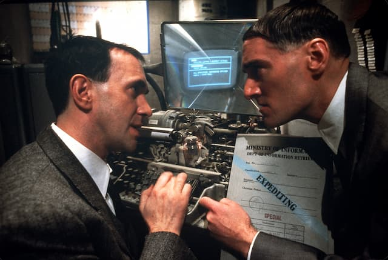

_"Desculpe-me, Dave, você digitou as palavras-chaves erradas"._

Você escreve um romance. Digita mil palavras num processador de textos on-line. Então, certo dia, tenta abrir o documento para revisá-lo. De repente, “[desculpe-me, Dave](https://www.youtube.com/watch?v=ARJ8cAGm6JE)”. O texto foi escaneado via _machine learning_ e censurado. Você não tem mais acesso a ele.

[Segundo a MIT Tech Review](https://www.technologyreview.com/2022/07/15/1056042/chinese-novel-censored-before-shared/), foi o que aconteceu recentemente com uma novelista chinesa, que usava uma espécie de Google Docs local, o WPS.

Furiosa, a autora reclamou na rede social Weibo e seu post viralizou. Oops. A denúncia ficou mais famosa do que a obra. Mais: ela despertou atenção negativa para a empresa por trás do WPS, Kingsoft, que teve que se explicar em público. Assim, também expôs os limites da Lei de Ciber-segurança chinesa.

Ou seja, mesmo num país ditatorial, **a censura acabou provocando mais barulho do que silêncio**. E, provavelmente, o romance foi pego pela paranoia descalibrada de algoritmos que não sabem distinguir contextos e nuances.

A reportagem da MIT é bem vaga (_alerta de factoide_). Ainda assim, serve para nos lembrar de duas palavras (grudadas): YouTube. Quantas vezes você já ouviu autores reclamarem de terem vídeos desmonetizados ou tirados do ar graças às barbeiragens das máquinas de aprender?

A vantagem que temos ao utilizar os aplicativos monopolistas norte-americanos é que, procurando bem, em algum lugar encontraremos um botão para reclamar. Em alguns casos, será até possível resolver a situação temporariamente. Mas não conte com isso.

Nossa tendência é pensar que as ferramentas de repressão são mega eficazes e monolíticas. Mas, no fundo, tanto as democracias quanto os países ditatoriais estão cada vez mais parecidos com o [Brazil](https://pt.wikipedia.org/wiki/Brazil_(filme_de_1985)), aquele filme do Terry Gilliam. Burocracia, burocracia e burocracia. Formulários, procedimentos e negociações infinitas. Agora com _interfaces_ de usuário. **UI é o sexto poder.** Ou sétimo – já perdi a conta.

_Cena de Brazil, o filme._

Franz Kafka se preocupava com o _nonsense_ da burocracia, que é um subproduto da tentativa de gerenciar massas de humanos usando padrões abstratos. No caso da sua obra (e também em “Brazil”), o que causava problemas era a combinação de três **polos de erros**: os funcionários, as máquinas e os procedimentos padronizados. Hoje em dia, **adicionamos programadores e designers à equação**.

Nossa época acredita ainda mais na ideia de que quanto mais dados coletarmos, mais precisos ficaremos. Por isso a necessidade de processar palavras-chave, dados de telemetria, estatísticas, etc. Porém, sempre acabamos criando mais buracos de coelho e novos geradores de caos. Daí mais "necessidade" de controle e censura.

O sonho tecnocrático da automatização do governo ainda está longe de ser realizado. Afinal, ainda que nossa privacidade seja invadida constantemente, ainda que as máquinas saibam tudo sobre nós, **sua eficácia em contextualizar dados varia muito**. Aparentemente, são super espertas para sugerir anúncios. Mas meio estúpidas para gerenciar ideias.

* * *

## Aviso para quem usa Protonmail

Por falar em máquinas causando problemas, depois da última reforma do Protonmail, alguns leitores não estão recebendo a _newsletter_. Se é o seu caso, vale [seguir os procedimentos descritos aqui](https://www.whitelist.guide/protonmail/). Estou pesquisando se há algo que eu possa fazer para evitar problemas como esses.
