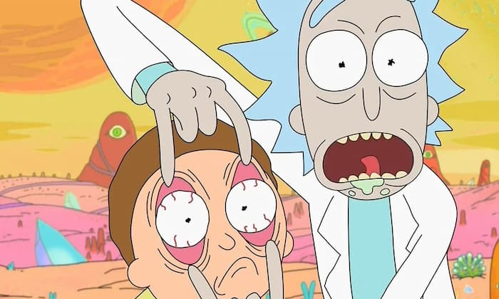

_"Abra os olhos, Morty!"_

É. A coisa está feia nos EUA. Ondas de calor, problemas no fornecimento de energia, entre outras notícias alarmantes sobre o aquecimento global.

Tanto que já se fala sobre migração em massa para [paraísos climáticos](https://megaphone.link/VMP9882778181), regiões com melhores condições naturais para hospedar humanos na crise ambiental.

E como adaptar uma cidade para, de repente, receber milhares de desempregados e desapropriados? Foi mais ou menos o que a jornalista Amanda Shendruk, da Quartz, [tentou imaginar](https://qz.com/1891446/welcome-to-leeside-the-uss-first-climate-haven/). Ela descreve um local futurista, mas realista — se é que você me entende.

Entretanto, para variar, meu assunto aqui é outro. A ideia é falar sobre negacionismo. Ou melhor, negacionismos.

## Antes, o ponto de mutação

Há apenas alguns anos, alguns de nós ainda tentávamos dizer que o aquecimento global era uma besteira. Hoje, chegamos nas conversas acima.

Existe um ponto de mutação, quando não há mais como negar um problema. Assim como foi com a COVID-19 no começo de 2020. Boom: de repente, o mundo mudou. [Choque ontológico](https://en.wiktionary.org/wiki/ontological_shock).

Porém, ainda assim, é claro, os negacionistas continuam existindo. Por isso, é importante investigar os poderes destruidores de cada tipo de negacionismo.

## Negacionismo otimista

**Comportamento:** A pessoa vê que o problema cresce assustadoramente. Mas evita enxergá-lo, corre para escapismos. Confia que, de alguma forma, tudo será resolvido por alguém ou alguma força (Deus, Mercado, Políticos), sem ela precisar se mexer.

**Motivação:** Manter um estilo de vida e certas conveniências.

**Exemplo:** Crescimento econômico, redes sociais, consumo de carne e produtos derivados de animais.

**Superpoder:** Esse é um dos negacionismos mais poderosos, porque desperdiça tempo e energia. Quando o ponto de mutação chega, é tarde demais.

## Negacionismo tático

**Comportamento:** A pessoa enxerga a crise como uma oportunidade de exploração. Assim, finge que é negacionista. Promove a ignorância para poder agir na surdina.

**Motivação:** Ganho imediatista, baseado numa visão cínica e individualista. A pessoa não entende que seu bem-estar está ligado ao do resto da sociedade e ataca os outros.

**Exemplo:** Hmmm.

**Superpoder:** Ataques tópicos e bombásticos. Grandes golpes, prevaricações, fortunas que crescem rapidamente. Ainda assim, o impacto é menor que o do negacionismo otimista. É que as tramoias fazem muito barulho, então acabam vindo à tona e o sistema acaba, de alguma forma, “corrigido”, pelo menos superficialmente.

## Negacionismo alucinatório

**Comportamento:** A pessoa fica presa em _loops_ discursivos, debates sobre detalhes e argumentações.

**Motivação:** Pode ser uma combinação dos negacionismos anteriores. Ou uma tentativa de escapismo, via exercícios intelectuais.

**Exemplo:** “O COVID é uma invenção do governo chinês para controlar… ". "Ah, mas vegetarianismo também causa problemas ambientais".

**Superpoder:** Gastar tempo e energia corrompendo debates realmente importantes. Até porque é essencial investigar crises de maneiras mais profundas e abstratas.

## Bônus: aceitismos

Se negacionismo é um problema, o “aceitismo” também pode ser. Mas, como o texto já está longo demais, insinuarei apenas o **aceitismo hedonista**: “tudo está perdido, então quero festa, abandonar todas minhas inibições”.

É mais ou menos como [naquele episódio](https://www.youtube.com/watch?v=rOv5YQeJPA8) de _Rick & Morty_, em que o cientista resolve fazer uma turnê por planetas prestes a serem destruídos e se engajar em várias surubas intergaláticas.

Há tanto para ser debatido nessa atitude. Melhor voltar ao assunto no futuro. É que, basicamente, o **aceitismo hedonista também é conservador**. Precisa de uma grande crise, uma grande garantia, para cancelar amarras culturais.

E também tem um prazo de validade curto, porque perde a noção do “gerenciamento contínuo” dos prazeres e recursos. O que leva a crises, como a ambiental, a econômica e a cognitiva (da Internet de 2021). Portanto, ao _loop_ aceitismo / negacionismo.

É o velho _Paradoxo de Lobón_, “é melhor viver 10 anos a mil ou mil anos a 10?” Essas são, realmente, as únicas alternativas? Será que, em vez de ter espasmos até ficar paralisado, é possível apenas… dançar?

Não perca o próximo episódio.
