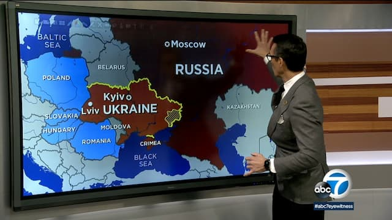

_Não estou incluído na proliferação de especialistas em geopolítica das últimas semanas._

Perdi a conta de quantas vezes comecei e parei de escrever esta edição da newsletter. É que, como muitos de nós, venho tentando tirar algum sentido da situação na Ucrânia. Mas, exatamente por ser formado em ciências políticas, percebo que **não sou suficientemente qualificado para dar opiniões relevantes sobre o assunto**.

É que a invasão da Ucrânia se relaciona com múltiplos fenômenos interdependentes:

1. A história do imperialismo norte-americano desde o fim da Segunda Guerra Mundial.
2. As relações econômicas das elites na Europa (ou seja: qual é o real objetivo das sanções na Rússia e que consequências isso pode trazer para o resto do mundo a longo prazo).
3. A posição da China e a reorganização da geopolítica em torno da Ásia.
4. A ascensão da extrema-direita (como perigo real e também como desculpa para ampliar os poderes de certos Estados).
5. Crimes de guerra (que são cometidos tanto pelo presidente da Ucrânia quanto pela Rússia).

Além de outros aspectos mais próximos dos assuntos regulares desta newsletter:

1. Como alguns ideólogos das criptomoedas e do blockchain estão aproveitando o momento para tentar nos convencer de que são uma alternativa viável à política tradicional.
2. O que significa para a política internacional quando grupos de hackers "independentes" decidem entrar num conflito como o da Ucrânia. Aliás, existe mesmo uma democratização da guerra?
3. A manipulação das redes sociais. A guerra como entretenimento interativo.
4. As consequências ambientais da guerra (como, por exemplo, manipular armamento pesado em zonas como as de Chernobyl).

Enfim. É um assunto vastíssimo.

Por enquanto, o máximo que posso fazer é dizer como venho acompanhando o conflito. Certamente, não é pela imprensa tradicional brasileira, que, de modo geral, se baseia na norte-americana e reproduz discursos problemáticos.

Então, [comece por aqui](https://youtu.be/L4TswCGkK6Y). Trata-se de "uma live" com o professor de relações internacionais da PUC-SP, Reginaldo Nasser (vale revelar que eu fui assistente dele durante minha graduação, então posso estar enviesado).

Tenho resistido a "fazer curadoria" para não estimular FOMO e vício em dopamina. Além disso, note que leio coisas com as quais discordo (por exemplo, propaganda crypto). E, hoje em dia, muita gente acha que linkar é necessariamente endossar.

Compreensível. Vivemos numa época de pânico cognitivo, que lida com a informação de uma maneira superficial e emocional. Até mesmo mencionar certos assuntos já soa como adesão. Então, é melhor praticar "curadoria lenta".

Ainda assim, se for útil, peçam, que eu posto alguns links na [comunidade do Telegram](https://t.me/edufme).

Enfim, só para dizer que não pretendo dar muitos palpites sobre a Ucrânia. Não atrapalhar, não espalhar mais besteiras por aí, já parece ajudar, de alguma forma.
