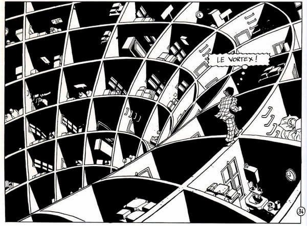
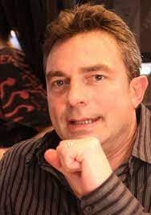

O assunto de hoje é uma história em quadrinhos. Nela, uma pessoa acorda assustada. Coisas estranhas começam a acontecer. Ela não sabe ao certo os limites entre sonho e vigília. De repente, surge a ameaça de um vórtice.

Sandman?

Não.

Refiro-me a [O Processo](https://www.amazon.com.br/Prisioneiro-dos-Sonhos-Vol-Processo/dp/6500459342?crid=3175ZYINXNE3G&keywords=marc-antoine+mathieu&qid=1660053043&sprefix=marc-a%2Caps%2C283&sr=8-1&linkCode=ll1&tag=eduf-20&linkId=aff9b4f90dda194f8d71da1f4bf40c28&language=pt_BR&ref_=as_li_ss_tl).

O de Kafka?

Não, o do francês [Marc-Antonie Mathieu](https://pt.frwiki.wiki/wiki/Marc-Antoine_Mathieu). É um dos livros que fazem parte da série “Julius Corentin Acquefacques, prisioneiro dos sonhos”, que vem sendo lançada pela destemida editora [Comix Zone](https://linktr.ee/canalcomixzone).

Por que destemida? É que a série traz histórias que **desafiam as convenções do próprio objeto livro**. Tipo inserir a capa no meio da publicação, colar uma espiral entre duas páginas, extrair um quadro da folha (deixando só um buraco), etc. Traduzir e viabilizar um projeto desses num preço acessível não é para qualquer um.

Apenas dois anos depois de Gaiman publicar seu _Sandman_, Mathieu (foto acima) já estava alargando os limites do que era possível se fazer nas HQs.

O tom da sua obra é inspirado em Kafka, claro. Mas sua imaginação está mais para os experimentos brincalhões dos surrealistas ou de M.C. Escher. E (até onde eu sei) o nível de sentimentalismo é zero.

Em _O Processo_, Mathieu começa com o reconhecimento da natureza cíclica da existência. Mostra as engrenagens de um relógio que, aparentemente, funcionam em harmonia. Mas, quando um micro detalhe sai do plano, toda uma série de consequências surgem.

Então, o Sr. Acquefacques é obrigado a fazer algo muito perigoso: **perceber as estruturas da sua própria vida**. Sair da repetição inconsciente de padrões.

Não é um “processo” simples. Ele ainda se sente compelido a repetir seu cotidiano à risca – a tal “responsabilidade”. Mas, agora, Sr. Acquefacques está oficialmente perdido.

E o problema nem é distinguir o sonho da realidade. É **saber o que fazer depois**. É reestabelecer uma identidade e senso de propósito, o mais rápido possível.

Ao ser ejetado da sua rotina, Sr. Acquefacques poderia ter simplesmente olhado para os lados, deixado aflorar sua curiosidade. Mas é **intolerável** ficar ali no “meio”, no espaço indefinido. É praticamente impossível apenas apreciar o que acontece.

Por isso, tanto em _O Processo_ quanto em _Sandman_, há sempre essa **ameaça do vórtice**. Aquela força da natureza que não permite manipulação, que suga suas certezas, que não lhe dá chances de negociar.

Existe alguma fascinação cultural com a ideia de estar “no olho do furacão”. Há quem imagine que exista alguma salvação ali, depois da tormenta das periferias. Uns fogem, outros querem vencê-la.

Sandman não se arrisca: resolve o problema via fofice, antes do bicho pegar de vez. Já Sr. Acquefacques acaba se deixando engolir.

E, como em _2001, Uma Odisseia no Espaço_, ou até _Interestelar_, surgem outras coisas. Não existe um fim, propriamente dito. Nem uma perfeita calmaria eterna.

Aparentemente, nós somos viciados em continuar, em reorganizar, traçar novos planos, “corrigir” os mapas, ajustar a percepção. Enquanto isso persistir, os vórtices servirão como portais. **O vórtice é uma metáfora para o medo e para a morte**.

Enfim, só para lembrar: algumas das obras de Marc-Antoine Mathieu estão disponíveis em português. Caso você queira se tornar prisioneiro de outros sonhos, claro.
