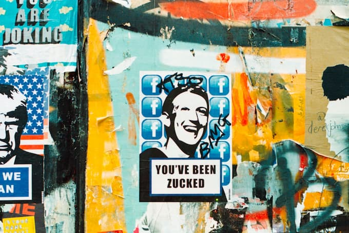

_Imagem via_ [_Annie Spratt_](https://unsplash.com/@anniespratt)_._

Se aprendemos algo nessa semana, foi o quão arriscado e triste é ter que depender de monopólios. E não me refiro apenas às corporações. O assunto aqui é o **corporativismo psicológico**, um hábito (até certo ponto) voluntário que desenvolvemos a cada dia.

## Como funciona

O **psico-corporativismo** se propaga via três mecanismos que se retroalimentam:

1. **Pressuposição da escassez.** Você é levado a pensar algo assim: "Todo mundo usa o WhatsApp. Todos se comunicam via escárnio e ofensa. Todos consomem nas mesmas plataformas. Fazer o quê? Não há como fugir".
    
2. **Controle da diversidade.** Na Internet, você encontra os nichos mais específicos. Porém, eles se comunicam e se desenvolvem via Twitter, YouTube, entre outras ferramentas _uniformizantes_. Então, são tratados como "tendências" ou "[estéticas](https://www.youtube.com/trends/articles/youtube-aesthetics/)".
    
3. **O mito da inconveniência alheia.** Aprendemos a lidar com as mumunhas e dificuldades de _apenas alguns_ aplicativos. E não é que eles sejam fáceis. Apenas decidimos enfrentar as curvas de aprendizado de uns, _pressupondo_ que os outros seriam muito piores.
    

## Formando o hábito ↻

Por meio desses três elementos, reforçamos _diariamente_ o hábito (de reforçar o hábito) de circular pela Internet centralizada. Assim, é natural que, a cada dia, fique mais difícil sair do Facebook, Instagram, WhatsApp, etc. Quem sai, parece um [creep, um weirdooo](https://www.youtube.com/watch?v=XFkzRNyygfk).

Imagine se isso acontecesse com aviões. Se uma turbina falhasse e não pudéssemos recorrer às outras. Se, em vez de projetar um sistema múltiplo e diverso, **preparado para a falha**, os engenheiros tivessem planejado aeronaves otimizadas para a centralização, para o monopólio de uma só turbina. Quem se arriscaria a viajar pelos ares?

## Medo e delírio

O psico-corporativismo é uma **mentalidade de decadência**. Baseia-se no medo da diversidade, na padronização constante e no emburrecimento progressivo.

Compreensível. É mais uma tentativa de domar o caos e a criatividade radical da existência. Ninguém disse que seria fácil.

Porém, feliz ou infelizmente, sempre vai sobrar um detalhe, um lapso, um ponto cego, que vai colocar todo o sistema abaixo por alguns momentos e sussurrar: "ei, há muita coisa lá fora. Muita".
