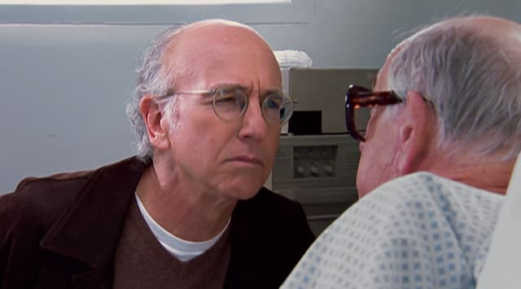
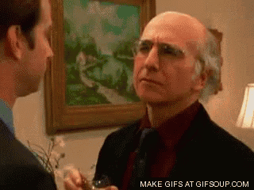

Uma das minhas ambiguidades de estimação é a crença / descrença na generosidade. Tento acreditar nela, tento praticá-la, mas a verdade é que sempre fico desconfiado. Se alguém me oferece algo, a primeira reação é a **Checagem Larry David**:

Por um lado, estamos vivos graças a redes de generosidade incessantes. Dos nossos pais até pessoas que mal conhecemos nas ruas, sempre tem alguém ajudando de alguma forma.

É difícil de perceber, mas vivemos cercados dessa generosidade biodegradável, "nunca te vi, nunca mais te verei, mas serei bacana contigo por um minuto". Há quem acredite até que, em catástrofes, nossa primeira reação é colaborar, não migrar para o estado de natureza hobbesiano.

Porém, como tantas outras coisas, a generosidade tem um **problema de escala**: vai ficando ameaçada conforme custa mais e se prolonga ao longo do tempo. E aí surgem os custos não combinados.

Como você bem sabe, há quem pratique generosidade para (consciente ou inconscientemente) escravizar os outros, mantê-los sob controle, criar um séquito de admiradores, para sentir-se superior, para calibrar a autoestima, etc.

Relações baseadas em **generosidade tóxica** costumam ser traumáticas. São tão desgastantes que a tendência é, como se diz por aí, descartar o bebê com a água do banho. Toda generosidade acaba sendo vista como manipulação. Estilo Silicon Valley: se você não paga, você é o produto.

Parece melhor, então, estabelecer contratos, definir condições. Trocar a generosidade por negociação, por Temos e Condições de Uso.

É por isso que eu fiquei tão espantado quando estive na California. Tudo parecia jurídico: nos restaurantes, você tem que, literalmente, assinar embaixo da gorjeta. Se alguém lhe oferece um pouco mais de café, vai cobrar por isso. Existe pelo menos uma impressão de que tudo funciona às claras, não há taxas invisíveis.

Há uma crença nos contratos, como se eles estivessem livres de obscuridades, manipulação e rigidez. Mas, se você acredita nas [pesquisas de Daniel Khaneman](https://www.amazon.com.br/Ru%C3%ADdo-Uma-falha-julgamento-humano/dp/8547001336?__mk_pt_BR=%C3%85M%C3%85%C5%BD%C3%95%C3%91&crid=1Y4JUHUP0QWM5&keywords=daniel+kahneman+ru%C3%ADdo&qid=1653476603&sprefix=daniel+khaneman+ru%C3%ADdo%2Caps%2C465&sr=8-5&ufe=app_do%3Aamzn1.fos.fcd6d665-32ba-4479-9f21-b774e276a678&linkCode=ll1&tag=eduf-20&linkId=a3836c3c7ff88cafce20aef40bd7a5fa&language=pt_BR&ref_=as_li_ss_tl), sabe que o sistema jurídico está cheio de desafios emocionais e cognitivos, o que ele chama de "ruídos".

No fundo, a generosidade é um exercício, tanto para praticá-la quanto para recebê-la. Você treina seu algoritmo para enxergar fraudes a tempo, para evitar escravizar os outros e para recorrer a contratos, quando necessário.

Isso vale para pessoas, aplicativos, UX, UI e empresas. Quanto antes você percebe que está numa relação de generosidade tóxica, melhor. Quanto antes você corta o fluxo do endividamento, menor o preço que vai pagar mais tarde.

O problema é que somos viciados em conveniência. Ainda que uma situação seja evidentemente corrosiva, queremos sempre um pouco mais de conforto, sempre beber mais um Martini antes do Titanic afundar. Mas o apego à conveniência só cresce exponencialmente e nos fragiliza cada vez mais.

Enfim, talvez essa seja a generosidade do processo de generosidade: refinar a percepção constantemente. Desconfiar, sem descambar para a rigidez. E, claro, nunca perder o compromisso com o resto da comunidade dos "viajantes de percepções". Desculpe-me se não tenho nada muito mais esperto do que isso para compartilhar hoje.
