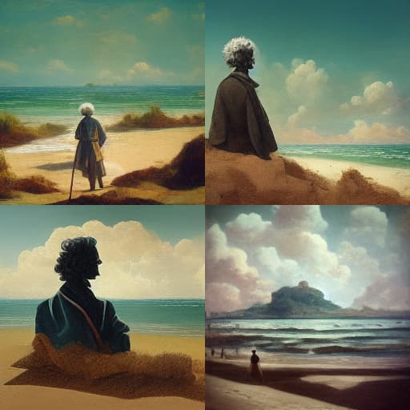
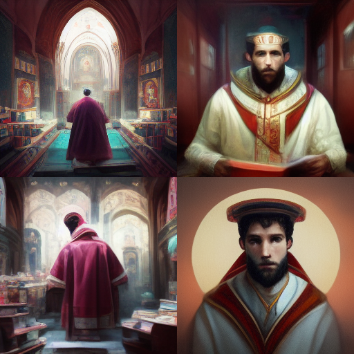

_Rousseau na praia, segundo o aplicativo de inteligência artificial [Midjourney](https://www.midjourney.com)._

Ano de 1996. Prédio velho da PUC-SP, um convento dos anos 40 convertido em universidade de Ciências Humanas. As salas são pequenas. Os estudantes se amontoam, sentados em carteiras escolares decadentes.

Faz frio. As janelas estão fechadas. No acidentado assoalho de madeira, as bitucas de cigarro se acumulam. Naquela época, era comum alunos e (especialmente) professores fumarem durante a aula. Fazia parte do show.

À frente da sala, uma das mais importantes pesquisadoras do departamento de ciências políticas, falava sobre [Jean-Jacques Rousseau](https://pt.wikipedia.org/wiki/Jean-Jacques_Rousseau). Não éramos mais “bichos”, não se tratava de uma aula introdutória. Estávamos agendados para debater um texto específico.

No entanto, a professora gastava nosso tempo (e pulmões) falando sobre a biografia do autor. Vivesse hoje em dia, Rousseau teria sido cancelado umas mil vezes.

30 minutos. Uma hora. E nada do texto.

Ao meu lado, meu amigo Mário (que merece um artigo à parte) se contorce na cadeira. Coça a cabeça. Respira fundo. Troca olhares comigo. E eu: “aí vem”.

Ele é uma pessoa preta, forte, com cerca de 1.90m. E tem uma gentil voz de tenor, totalmente contraintuitiva para sua aparência imperial.

Pois bem. Mário pede a palavra.

“Aí vem”.

– Professora.

– Sim.

– A senhora está levando Rousseau para a [Ilha de Caras](https://caras.uol.com.br/canal/ilha-de-caras).

Silêncio completo na sala. Até os cigarros pararam de soltar fumaça.

_Santo Agostinho, segundo o Midjourney._

A professora continua, perturbada:

– Po-pois saiba que, para, co-como o senhor diz, levar Rousseau para Ilha de Caras, eu eu eu tive que me preparar durante muitas horas.

– Sim. Muito obrigado. Mas será que poderíamos discutir o texto?

Seguiu-se alguma troca de ideias tensa. Mas Mário _sempre_ resolvia a situação. Talvez ele usasse algum perfume de [ocitocina](https://pt.wikipedia.org/wiki/Ocitocina). Qualquer bate boca com ele terminava em “só love, só love” (já que estamos nos anos 90). Comigo, dou bom dia e já preciso me esquivar da facada.

Mas onde é que eu queria chegar, mesmo? Ah. Nisso: é possível separar a vida do autor de sua obra? É um debate que já acontece há séculos. Seria um crime gastar apenas poucas linhas nisso.

O que eu queria dizer é que, hoje, essa discussão ganha um novo colorido.

Em certos ambientes midiáticos, como o YouTube, há criadores que só se tornam populares quando começam a virar personagens, quando fabricam uma pseudo espontaneidade passível de repetição (bordões, tiques, idiossincrasias).

O fator fundamental aqui é a **repetição**. É preciso mostrar aquele traço de “espontaneidade” muitas vezes, de modo a **virar um hábito para o consumidor**.

Até certo ponto, o criador precisa aprender a empacotar, reproduzir e industrializar esse personagem.

E precisa **criar espaço para exibir esse produto**. Ou melhor, precisa agendar a visita de Rousseau à Ilha de Caras. Além de se certificar de que as câmeras estão bem posicionadas.

Em outros ambientes, como o TikTok, **não é tão importante identificar o criador**. Como o algoritmo se foca no consumidor, é possível até que uma pessoa passe o dia inteiro vendo vídeos, até lhe caírem as retinas, sem se vincular a um autor específico.

Nesse caso, o consumo da espontaneidade não depende, necessariamente, de um criador-personagem. Ela é encontrada, repetida, encorajada e empacotada **pela própria plataforma**.

É claro, existem criadores celebridades no TikTok e também assistimos à tutoriais “impessoais” no YouTube.

Mas é, pelo menos, interessante ver como o debate sobre se é possível separar biografia da obra fica cada vez mais complexo. Agora também precisamos pensar se **a vida virou obra**.

E se é possível separar:

- a vida – coisas que acontecem cotidianamente.
    
- biografia – narrativas consumíveis.
    
- serialização da biografia – “ganchos” de personalidade que podem ser empacotados e reproduzidos continuamente.
    

É. Não sei se eu iria gostar de ver Rousseau na Ilha de Caras. Mas um TikTok de [Santo Agostinho](https://pt.wikipedia.org/wiki/Agostinho_de_Hipona), ah, esse eu ia acabar espiando de vez em quando.

PS - Vocês viram meu vídeo sobre [espontaneidade digital](https://youtu.be/unK76xZk67o)?
