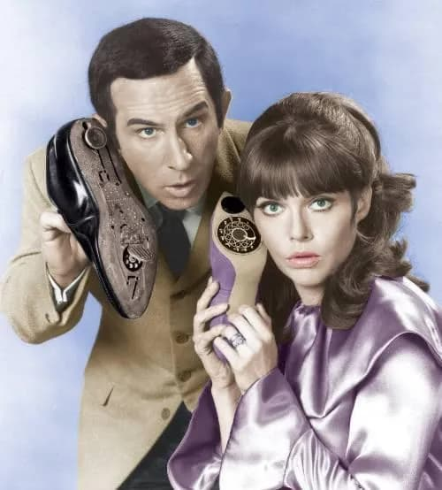

_Maxwell Smart, da série Agente 86, consultando seu smart watch._

Contratos, telefones, roupas, parece que, hoje em dia, tudo precisa ser “smart”. Daí que, nessa semana, pensei em escrever sobre a nossa atual obsessão com essa palavra. Em que contexto ela começou a ser usada? Quando foi atrelada a produtos e tecnologias?

Para evocar o espírito do absurdo, eu citaria a clássica série de TV Agente 86 (“Get Smart”, em inglês), dos anos 1960. Era uma paródia dos filmes de espionagem. O protagonista chamava-se Maxwell Smart. E, de James Bond, só tinha a autoconfiança. Na prática, era um tapado, tentando desvendar mistérios e usar gadgets estranhos, como um telefone-sapato.

Daí, aconteceu a Internet. Alguém foi mais smart que eu e [escreveu o texto dois anos antes](https://www.t-systems.com/de/en/newsroom/best-practice/01-2018-totally-smart/what-does-smart-mean-history-of-a-buzzword).

Mas, enfim, sobre a palavra, em si, teria surgido do alemão, “smarta”, “doloroso” — há cerca de 2 mil anos. No Inglês antigo, há registros de “smeart”, que seria algo como “ferramenta afiada que causa dor”. A partir de 1300, ganhou uma conotação paralela: coisa ou pessoa rápida e ativa. Só em meados do século 20 é que começou a ser preferencialmente associada à inteligência.

É [mais um caso](https://eduf.me/tecnologia-o-que-e-isso/) de inversão de significado: no começo, “smart” era _induzir_, depois virou _evitar_ dor.

Interessante. Até porque esperteza é algo relativo — em geral, depende de prejudicar os outros. No Brasil, até, mantemos uma saudável desconfiança da palavra: “você é um espertinho”. Ou, em São Paulo, quando se diz “experto”, com sotaque carioca, para indicar falcatrua (e bairrismo).

### Smartização do mundo

A atual obsessão com a palavra “smart” teria começado nos anos 1990. Então, ela passou a significar, virtualmente, qualquer coisa: mais conveniência, mais rapidez, mais funcionalidades, menos passos para completar uma tarefa.

“Smart” virou uma espécie de medalha: é pressuposto que esperto seja bom e desejável. Você pode ser até considerado um tanto idiota e atrasado, caso não possua algo “smart”. Isso implica que as técnicas do passado eram burras. E que o tempo é linear: ou você anda para a frente ou está em marcha-ré — sem nuances.

Parece que estou implicando. Mas palavras vagas ganharam uma força mobilizadora incrível a partir do advento do neoliberalismo. Enquanto os teóricos diziam desconfiar das grandes narrativas (como socialismo, comunismo, História), as “pequenas” tomaram o poder.

E, agora, começa a ficar evidente que a medalha “smart” é um símbolo da decadência entorpecida capitalista.

Como explicá-la? Hmmm. Com outra referência velha.

### Caindo do penhasco

Talvez você conheça aquele desenho, Papa Léguas. Seu arqui-inimigo, Coiote, se achava esperto. Planejava e criava tecnologias para capturar o pássaro. No papel, tudo parecia incrivelmente funcional. Mas, na prática, o Coiote sempre acabava despencando do penhasco.

O mais interessante é que, antes de se esborrachar, sempre havia uma pausa. Esbugalhado, o Coiote olhava para o espectador. Era como se o tempo parasse por um segundo e nós tivéssemos esse **momento de intimidade**. Coiote percebia que não era tão “smart” assim e nos pedia um lance de empatia.

_O momento íntimo que o Coiote tinha conosco._

Vivendo numa sociedade como a nossa, nem sempre temos esse privilégio, esse tempo para pensar. Ainda que continuamente percebamos a fragilidade da lógica smart, tentamos hackear a queda: compramos um tíquete de avião no programa de milhagem, ligamos para a Amazon, torcendo para que entregue uma smart rede, antes de chegarmos ao chão. Pulamos de uma esperteza para outra.

É exatamente isso que dava graça aos episódios de Agente 86: Maxwell Smart realmente acreditava na sua inteligência e na eficácia dos seus aparelhos. Mas vivia protegido, em delusão: quem resolvia os problemas era a Agente 99 (ou a sorte). Maxwell posava de hétero top, mas sempre acabava prendendo o nariz na porta. E olhando para os lados para ver se alguém percebeu.

_Maxwell e a verdadeira heroína da série, Agente 99._

Não sei de você, mas, às vezes, acho que parte dos nossos produtos espertos parecem ter saído do Controle — digo, da agência norte-americana de espionagem do seriado.

São interessantes, úteis e tal. Mas prometem muito mais do que entregam. E não precisamos, realmente, da maioria deles. Digo isso porque acabei de testar mais um serviço que se dizia “do futuro”. Na hora de ativá-lo, “encoiotou” e caiu do penhasco. E a empresa só foi capaz de me dizer: “desculpe por isso, chefe”.

Há! O velho truque das narrativas que parecem inofensivas.
