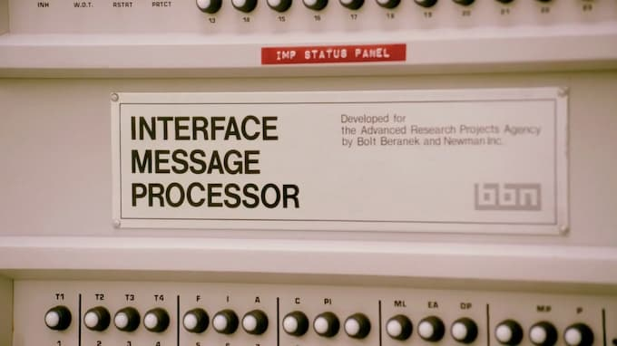

O que "tecnologia" evoca para você? Aparelhos? Códigos? Notícias sobre empresas canibais buscando o Lucro Infinito? Talvez tudo isso. Porém, [a etimologia](https://en.wikipedia.org/wiki/Techne) indica que usamos essa palavra de um jeito estranho. Simplificando, o termo grego _tékhnē_ indica "fazer", e é usado em comparação a _epistēmē_, "conhecimento", "entendimento".

Esse é um debate um tanto específico na filosofia clássica. No entanto, ao longo da história, o significado da palavra se tornou praticamente o oposto do original. Hoje, tecnologia é mais associada à ideia de conveniência, de algo que executa tarefas por nós. Em vez de fazer, tentamos delegar, externalizar complexidades e, no limite, facilitar a alienação voluntária.

## Gente que (não) faz

Assim, um artesão criando um cesto manualmente pode ser mais "tecnológico" do que alguém que compra o mesmo objeto usando VPN e navegador Tor, na deep web. Por outro lado, um programador, idealmente, ainda seria um "fazedor". Daí a frase de Douglas Rushkoff, [programe ou seja programado](https://www.amazon.com.br/As-Quest%C3%B5es-Essenciais-Era-Digital/dp/8502158821?__mk_pt_BR=%C3%85M%C3%85%C5%BD%C3%95%C3%91&crid=2KCC5HKDVVOXQ&dchild=1&keywords=douglas+rushkoff&qid=1628688337&sprefix=douglas+rush%2Caps%2C293&sr=8-4&linkCode=ll1&tag=eduf-20&linkId=486960ff1a2c7565924d1b1e2a9fcbd5&language=pt_BR&ref_=as_li_ss_tl).

Então, a respeito de tecnologia, seja você entusiasta ou cético, [apocalíptico ou integrado](https://www.amazon.com.br/Apocal%C3%ADpticos-Integrados-Umberto-Eco/dp/8527301571?__mk_pt_BR=%C3%85M%C3%85%C5%BD%C3%95%C3%91&crid=X6FP2ZCD8JS3&dchild=1&keywords=apocalipticos+e+integrados&qid=1628688528&sprefix=apocalipticos+e+%2Caps%2C324&sr=8-3&linkCode=ll1&tag=eduf-20&linkId=d24920c7685eda5cbef30ac3e50cc682&language=pt_BR&ref_=as_li_ss_tl), ou qualquer nuança entre esses extremos, é importante entender que nossa visão de tecnologia é baseada numa **Vontade de Ignorar**. (Brinco aqui com a ideia de Nietzsche, Vontade de Poder, e a de Michel Foucault, Vontade de Saber).

Ou melhor: o que eu preciso _construir_ ou _comprar_ para não precisar _saber_? Para não _ter que lidar_ com (insira um problema). Talvez os gregos achariam um tanto inusitado esse uso do termo _tékhnē_. Vai saber.

## Fomos mesmo traídos?

Toda essa volta para dizer o seguinte: não deveríamos nos sentir _exatamente_ traídos quando notamos que parte da indústria de tecnologia se tornou monopolista, lobista, obscura em seus procedimentos e que, basicamente, é uma reencarnação da indústria do tabaco.

De certa forma, isso era o esperado, dado suas bases filosóficas (conscientes ou inconscientes). Você não pode criar toda uma indústria baseada na Vontade de Ignorar e esperar coisas justas, claras e transparentes.

O que falta para a versão atual de _tékhnē_ é o velho contraponto de _epistēmē_. Não que isso resolveria todos os problemas da humanidade, especialmente dentro de um sistema capitalista. Mas parar de cultuar cegamente a Religião Tecnológica talvez fosse um bom começo. Tecnologia é o ópio do povo (às vezes até literalmente).
