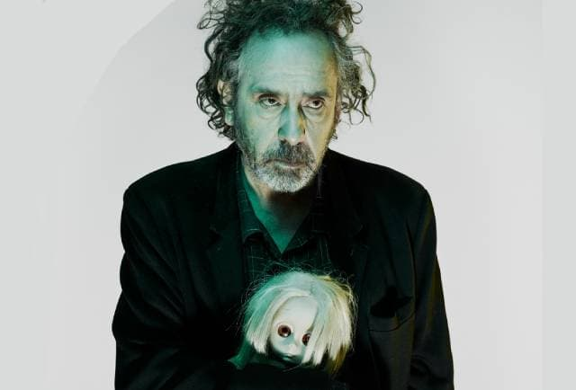

O cineasta Tim Burton [voltou ao Brasil](https://g1.globo.com/fantastico/noticia/2022/05/08/tim-burton-visita-sao-paulo-e-diz-que-e-fa-de-ze-do-caixao.ghtml). Veio promover uma exposição sobre seu trabalho, que [está na Oca, em São Paulo, até o dia 14/08](https://catracalivre.com.br/agenda/faca-um-mergulho-sensorial-na-arte-de-tim-burton-em-exposicao-na-oca/).

Note que eu mencionei trabalho e não filmes. É que o evento reúne seus desenhos e cenários, tudo organizado de forma imersiva. É esperado que o visitante "entre" no mundo de Burton e circule por ele. E tire fotos. E compartilhe no Instagram, claro.

Burton é uma espécie de Disney, só que focado em encontrar fofura e inocência no meio da neurodiversidade, das secreções, do horror, das pessoas marginalizadas pela aparência e de comportamento estranho.

Essa "leveza" no meio do terror é o que diferencia Burton de outros autores que trabalham em áreas semelhantes, como David Lynch, por exemplo. Burton celebra a esquisitice, em vez de temê-la ou compará-la com alguma "normalidade" perdida.

É curioso que Burton seja relembrado agora, bem quando um dos seus maiores parceiros, Johnny Depp, também está em cartaz num _reality-show-de-horror_ muito popular na Internet. Não sei se você ouviu falar.

Depp foi essencial na construção da imagem e da voz dos vários tipos de "antimeritocratas" norte-americanos imaginados por Burton.

Sabe aquela pessoa que se esforça, que dá o sangue, mas nunca consegue realmente vencer? De Edward Mãos de Tesoura até [Ed Wood](https://en.wikipedia.org/wiki/Ed_Wood_(film)), passando por Willy Wonka, os personagens podem até alcançar algum sucesso, mas sempre dentro da gaveta dos estranhos, dos traumatizados e traumatizantes.

Ed Wood, [o cineasta](https://en.wikipedia.org/wiki/Ed_Wood), aliás, é uma espécie de anti-Elon Musk: assim como o bilionário, era cafeinado, empreendedor, obsessivo e estava disposto a vencer em suas convicções malucas. Mas as coisas simplesmente não funcionavam, o dinheiro não aparecia, as pessoas raramente o levam à sério. Apenas conseguiam enxergá-lo como alguém de talento questionável.

Seu sucesso vem da nossa compaixão por ele. Da ternura da empatia, já que praticamente todos nos sentimos impostores em algum momento da vida. Todos erramos, questionamos nossas decisões e nos arrependemos.

Essa tensão entre a megalomania e a impostura é um lado que o entretenimento colonialista norte-americano até enxerga, mas tende a suprimir. Ainda que a fragilidade apareça, de modo geral, ela é eliminada pelo heroísmo, pela audácia. Vulnerabilidade é problema, anomalia.

Não em Tim Burton: as cicatrizes, a sujeira e o _gore_ não somem. Mesmo que haja sucesso e redenção, isso não apaga a esquisitice. Ela apenas faz parte de se estar vivo. A megalomania e o sucesso é que são um tanto questionáveis.

É triste ver Burton virar um tipo de exposição enquanto Depp e família viram outro, bem diferente. Ainda assim, a história do ator não deixa de ser um tanto Burtoniana. É o lado horror do entretenimento. O fedor de putrefação que sempre acaba escapando das profundezas de qualquer cultura. Acorde e cheire o cadáver.
