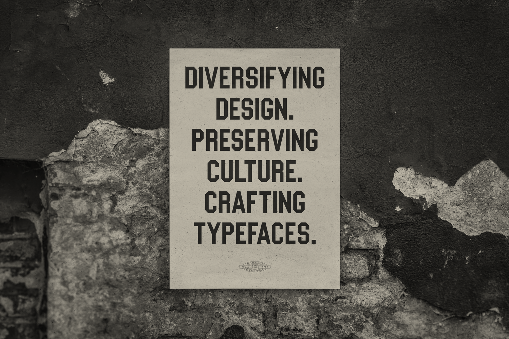

> Each typeface highlights a piece of history from a specific underrepresented race, ethnicity, or gender—from the Women’s Suffrage Movement in Argentina to the Civil Rights Movement in America. (…)
> 
> This is a type foundry for creatives of color who feel that they don’t have a say in their industry. This is for the creative women who feel that they don’t have a say in their industry. This is for the creative that is tired of being “inspired” by the same designs over and over again.

Fonte (oops): _[Manifesto — VOCAL](https://www.vocaltype.co/manifesto)_

Que tipografia expressa e reflete ideologias, você já sabe (se não, assista ao clássico documentário [Helvetica](https://www.hustwit.com/helvetica/)). Assim, a foundry [Vocal Type](https://www.vocaltype.co/) quer criar fontes que representem momentos e personagens históricos além do universo "branco", "homem" e "ocidental". Vamos ver o que surge daí.
