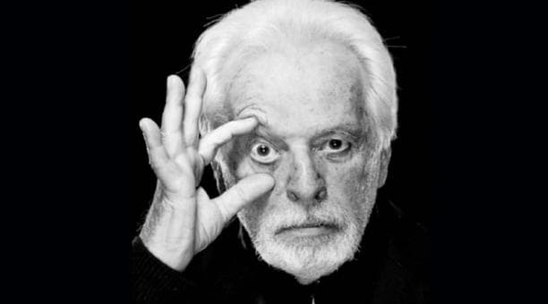

Recentemente, soubemos que a clássica série de quadrinhos [The Incal](https://www.amazon.com.br/Incal-1-S%C3%A9rie-Todo/dp/6586672333?__mk_pt_BR=%C3%85M%C3%85%C5%BD%C3%95%C3%91&keywords=incal&qid=1637160779&sr=8-1&ufe=app_do%3Aamzn1.fos.6a09f7ec-d911-4889-ad70-de8dd83c8a74&linkCode=ll1&tag=eduf-20&linkId=ba4e235f9107dd7ef5c5303a721294e5&language=pt_BR&ref_=as_li_ss_tl), de Moebius e Alejandro Jodorowsky, deve ser adaptada ao cinema pelo diretor e comediante [Taika Waititi](https://en.wikipedia.org/wiki/Taika_Waititi).

A notícia, cuidadosamente divulgada na época do lançamento de Duna, soou como um acerto de contas do destino. É que Jodorowsky ficou famoso por ter sido impedido de levar o livro de Frank Herbert às telas.

O projeto era tão inventivo e megalomaníaco (tipo contratar Salvador Dalí como ator) que deu com os burros na areia. Não conseguiu financiamento. Ainda assim, mudou a história do entretenimento.

Jodorowsky montou um _dream team_ de criadores para reimaginar o universo de Duna. O resultado do trabalho foi ajambrado num livro contendo roteiro, conceitos e _storyboards_, que circulou pelos estúdios da eṕoca. Os executivos negaram o dinheiro, mas roubaram as ideias, que foram usadas em quase todo o cinema de ficção científica que se produziu dali em diante.

Frustrado, Jodorowsky resolveu se juntar novamente a Moebius e usar parte das ideias de Duna para um álbum em quadrinhos, entitulado _The Incal_. O projeto fez tanto sucesso que se ramificou em uma série e alguns _spin-offs_. E também influenciou várias áreas da comunicação, não só cinema e quadrinhos.

Agora, Taika Waititi assume a responsabilidade de adaptar essa história rocambolesca, psicodélica e, certamente, pós-moderna (já que mistura de Tarô à física para criar múltiplas camadas de ficção). Jodorowsky declarou estar feliz com a escolha do diretor, afirmando que não teria como filmá-la por si mesmo.

## Jodo quem?

Provavelmente,você já conhece essa epopeia da vida de Jodorowsky. Mas talvez nunca assistiu aos seus filmes, ou nem mesmo leu _The Incal_. É por isso que meu interesse aqui é outro: perceber os caminhos tortuosos da criação e da autoria.

Os trabalhos derivados da frustração de Jodorowsky se tornaram tão ou mais influentes e longevos do que o material que ele efetivamente criou e planejou. A “falha” de Duna lhe garantiu uma influência capilarizada, que, talvez, tenha sido ainda maior do que ele conseguiria se tivesse feito o filme.

Enquanto a maior parte das pessoas criadoras sofrem lidando com aceitação e rejeição, muitas vezes, suas atividades se consolidam por vias inesperadas e caóticas. Plágios, interpretações errôneas, combinações fora de contexto e, como no caso de Jodorowsky, mitologias associadas a episódios da sua vida.

Jodorowsky é tão criatura quanto criador. Foi mais influente ainda quando invisível, espalhando conceitos que nem sempre lhe foram (ou serão) creditados.

Talvez seja por isso que adoramos biografias. Elas nos aliviam do peso de ter que acreditar em livre arbítrio, de tentar exercê-lo e recompô-lo quando se estilhaça.

Também gostamos das “vinganças históricas”: narrativas sobre aquela pessoa criadora obscura que foi finalmente reconhecida, tipo [The Sparks](https://en.wikipedia.org/wiki/The_Sparks_Brothers), [Sugar Man](https://en.wikipedia.org/wiki/Searching_for_Sugar_Man), entre tantas outras.

De certa forma, essas histórias também se conectam com a nossa intolerância ao FOMO. Como deixei passar essa? Como perceber o próximo grande influencer escondido?

Mas a vida não acaba sendo mesmo essa sucessão contínua de “missing outs” e de sucessos não-atribuídos (ou reconhecidos, ou privatizados)?
