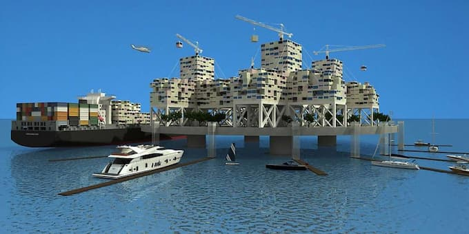

_Mas é tão legal no papel!_

Um dos mitos mais recorrentes da história da humanidade é o da sociedade alternativa: um grupo de escolhidos, buscando uma terra prometida, com regras e condições melhores. Há variações dessa narrativa em praticamente todas as sociedades. Por que, então, não surgiria uma entre os entusiastas das criptomoedas?

O jornal inglês The Guardian [publicou a incrível história](https://www.theguardian.com/news/2021/sep/07/disastrous-voyage-satoshi-cryptocurrency-cruise-ship-seassteading) do ex-engenheiro do Google, Patri Friedman, neto de [Milton Friedman](https://en.wikipedia.org/wiki/Milton_Friedman), o economista cultuado pelos neoliberais. Patri juntou um grupo de milionários, comprou um cruzeiro de 245 metros e resolveu fundar uma utopia flutuante, gerenciada via bitcoin. O nome do navio? [Satoshi](https://en.wikipedia.org/wiki/Satoshi_Nakamoto), é claro.

## O segredo das águas

Em outubro de 2020, no meio da pandemia, Friedman tentou lançar sua "seavilization", trocadilho em inglês que significa civilização marítima. A audácia causaria inveja a [Kevin Costner](https://en.wikipedia.org/wiki/Waterworld) e [Sr. Wilford](https://www.adorocinema.com/series/serie-19982/): financiar, do próprio bolso, uma vila autônoma, livre, sustentável. E com vista para o mar.

Friedman e parceiros passaram cerca de 10 anos planejando a operação. Afinal, teriam que gerenciar energia, alimentação, defesa e milhões de etcéteras.

_Spoiler alert_, deram com os burros n'água. No mar, surgiram todo tipo de obstáculos: de encontrar um país disposto a aceitar o navio ancorado em suas águas, até definir onde despejar todas feses da tripulação.

Isso é o que acontece quando se esquece do filme [Das Boot](https://www.imdb.com/title/tt0082096/).

## Um lugar do c\*\*alho

Não é que eu queira brincar de [schadenfreude](https://en.wikipedia.org/wiki/Schadenfreude). A ideia é encarar esse fantasma cultural do Novo Mundo. Um lugar outro, hermético, isolado das intempéries da "vida real" e ultrapassada. Um _update_ civilizatório.

O raciocínio é sempre parecido: não importa quantas frustrações encontramos na História, agora vai. Se pensarmos direito, se planejarmos detalhadamente, se tivermos as condições tecnológicas adequadas, se nos aliarmos às pessoas certas, ah, dessa vez dará certo. _Fail better_.

Esse é um hábito tão arraigado, que surge, escondido, de diversas maneiras:

- A busca pelo emprego ideal, com o melhor escritório e as pessoas mais compatíveis.
- O monastério e a jornada de purificação pessoal para que se mereça achá-lo e permanecer nele (estilo [Encontro com Homens Notáveis](https://www.youtube.com/watch?v=i6OAq4jwTW4)).
- O isolamento dos contaminados e degenerados, que aparece na crença no sistema penitenciário e em filmes como [Fuga de Nova York](https://en.wikipedia.org/wiki/Escape_from_New_York) (tirar da visão aqueles que causam problemas e deixá-los se autodestruírem).

E tantos outros exemplos.

## O velho cotidiano

O problema é que o mito da sociedade alternativa, de modo geral, ignora o fato de que tudo é interdependente. Não há como fugir, o isolamento é uma ilusão. E é exatamente o cotidiano que nos ensina isso — o que os tripulantes do Satoshi perceberam rapidamente.

Os detalhes caóticos da vida surgem de todos os lados. Ou abraçamos a vida, _agora_, em toda sua dinâmica, ou continuaremos a projetar _bunkers_ furados.

## Antifrágil

Por isso, admito que tenho gostado de ler [Antifrágil](https://www.amazon.com.br/Antifr%C3%A1gil-Nova-edi%C3%A7%C3%A3o-Coisas-beneficiam/dp/8547001085?__mk_pt_BR=%C3%85M%C3%85%C5%BD%C3%95%C3%91&dchild=1&keywords=Antifr%C3%A1gil&qid=1632926970&sr=8-5&linkCode=ll1&tag=eduf-20&linkId=c5d5b19b0b99dd1f78d7378af555920b&language=pt_BR&ref_=as_li_ss_tl), livro do polêmico ensaísta libanês, Nassim Taleb. Segundo ele, "antifrágil" é tudo aquilo que se beneficia dos erros, que está eternamente em correção, no limite do fracasso, mas sempre voltando mais forte.

A partir desse ponto de vista, é possível aceitar que esse mundo, _exatamente esse_, em que vivemos, está longe de ser estável e monolítico. Ele é cheio de rachaduras, pontos cegos e oportunidades de mudança, que não enxergamos. Afinal, gastamos todo nosso tempo planejando (e afundando) mundos ideais e terras prometidas.
