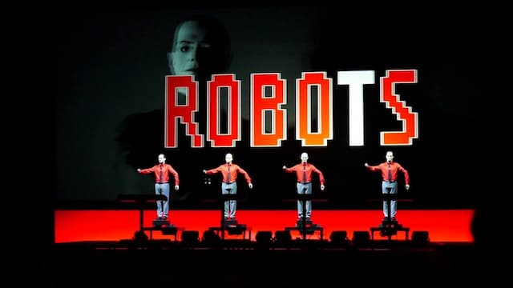

Muita gente reclama que a Internet está cada vez mais negativa, que não consegue encontrar nada de “diferente” nela, que estamos condenados a acompanhar os mesmos assuntos, nas mesmas plataformas.

Mas é só procurar um pouco e você encontrará uma quantidade absurda de experimentos, de conteúdo voltado para nichos, de aplicativos alternativos e de propostas editoriais destoantes das bolhas extremistas que dominam _parte_ da web.

Onde buscar essas coisas? Como sair da repetição compulsiva do consumo de informação?

Para responder a essas questões, não basta buscar o próximo _hype_ da curadoria ou a próxima tecnologia disruptiva. É preciso investigar os **4 mitos fundadores da web 2.0**, das redes sociais e da distribuição industrial, algorítmica, das Big Tech.

Vamos lá. Publicar conteúdo usando aplicativos como Facebook, Tiktok, YouTube, Instagram, Twitter etc é…

## 1\. Conveniente

Só se você ignora anúncios, formatações rígidas, limites de caracteres, “clique no sininho”, conteúdo censurado por erros algorítmicos, ou ambientes tóxicos e otimizados para conflitos.

## 2\. Barato

Não existe hospedagem gratuita. Existe externalização de custos.

Os usuários pagam com seus dados, expondo seu público a práticas viciantes promovidas por empresas de tecnologia que vivem sendo acusadas de estar envolvidas em monopólios, sonegação de impostos, financiamento de campanhas políticas, lobbies etc.

Ou seja: o que você economiza com hospedagem, acaba pagando em impostos ou tendo que lidar com outros problemas na sociedade.

## 3\. Melhor para encontrar “seu” público

Raramente alguém consegue criar algo pessoal e alternativo nesses ambientes. É bem mais comum que o criador tenha que gastar tempo se adaptando a listas de “best practices” para domar algoritmos e políticas institucionais.

De modo geral, o criador **luta para não ser prejudicado pela plataforma**. E não é particularmente ajudado por ela. Ou seja: você não encontra “seu” público, você é que se transforma em outro criador.

## 4\. Melhor para criar uma comunidade

O que, afinal, é uma comunidade? Números crescentes de seguidores? A sensação de que se está vencendo num jogo de crescimento, atingindo métricas estatísticas aleatórias?

Além dos robôs, que inflam os números em redes sociais, os ambientes algorítmicos também facilitam o surgimento dos “robôs humanos”. Quer dizer, os seguidores passivos, que nunca interagem, que nem mesmo lêem seu conteúdo – apenas colecionam notificações.

Em vez de comunidades, o que se cria aqui são **custos para o planeta**: dados circulando em servidores que consomem eletricidade e jogam carbono na atmosfera. No limite, isso ajuda a destruir outros tipos de comunidades, literalmente mais orgânicas.

Sem falar nos seguidores que apenas escaneiam títulos e compartilham ou criticam ideias antes mesmo de conhecê-las. Tudo isso é custo: de tempo, de energia, de saúde mental.

"Eu te odeio mas eu não te largo".

## Tirando a solidez

Quando percebemos que a web 2.0 não é tão sólida, inevitável e necessária, podemos começar a buscar comportamentos alternativos, novas rotinas de produção, compartilhamento e consumo. Mas isso é assunto para os próximos textos.

Primeiro, podemos começar um movimento de transição, usando as redes sociais para um fim bastante específico: [divulgar conteúdo que publicamos originalmente em nossos próprios sites](https://indieweb.org/eat_what_you_cook).

Há pouco tempo, Elon Musk disse que queria excluir os robôs do Twitter. De que adiantaria, se os humanos continuassem a agir como robôs dentro da plataforma? Talvez, seja preciso fazer o exato contrário: deixar os robôs povoarem as redes sociais. Mas robôs que nós mesmos controlamos, a partir dos nossos sites.

* * *

Bonus: [princípios da IndieWeb](https://indieweb.org/principles) (em Inglês).
