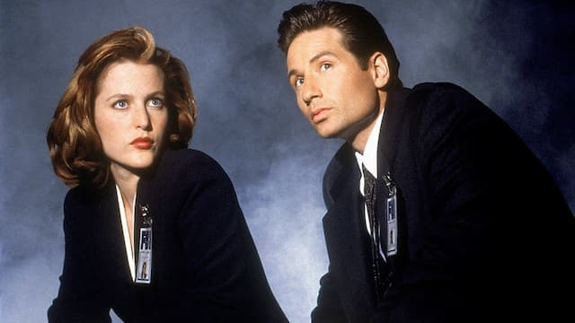

_O casal de agentes de Arquivo X: sempre desconfiados_.

Ando obcecado com a ideia de que, desde a Segunda Guerra, cada vez mais aplicamos técnicas da Indústria do Entretenimento (_storytelling_, gamificação, entre outras) para gerenciar o cotidiano. Até certo ponto, o Entretenimento vem se tornando a linguagem pela qual entendemos a vida.

Eleger um presidente, trabalhar, transar, pensar, tudo passa a ser uma espécie de seriado, com seus mistérios, tramas ocultas (conspirações) e ansiedades por fluxos constantes de “novidades”, estímulos surpreendentes (plot twists) ou expectativas pela renovação do frescor nas experiências (próximo episódio ou temporada).

É uma tese complexa, que demandaria mais explicações do que eu poderia dar aqui. Por isso, eu só queria compartilhar trechos de um [artigo na Vox](https://www.vox.com/culture/22882797/yellowjackets-finale-succession-mystery-box), de [Emily St. James](https://www.twitter.com/emilyvdw) (ex-VanDerWerff), que relatam um curioso caso de **cobra mordendo o próprio rabo**.

Traçando uma linha histórica do uso do mistério em seriados, St. James afirma que:

> A popularidade de Arquivo X na Internet estabeleceu um padrão rudimentar para como discutimos sobre TV on-line: tentamos deduzir o que acontecerá no show, mesmo quando ele não é, particularmente, obscuro.

A ideia é que, mesmo que um programa não seja sobre mistério, tentamos transformá-lo nisso que ela chama de “Mistery Box”.

St. James continua, falando sobre a série Succession:

> Vez após vez, o programa apresenta um desenvolvimento de história que é mais ou menos simples, mas a audiência debaterá sobre ele infinitamente, como se uma grande revelação estivesse por surgir. É o que fomos treinados a fazer, e os produtores de Succession sabem disso.

A autora conta que, no começo dos anos 2000, os próprios produtores de Arquivo X debateram internamente sobre os riscos de continuar usando o tom teoria da conspiração.

> Arquivo X embelezou as teorias da conspiração, deixando-as sexy e divertidas, o que as levou ao mainstream.

Mas a era da desinformação on-line já estava muito evidente e se consolidaria com Donald Trump. Usar essa técnica, agora, poderia gerar consequências inesperadas.

Interessante. Mas eu acredito que a Mistery Box é só uma das lógicas do entretenimento que vazaram do seu laboratório inicial. Também fomos treinados a explorar e a esperar coisas como:

- **Nostalgia** — tentar constantemente se referir a um grande momento de entusiasmo que, supostamente, sentimos quando consumimos certos produtos culturais no passado.
- **FOMO** (Fear of Missing Out) que, hoje, é aplicado até na economia.
- **Neomania** — acreditar que tudo o que é novo é necessariamente melhor.
- **Heroísmo** — pensar a si mesmo como um grande personagem dramático que enfrenta obstáculos e pode resolver tudo à base da força de vontade (o que pode levar ao extremo de ignorar a colaboração, os acasos e os acidentes).
- **Culto às macro, micro e nanocelebridades**. Pensar a si mesmo como um produtor de entretenimento, com uma carreira e público para gerenciar (Síndrome de Show de Truman).

Esses fenômenos devem ficar ainda mais evidentes se a chamada web2 se tornar mesmo web3, se “migrarmos” a política e a economia para ambientes, discursos e lógicas cada vez mais geeks. Ou seja: discursos criados por pessoas que nasceram num mundo cercado por um certo tipo de Entretenimento e que desenvolveram suas mentes a partir dele.

Se isso, de fato, ocorrer, será um seriado, no mínimo, intenso.
