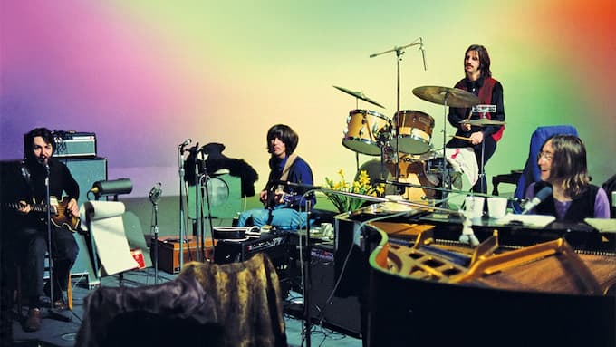

Nesta semana também fui afetado pela gentrificação dos _reality shows_ promovida pelo diretor Peter Jackson. Em outras palavras, se me achava esnobe demais para o BBB, não resisti a assistir (e comentar copiosamente) o documentário [Get Back](https://www.imdb.com/title/tt9735318/), sobre os Beatles.

Claro: também gastei tempo interpretando os comportamentos “separatistas” de George Harison, me comovendo com o jeito mandão-inseguro de Paul McCartney e admirando a postura profissional _good vibes_ de John Lennon e Ringo Starr. Como é costumeiro na época dos BBBs, a Internet fervilhou com palpites psicológicos sem muito fundamento. Os meus valem nem 10 centavos.

Mas meu assunto aqui é outro. É que, por estranho que pareça, a situação dos Beatles no documentário é semelhante à de um _sprint_ nas empresas de tecnologia.

Sprint é um período curto, intenso e imersivo de trabalho, em que uma equipe tem um produto específico para entregar. E rapidamente. Os participantes vivem numa mistura entre cansaço absoluto e motivação messiânica para “resolver um problema”. Supõe-se que você se sinta completamente motivado, até orgulhoso, de estar ali.

O sprint é um dos fenômenos mais sintomáticos do capitalismo avançado: os participantes fazem quase que uma viagem psicodélica de trabalho (muitas vezes até literalmente, com microdosagens de certas substâncias para ajudar onde a cafeína falha). É o mais próximo que conseguimos chegar de um [Khumba Mela](https://pt.wikipedia.org/wiki/Khumba_Mela), a celebração da criação via esforço religioso.

## Trabalhar até criar

É fácil perceber que os Beatles trabalhavam duro. Como escultores, partiam de uma ideia bruta, uma pequena célula proto-pop que furava o cansaço generalizado e pedia atenção. A partir daí, era refinada por um processo de repetição exaustiva.

Mas o que, talvez, seja mais difícil de notar, é o papel da procrastinação naquele contexto. O quarteto gastava muito tempo brincando e tocando versões cômicas de músicas dos seus ídolos. Ou simplesmente falando coisas sem sentido.

O cansaço (e a tentativa de superá-lo) produz um certo “barato”, que leva a criatividade para áreas não lógicas do cérebro. Você está, **ao mesmo tempo**, trabalhando, micro-descansando e juntando matéria-prima para a próxima fagulha de ideia.

Tive bandas por 10 anos ou mais. Certamente, testemunhei essa mistura de tensão, estupidez, diversão e produtividade que acontece durante ensaios prolongados. Na verdade, isso acontece até mesmo quando se toca sozinho, com um computador. Você se aborrece e se infantiliza, mas acaba funcionando.

Felizmente, o _sprint_ dos Beatles resultou em mais do que números abstratos numa conta bancária. Ainda assim, também gerou fortunas. “Dinheiro é uma troca energética”, se diz por aí. Assim como o trabalho, obviamente. E energias mudam constantemente.

Portanto, não é de se espantar que George tenha gravitado para outras parcerias nas décadas seguintes. Ele tentou avisar o grupo (como quando, no documentário, explicou o estilo de Eric Clapton para um entediado Paul McCartney). Mas não foi compreendido.

Faz parte. Nem sempre é possível voltar, voltar para onde um dia pertencemos.
