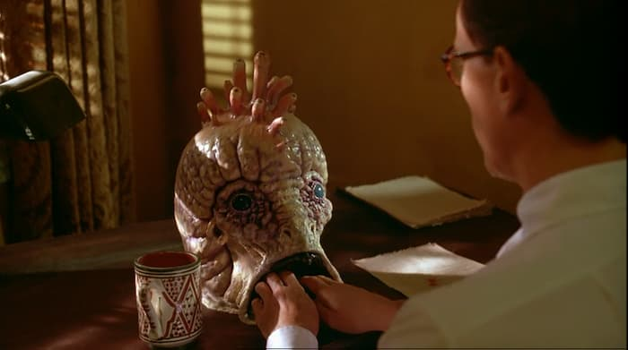

Semana passada, depois dos anúncios da Apple no WWDC, o jornalista Rodrigo Ghedin relatou que desenvolveu uma espécie de [fadiga de novidades](https://manualdousuario.net/fadiga-novidades-apple/). Quem não?

Minha hipótese aqui é que esse cansaço indica uma **mutação pré-decadência** de um estilo de indústria cultural. Uma ressaca de tanta velocidade, de tantas requisições por atenção.

Mas, espera aí: não estamos falando sobre tecnologia? Por que a expressão "indústria cultural"? Explico.

## Periodicidade

Por volta de 1440, Gutenberg inventa o sistema mecânico de tipos móveis. Isso possibilita a criação da Imprensa, a produção e distribuição de conhecimento em **ritmo industrial**.

Passamos a acreditar que devemos adquirir e processar cultura em ciclos regulares de tempo, o que chamamos de **periodicidade**.

Criamos os hábitos de consumo industrial de informação e, consequentemente, a **obsolescência cultural programada** ("daily", "breaking news"), os avós dos atuais _updates_.

## Entretenimento

No pós-Segunda Guerra Mundial, há um grande salto no estilo e velocidade da indústria cultural, com a consolidação da indústria do entretenimento, Hollywood, rádio, TV, publicidade, jornalismo cultural e tabloidismo.

Nessa época, também surgem os embriões das versões contemporâneas das Fake News e do mercado de atenção (segundo [Tim Wu](https://www.amazon.com.br/Attention-Merchants-Scramble-Inside-Heads/dp/0804170045?__mk_pt_BR=%C3%85M%C3%85%C5%BD%C3%95%C3%91&dchild=1&keywords=tim+wu&qid=1623678654&sr=8-2&linkCode=ll1&tag=eduf-20&linkId=fcdc764aeefd83c8b18056f338e297ad&language=pt_BR&ref_=as_li_ss_tl)). Também passamos a usar a Cultura Pop como referência para a construção de identidades.

## Tecnologia vira identidade

Nos anos 1980, Steve Jobs faz a ponte: ajuda a **aplicar na tecnologia a mesma lógica da Indústria do entretenimento**: transforma computadores em entretenimento, identidade, estilo de vida e assunto para ser coberto extensivamente pela mídia.

De certa forma, é ajudado pela cultura cyberpunk, por fanzines e revistas como a High Frontiers, Mondo 2000 e, mais tarde, a Wired.

## Aceleração

Com a popularização da Internet e, nos anos 2000, o lançamento do iPhone, a "tecnologia digital cultural", ganha ares de indispensável, inescapável. Grandes corporações descobrem o seu potencial.

Com as redes sociais, as periodicidades ficam cada vez mais curtas, conflitantes e sobrepostas. Se a TV era "tempo real, ao vivo", as redes superam a nossa capacidade de atenção. Portanto, as atualizações se acumulam em inboxes e viram ansiedade no cérebro.

Como nosso "bioware" é limitado, não conseguimos consumir no mesmo ritmo da tecnologia. Então, delegamos o gerenciamento de informação para algoritmos. Ou seja: **máquinas filtrando e processando conteúdo que criamos como se fôssemos máquinas**. Aliás, cada vez mais, os próprios _bots_ também assumem a produção cultural.

Assim, em vez de grandes pacotes de lançamentos, vivemos num rítmo que os técnicos chamariam de "rolling release", isto é: atualizações constantes, acontecendo nos bastidores.

Eventos como o WWDC não acontecem por causa de limitações técnicas, são rituais de marketing. Pior: muitos updates anunciados sequer estão disponíveis durante o evento. Alguns nem podem ser utilizados por todos os consumidores. A questão aqui é incitar a compra de novos devices e fortalecer a imagem da corporação.

## Vício

Lembre-se, ainda seguimos aquela mesma tendência dos primórdios da Imprensa: em vez de "receber" atualizações passivamente, nos habituamos a desejá-las e procurá-las. Até o ponto em que **a busca fica mais importante que o resultado**.

Portanto, as informações têm que ser mais curtas (ou apenas armazenáveis rapidamente), para que possamos continuar no frenesi da busca. _Refresh_. Abra outra aba. Assine mais uma newsletter. É uma lógica industrial, compulsiva, a linha de produção e a linha de consumo.

Esse é o contexto global na qual os updates acontecem. Eles são mais um ponto de requisição de atenção.

## Fadiga

Às vezes, você precisa prestar atenção nos updates. E isso provoca a fadiga a que Ghedin se refere.

O que pode ser bom, já que nos dá a oportunidade de reconhecer a compulsão e a insanidade da coisa toda. Muitos nos percebemos até viciados. E, assim, enxergamos os custos (psicológicos e sociais) das atualizações. Questionamos até o próprio conceito de atualização. A quem elas servem?

Aparentemente, a fadiga cognitiva vem se espalhando por toda a cultura. Gradativamente, nos cansamos de ser tratados como máquinas e de _desejar_ nos comportar como elas.

## Descontentamento compulsivo

No limite, a mecânica do update também pode reforçar padrões de descontentamento. Pode criar o **mal-estar do workflow**: quero mudar porque estou entediado, porque a grama alheia é mais verde, etc.

Até certo ponto, o descontentamento é útil. Em excesso, se torna um monstro consumindo a mente.

## Soluções

Dizem que nunca se deve terminar um texto sem apontar para uma solução. Então, segue mais uma IGE® (Ideia Genial do Eduf): **pedir para o cineasta David Cronenberg [desenhar](http://cronenbergmuseum.tiff.net/artefacts-artifacts-eng.html) nossos próximos aparelhos e interfaces.**

Está aí um sujeito que entende de mentes viciadas, não é? Assim, que tal um celular que fosse mais ou menos como as máquinas de escrever do filme [Naked Lunch](https://en.wikipedia.org/wiki/Naked_Lunch_(film))? (Omito as imagens mais nojentas, como as da [Clark Nova](https://www.themortonreport.com/2013/04/16/Naked%20Lunch%20clark%20nova%20%28350x197%29.jpg).)

Ou os joystics e entradas USBone do [eXistenZ](https://www.youtube.com/watch?v=W1fkINKMwHA)?

Bonus: sons de interface compostos por [Stockhausen](https://www.youtube.com/watch?v=vdIe2CrorMM).

Alguém iria querer usá-los o tempo todo?
