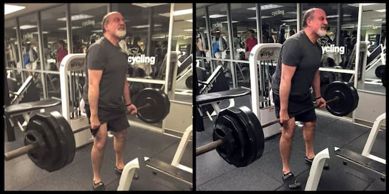

_O escritor marombeiro Nassim Nicholas Taleb._

Já faz alguns meses que o ensaísta libanês [Nassim Nicholas Taleb](https://en.wikipedia.org/wiki/Nassim_Nicholas_Taleb) vem me assombrando. Comecei a ler seu [Antifrágil - Coisas que se beneficiam com o caos](https://www.amazon.com.br/Antifr%C3%A1gil-Nova-edi%C3%A7%C3%A3o-Coisas-beneficiam/dp/8547001085?__mk_pt_BR=%C3%85M%C3%85%C5%BD%C3%95%C3%91&crid=VR3ZGKPVOPDI&keywords=antifragil&qid=1637765985&sprefix=anti%2Caps%2C351&sr=8-5&linkCode=ll1&tag=eduf-20&linkId=01d7d1f69540792974d6379470606781&language=pt_BR&ref_=as_li_ss_tl) por pura curiosidade e desejo de entender como alguém faz sucesso literário internacional tratando de assuntos tão controversos e impopulares.

Ok. Existe algo chamado _marketing_. Entendo. Porém, Taleb está há mais de 20 anos falando sobre a futilidade de tentar prever o futuro, sobre como a busca de poder econômico e riqueza é uma autossabotagem, sobre como tentar corrigir uma situação é a melhor forma de piorá-la e sobre como dependemos de agentes estressores para sobreviver. Não é interessante que esse tipo de discurso tenha parado nas sessões de autoajuda das livrarias?

De certa forma, Taleb pega carona numa tradição muito antiga, cuja origem é o próprio Buda e passa por grandes mestres indianos como Shantideva e Aryadeva: a de analisar o sofrimento imanente à vida e perceber que, de certa forma, ele nos guia e influencia, de maneira complexa.

É preciso questionar tanto o conceito de sofrimento quanto o de felicidade. E perceber como são vagos e enganosos. Assim, sofrimento não é apenas um problema a ser resolvido e do qual devemos fugir. Felicidade não é algo exclusivamente bom, que devemos buscar.

Parece óbvio. Mas analise sua própria vida nos detalhes e as coisas ficarão estranhas. O automatismo, a cegueira e a ansiedade do processo de buscar prazer e rejeitar a dor são as fontes da maioria dos nossos problemas.

Taleb não é budista, claro. É um _trader_, matemático e estudante de estoicismo — o que traz alguns problemas particulares às suas reflexões. Ainda assim, seus textos levam a conclusões bem familiares aos estudantes de budismo, taoismo e alguns outros sistemas não-cristãos e não-Modernos de pensamento: as limitações da ideologia do Sujeito, essa entidade fantasmagórica que acha que faz, que acontece, que pensa que entende e controla o mundo.

Talvez o sucesso de Taleb seja mais um dos sintomas do esgotamento da Modernidade, uma nova fase na longa busca por outras formas de entender o mundo.

Taleb vem do Líbano, fala 10 línguas e se formou na França e EUA. Ainda é o tal “homem, branco e de elite”. Mas há vozes com formações bem diferentes, vindas de outras experiências, como a dos povos nativos, de [Tyson Yunkaporta](https://www.amazon.com.br/Sand-Talk-Indigenous-Thinking-World/dp/0062975641?__mk_pt_BR=%C3%85M%C3%85%C5%BD%C3%95%C3%91&keywords=Tyson+Yunkaporta&qid=1637764115&sr=8-1&ufe=app_do%3Aamzn1.fos.6a09f7ec-d911-4889-ad70-de8dd83c8a74&linkCode=ll1&tag=eduf-20&linkId=b770383568f3d1b311a8575cba1fea0d&language=pt_BR&ref_=as_li_ss_tl) a [Ailton Krenak](https://www.amazon.com.br/Ailton-Krenak/e/B001JY4QYM?&linkCode=ll2&tag=eduf-20&linkId=7ffacd557bec37fb5df3aaebd8855f76&language=pt_BR&ref_=as_li_ss_tl).

Talvez, esse seja o verdadeiro pós-modernismo, um que não parte apenas do escárnio e da crítica ao Modernismo, mas que resgata alternativas que sobreviveram à colonização mental capitalista.

Imagino que [Os 400 versos de Aryadeva](https://en.wikipedia.org/wiki/Aryadeva), por exemplo, são radicais demais para inspirar o surgimento de autores como Taleb. Pensamentos de civilizações nativas podem acabar neutralizadas ao serem consumidas como entretenimento exótico. Já esse neo-estoicismo dialoga melhor com mentes modernas ainda não dispostas a abandonar as supostas conveniências (sociais e intelectuais) da Modernidade.

Assim, Antifrágil, de Taleb, tem sido uma leitura quase que “pugilística”. Às vezes me esquivo, às vezes ataco. Levo uns golpes aqui e ali. Certas horas, o texto parece uma bravata infinita, uma sequência de 500 páginas de tweets. Num capítulo parece uma novela, em outro, artigo de divulgação científica (mas sem citações e contextos).

A palavra ensaio parece bem adequada aqui: algo imperfeito, inacabado, um tanto fora de sincronia e dissonante. Enfim, o que esperar de alguém que se proponha a discutir as influências do caos e das descontinuidades no cotidiano, na economia e na política? Um texto cartesiano?
